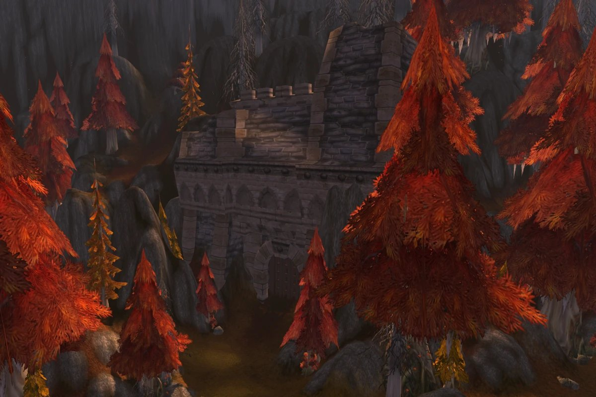
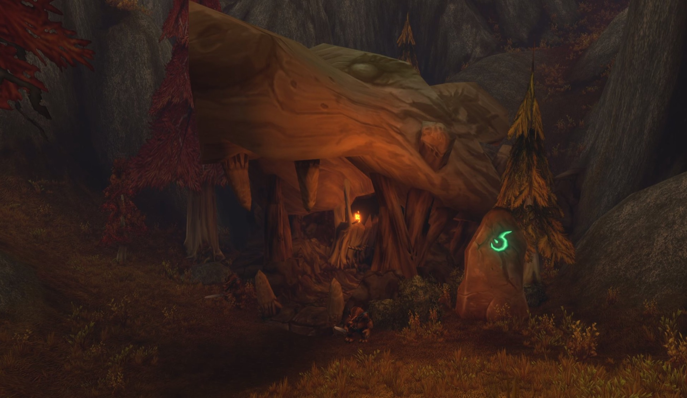

Blackmaw Hold, einer der neuen Dungeons in World of Warcraft: Forever, liegt hinter dem großen Steintor in Azshara. Spieler kennen dieses Tor seit 2004. Der Furbolg-Dungeon ist für Level 60 und wohl etwas größer als Blackrock Depths, sagen die Entwickler.

Die Details kamen in der dritten Folge von The WoW: Forever Podcast am 8. Oktober. Senior Game Designer Rowan Ryder und Jay Hartman vom Encounter-Team sprachen darüber mit Josh Greenfield.

## Das Tor, an dem Timbermaw Hold stand

In Classic hat Azshara ein Tor aus Ziegeln, das nirgendwohin führt. Wer sich nähert, bekommt die Meldung, Timbermaw Hold zu betreten. In Forever ist dieses Tor der Eingang zu Blackmaw Hold.

Es ist nicht das Timbermaw Hold aus Felwood und auch nicht derselbe Stamm. Ryder nennt es eine alte Legende, die das Team endlich einlösen wollte:

> It's a space in Azshara. It was originally this big stone gate. And when you came up close, it said Timbermaw Hold, right? It's this kind of old legend that we wanted to pay off. It's one of those ones where we looked at it and we said, it's connected to Timbermaw Hold. But in our lore, it actually isn't Timbermaw Hold, right? It is Blackmaw Hold, that's where the place is.

## Groß, aber kein Mega-Dungeon

Die Entwickler nennen Blackmaw Hold keinen Mega-Dungeon. Für sie ist ein Mega-Dungeon nicht einfach ein großer Dungeon, sondern einer, der stark verzweigt ist, mehrere Runs braucht und einen breiten Levelbereich abdeckt. Blackmaw Hold hat einen engeren Bereich, und eine Gruppe soll ihn in einer Sitzung von Anfang bis Ende schaffen.

Allerdings in einer langen Sitzung. Ryder vergleicht den Dungeon mit Blackrock Depths und schätzt ihn etwas größer ein. „Ihr werdet wahrscheinlich eine Weile dort sein“, ergänzt Greenfield.

Im September antwortete Greenfield auf den Wunsch nach einem Mega-Dungeon wie Blackrock Depths mit „Hold our beer(s)“ und einem Screenshot einer Furbolg-Höhle. Mehr dazu im [Beitrag vom 28. September](/de/news/aggrend-hints-at-a-mega-dungeon-like-blackrock-depths/).

<figure class="wf-embed wf-embed--x" data-wf-x="2104356489427394592">
  <button type="button" class="wf-embed__play">
    
    
      Aggrend: Hold our beer(s)
      Den Beitrag von X laden.
    
  </button>
</figure>

## Level 60 und Furbolgs

Blackmaw Hold ist ein Dungeon für hohe Level. Auf Level 60 sind Spieler dort gut aufgehoben, sagt Ryder, aber sie können auch etwas früher hinein. Der Dungeon hat Quests, und Blizzard nannte vorher einen Bereich von 55 bis 60. Dort von 50 auf 60 zu leveln, ist nicht die Idee.

Drinnen leben Furbolgs eines verdorbenen Stamms, der sich mit Dämonen einlässt. „Viele Furbolgs, viele Dämonen“, sagt Ryder. Der Dungeon hat viele Geheimnisse, aber dazu kann Ryder noch nichts sagen.

## Ein Ort, bevor es ein Dungeon ist

Das Team will, dass Blackmaw Hold sich wie ein echter Ort anfühlt, der lange vor den Spielern existierte. Dungeons aus Classic sind keine Korridore, sagt Greenfield: Sie haben viele Wege, viel Vertikalität, und sie sind nicht aufgeräumt. Laut Hartman soll ein Dungeon wirken, als lebe er in der Welt, und nicht, als sei er für den Spieler hergerichtet. Ryder fasst es so zusammen:

> I like to think of it as being a space before it's a dungeon. You know, it's more important that it's a space in the world and we populate it with stuff that makes sense.

Blackmaw Hold ist noch nicht auf der Beta. Wann er getestet werden kann, hat Blizzard nicht gesagt. Die Dungeons, die schon auf der Beta sind, stehen im [Dungeon-Guide](/de/guides/dungeons/).

<figure class="wf-embed" data-wf-video="LwOWAf06YPg">
  <button type="button" class="wf-embed__play">
    
    
      Dive into Dungeons with Devs ft. Hammer Dance Gaming, Episode 3 of The WoW: Forever Podcast
      Das Video abspielen. World of Warcraft auf YouTube, 64 Minuten.
    
  </button>
</figure>
