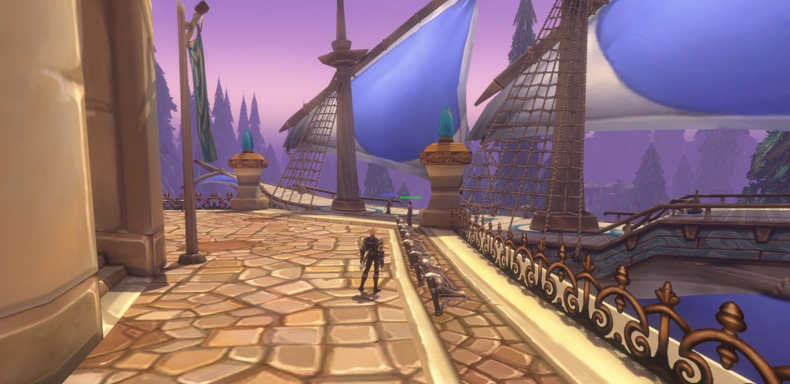
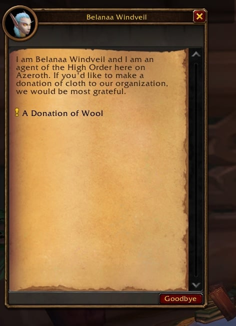
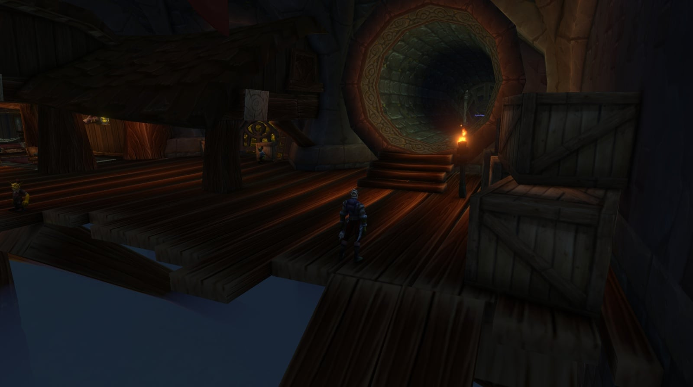
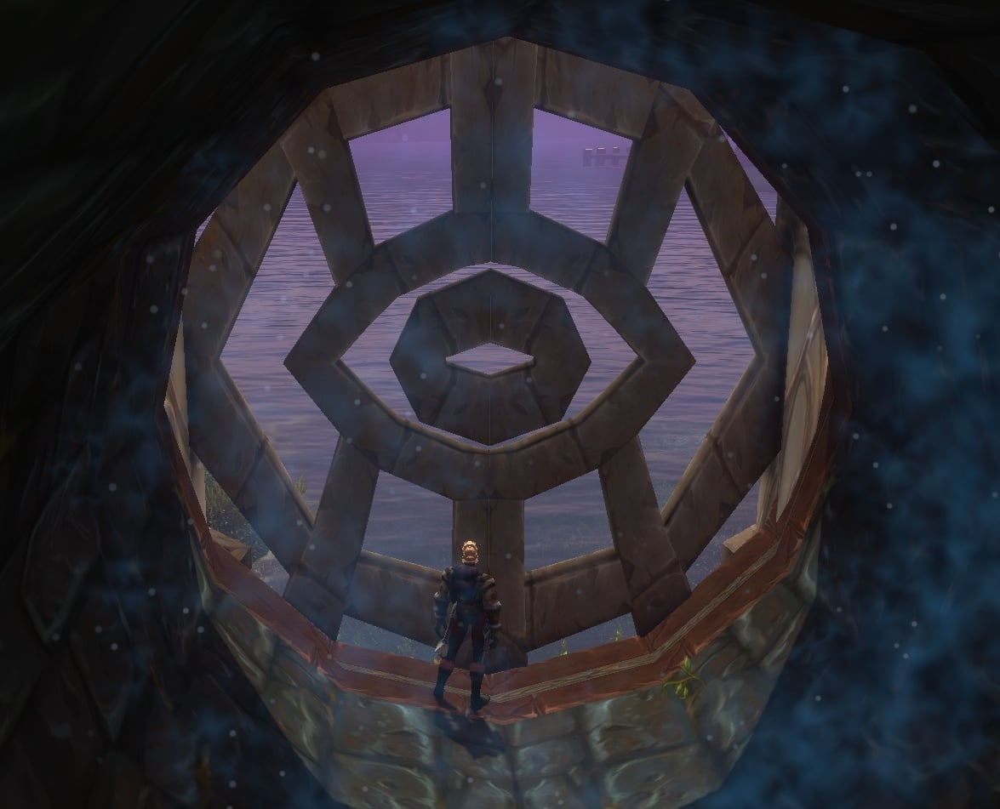
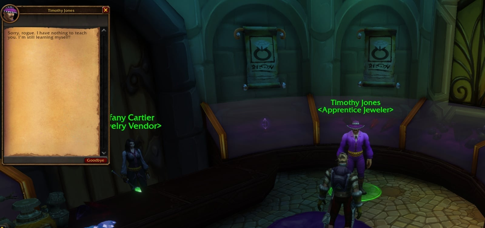

Dalaran ist in der Beta von WoW Forever offen. Die Alliance spaziert frei hinein; die Horde ist nicht willkommen, auch wenn die Stadt als Sanctuary gilt. Drinnen warten Lehrer, Kampfmeister und der Weg in einen neuen Dungeon, schreibt Wowhead.

## Hineinkommen

Die Stadt liegt in den Alterac Mountains, nordwestlich von Southshore. Es gibt drei Wege hinein:

- **Die Treppe** gleich nördlich von Hillsbrad Fields.
- **Ein fliegendes Schiff** zwischen Dalaran und Valanaar auf Zephras Isle, dem Zuhause der Skyborne. Es landet vor der Violet Citadel, südlich von Fenris Isle.
- **Ein Portal** in der Violet Citadel zum Wizard's Sanctum in Stormwind City, mit einem Portal zurück.

Noch landet keine Flugroute in Dalaran.

## Lehrer und Dienste

| Was | NPC | Wo |
|---|---|---|
| Druid-Lehrer | <a class="wf-wh wf-plain" href="https://www.wowhead.com/forever/npc=270459">Alfina Nightgaze</a> | Violet Citadel, beim Anleger des Schiffs |
| Mage-Lehrer | <a class="wf-wh wf-plain" href="https://www.wowhead.com/forever/npc=246797">Jessa Weaver</a> | The Violet Gate, /way 17.7 69.7 |
| First Aid | <a class="wf-wh wf-plain" href="https://www.wowhead.com/forever/npc=251977">Angelique Butler</a> | /way 17.4 61.2 |
| Enchanting | <a class="wf-wh wf-plain" href="https://www.wowhead.com/forever/npc=251978">Vanessa Sellers</a> | /way 16.9 62.6 |
| Cooking | <a class="wf-wh wf-plain" href="https://www.wowhead.com/forever/npc=252084">Katherine Lee</a> | Silver Enclave, /way 12.7 64.2 |
| Herbalism | Edward Egan | /way 18.4 63.4 |
| Blacksmithing | Alard Schmied | Violet Plates and Framing, /way 19.6 63.3 |
| Tailoring | <a class="wf-wh wf-plain" href="https://www.wowhead.com/forever/npc=251972">Charles Worth</a> | Talismanic Textiles, /way 17.8 60.4 |
| Alchemy | <a class="wf-wh wf-plain" href="https://www.wowhead.com/forever/npc=246795">Linzy Blackbolt</a> | The Agronomical Apothecary, /way 18.6 62.4 |
| Transmogrifizierer | <a class="wf-wh wf-plain" href="https://www.wowhead.com/forever/npc=270513">Spellweaver Thaldris</a> | Talismanic Textiles |
| Stallmeister | <a class="wf-wh wf-plain" href="https://www.wowhead.com/forever/npc=251953">Talia Softglen</a> | Magical Menagerie, /way 19.7 70.1 |
| Barbier | | Eclipse with Shears, /way 20.1 66.6 |

Die Wachen der Kirin Tor weisen keinen Weg, anders als die Wachen in anderen Städten.

## Vorerst eine Quest

Mit der Beta auf Stufe 20 hat Dalaran eine Quest. <a class="wf-wh wf-plain" href="https://www.wowhead.com/forever/npc=276170">Belanaa Windveil</a>, die Stoffquartiermeisterin des High Order in The Sky Enclave, verlangt 60 <a class="wf-wh wf-q1" href="https://www.wowhead.com/forever/item=2592">Wool Cloth</a> in A Donation of Wool. Die Reihe geht weiter mit 60 <a class="wf-wh wf-q1" href="https://www.wowhead.com/forever/item=4306">Silk Cloth</a>, 60 <a class="wf-wh wf-q1" href="https://www.wowhead.com/forever/item=4338">Mageweave Cloth</a> und 60 <a class="wf-wh wf-q1" href="https://www.wowhead.com/forever/item=14047">Runecloth</a>.

## Schlachtfelder in The Underbelly

Unten in The Underbelly melden dich vier Kampfmeister für jedes Schlachtfeld an: "Techs" Rickard Rustbolt für Warsong Gulch, Minzi the Minx für Arathi Basin, Sai für Alterac Valley und Bimble Sparkfingers für das neue Darkspear Islands. "Dapper" Danik Blackshaft, Nixi Fireclaw und Blazik Fireclaw verkaufen PvP-Ausrüstung.

## Der Weg in die City of Dalaran

Die [City of Dalaran](/de/guides/dungeons/) ist ein neuer Dungeon für die Stufen 28 bis 33. Die Alliance kommt über ein Rohr in Cantrips & Crows in den Dalaran Sewers hinein: das Gitter öffnen und dem Rohr bis zum Portal folgen.

Die Horde geht von außerhalb der Stadt hinein, bei /way 8.8 59.6, mit dem <a class="wf-wh wf-q2" href="https://www.wowhead.com/forever/item=277507">Dalaran Sewer Key</a>.

## Ein Juwelier ohne Beruf

Bei Cartier & Co. Fine Jewelry, bei /way 18.1 61.9, steht Timothy Jones, Apprentice Jeweler. Dieser Titel gehört meist zu einem Lehrer, merkt Wowhead an. Jewelcrafting gibt es in Forever nicht, und er lehrt vorerst nichts.

## Was nicht bekannt ist

Wo die Horde den Dalaran Sewer Key bekommt, sagt Blizzard nicht. Auch nicht, ob eine Flugroute nach Dalaran folgt oder ob der Juwelier je Lehrer wird.
