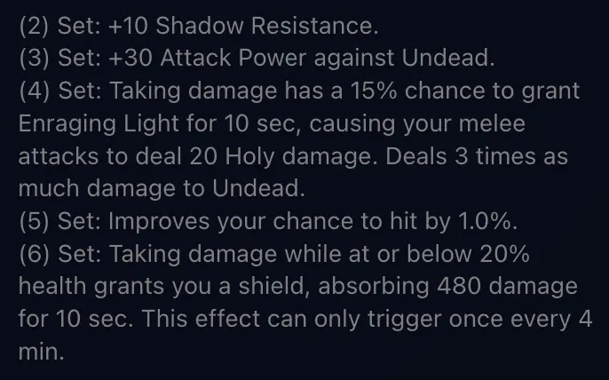
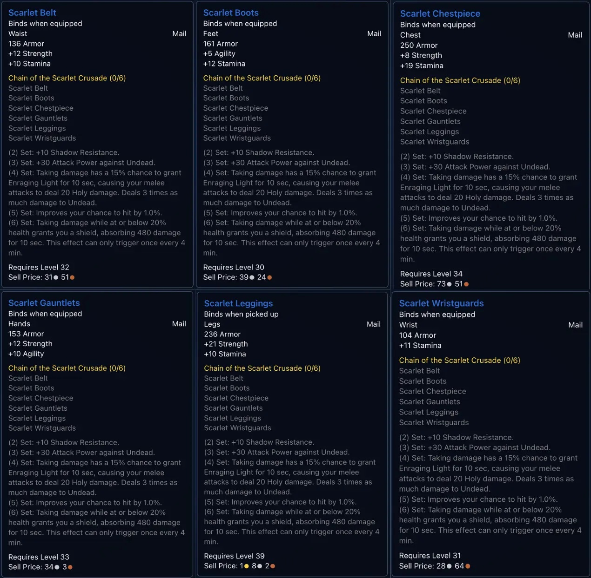
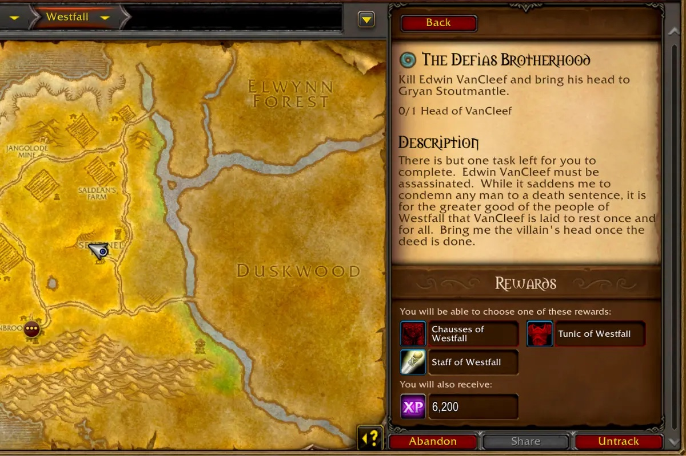

Die Chain of the Scarlet Crusade droppt jetzt auf der Beta von World of Warcraft: Forever. Drei der sechs Teile werden von grün zu blau. Die Boni bei 4 und 6 Teilen sind neu: ein heiliger Proc und ein Schild.

Am 3. Oktober waren die neuen Boni nur aus den Dateien der Beta bekannt, wie im [Beitrag über die Beute aus Scarlet Monastery](/de/news/scarlet-monastery-loot-gets-new-effects/) beschrieben. Jetzt droppen die Teile im Dungeon, und ihre Tooltips zeigen Boni und Werte.

## Der Setbonus

| Teile | Classic Era | Forever |
|---|---|---|
| **2** | +10 Armor | +10 Shadow Resistance |
| **3** | +1 Defense | +30 Attack Power gegen Undead |
| **4** | +5 Shadow Resistance | <a class="wf-wh wf-spell" href="https://www.wowhead.com/forever/spell=1293674">Enraging Light</a> |
| **5** | +15 Attack Power gegen Undead | +1 % Trefferchance |
| **6** | +1 % Trefferchance | <a class="wf-wh wf-spell" href="https://www.wowhead.com/forever/spell=1293670">Scarlet Guardian</a> |

Armor und Defense fallen weg. Shadow Resistance und Attack Power gegen Undead verdoppeln sich, und die Trefferchance rückt von 6 auf 5 Teile.

Enraging Light löst aus, wenn der Träger Schaden erleidet, mit einer Chance von 15 %. Dann machen Nahkampfangriffe 10 Sekunden lang 20 zusätzlichen Heiligschaden, gegen Undead das Dreifache. Der Tooltip nennt eine Abklingzeit von 15 Sekunden zwischen zwei Procs.

Scarlet Guardian löst bei Schaden mit 20 % Gesundheit oder weniger aus. Es gibt einen Schild, der 10 Sekunden lang 480 Schaden absorbiert, einmal alle 4 Minuten.

## Die Teile

Alle sechs Teile sind Kette. Die Beinschützer werden beim Aufheben gebunden, die anderen fünf beim Anlegen.

| Item | Stufe | Forever | Classic Era |
|---|---|---|---|
| <a class="wf-wh wf-q3" href="https://www.wowhead.com/forever/item=10329">Scarlet Belt</a> | 32 | 136 Armor, 12 Strength, 10 Stamina | grün, 123 Armor, 8 Strength, 7 Stamina |
| <a class="wf-wh wf-q3" href="https://www.wowhead.com/forever/item=10331">Scarlet Gauntlets</a> | 33 | 153 Armor, 12 Strength, 10 Agility | grün, 139 Armor, 8 Strength, 7 Agility |
| <a class="wf-wh wf-q3" href="https://www.wowhead.com/forever/item=10333">Scarlet Wristguards</a> | 31 | 104 Armor, 11 Stamina | grün, 95 Armor, 8 Stamina |
| <a class="wf-wh wf-q3" href="https://www.wowhead.com/forever/item=10330">Scarlet Leggings</a> | 39 | 236 Armor, 21 Strength, 10 Stamina | Stufe 38, 233 Armor, 20 Strength |
| <a class="wf-wh wf-q3" href="https://www.wowhead.com/forever/item=10328">Scarlet Chestpiece</a> | 34 | 250 Armor, 8 Strength, 19 Stamina | unverändert |
| <a class="wf-wh wf-q3" href="https://www.wowhead.com/forever/item=10332">Scarlet Boots</a> | 30 | 161 Armor, 5 Agility, 12 Stamina | unverändert |

Gürtel, Handschuhe und Armschienen gewinnen am meisten. Die Beinschützer verlangen eine Stufe mehr, mit etwas höheren Werten. Brustteil und Stiefel bleiben, wie sie waren.

## Weniger Erfahrung in Dungeons

Kettenträger wie Warriors, Paladins und Enhancement-Shamans suchen dieses Set seit Langem. In Classic brachte das Farmen auch Erfahrung. Auf der Beta gilt das weniger: Monster in Dungeons geben weniger Erfahrung, und [Dungeon-Quests geben 50 % weniger Bonuserfahrung](/de/news/dungeon-quests-give-50-percent-less-bonus-experience/).

Blizzard will, dass Spieler in der offenen Welt leveln, und [auch grüne Monster geben weniger Erfahrung](/de/news/green-mobs-give-less-experience-than-in-classic/). Mehrere Teile des Sets droppen von normalen Monstern in Scarlet Monastery, also sehen Gruppen, die Monster auslassen, weniger davon. Ob sich die Erfahrung vor dem Start noch ändert, ist nicht bekannt.
