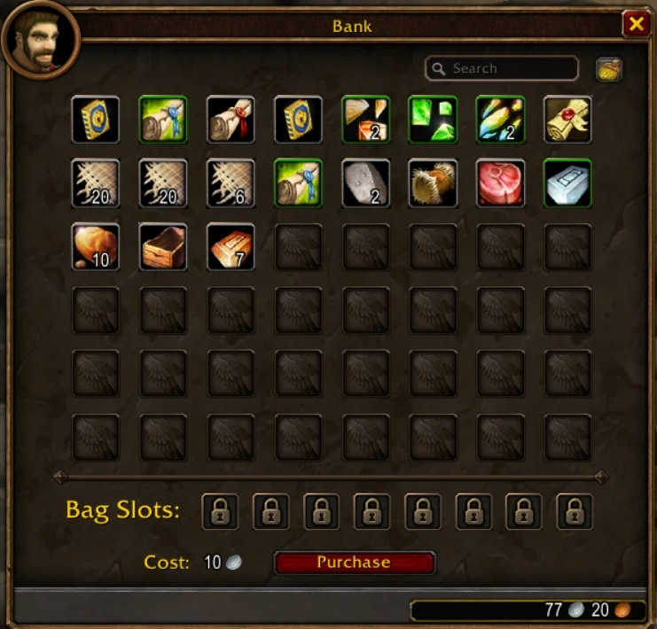

Die Bank in World of Warcraft: Forever öffnet doppelt so groß. Die Standardbank fasst 48 Plätze statt 24, und die Zahl der Bag Slots steigt von 6 auf 8. Wowhead fand die Änderung am 21. September in der Beta.

## Warum die Bank wachsen musste

Forever hält jeden Charakter auf Level 60 und legt den Fortschritt zur Seite statt nach oben, schreibt Wowhead. Eine der Arten, wie das Team Spieler beschäftigt, sind Effekte auf Gear, die nur in einer bestimmten Umgebung auslösen: in einer Zone, in einem Biome oder gegen eine Art Mob.

Damit wird Gear zur Sammlung. Wer durch Elwynn Forest levelt, will dort vielleicht einen Bonus auf Lauftempo, und gegen den Onyxia-Raid mit 40 Spielern ein Set mit einem Bonus gegen Dragons. All das muss irgendwohin.

## Was es bringt

Achtundvierzig Plätze zum Start sind ein ordentliches Stück zusätzlicher Raum für Ore, Herbs, Gear und alles andere, was sich beim Leveln zu behalten lohnt, schreibt Wowhead.

Blizzard rechnet damit, den Standardplatz in der Bank später noch einmal zu erhöhen, sagte das Studio zu MMORPG, aber erst, wenn Spieler an den Punkt kommen, an dem sie ihn brauchen. Wann dieser Punkt ist, sagt Blizzard nicht.

## Mehr Stauraum in der Beta

Auch an Bags kommt man leichter. Quests in den Anfangsgebieten geben kostenlose Bags, und die [Item Sets, die in der Beta gefunden wurden](/de/news/a-set-pairs-a-deadmines-ring-with-a-level-60-ring/), geben Spielern einen weiteren Grund, Gear niedriger Level lange zu behalten.
