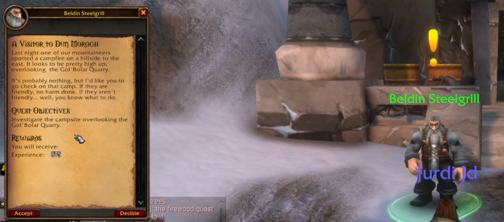

The Hall of Thanes ist der erste neue Dungeon, den die meisten Spieler der Allianz in World of Warcraft: Forever betreten. Er liegt in Old Ironforge, für Level 13 bis 18. Wowhead hat einen Guide zu seinen vier Bossen und fünf Quests veröffentlicht.

<figure class="wf-embed" data-wf-video="c5PJmoBKcKc">
  <button type="button" class="wf-embed__play">
    
    
      Hall of Thanes Dungeon Overview: All Quests, Bosses, Trash, and Loot
      Das Video abspielen. Jurdi auf YouTube, 59 Minuten.
    
  </button>
</figure>

Der Guide stammt von Jurdi, der für Wowhead über Paladins schreibt und den Dungeon in der Beta getankt hat. Die ersten sieben Minuten seines Videos erklären den Dungeon, der Rest ist ein kompletter Run. Der Endboss ist Level 16, eine Gruppe, die mit Level 13 hineingeht, hat es also schwer.

## Wo er liegt

Die Tür nach Old Ironforge liegt links, gleich hinter dem Eingang des High Seat, schreibt Wowhead. Ein Weg führt hinunter bis zum Portal. Die Hall ist die Ruhestätte der großen Dwarves der Eastern Kingdoms, und die Dark Iron Dwarves sind mit ihren Bohrmaschinen eingebrochen.

Der Dungeon ist das [Gegenstück der Allianz zu Ragefire Chasm](/de/news/one-faction-per-player-on-pvp-rulesets/). Die Horde kann hinein, hat aber einen langen Weg: von Tarren Mill durch die Arathi Highlands, die Wetlands und Loch Modan nach Dun Morogh, dann an den Wachen von Ironforge vorbei. Eine schnellere Route ist nicht gefunden. Nach einem Wipe steht der Spirit Healer nah, gleich vor der Stadt.

## Fünf Quests

Zwei Quests beginnen direkt vor dem Dungeon, zwei darin, und die fünfte startet in Dun Morogh. Jede bringt zwischen 3.900 und 4.900 Erfahrung, schreibt Wowhead. Monster darin geben sehr wenig: Jurdi sah 28 bis 30 Erfahrung pro Kill.

- **Important Heirlooms**, von Thom Filch in Old Ironforge: sammle 8 Dwarven Heirlooms. Sie tauchen nach dem ersten Boss auf, und die Tresore im letzten Raum, dem Reliquary of Kings, enthalten genug für eine volle Gruppe.
- **The Restless Dead**, von Afadra Dunwall in Old Ironforge: räume die Geister im ersten Teil des Dungeons weg.
- **Old Ironforge Incursion**: besiege den Endboss. Das ist die Hauptquest. Sie beginnt mit A Visitor to Dun Morogh von Beldin Steelgrill in Steelgrill's Depot, die zu Earthseer Farsen am Gol'Bolar Quarry führt. Eine Dark Iron Map von den Dark Iron Dwarves dort öffnet die Dungeonquest.
- **An Ancient Grudge**, von einem Ghostly Attendant in Anvilmar's Rest, drinnen: besiege den ersten Boss.
- **The Treaty of Understanding**, aus einem Tresor im Reliquary of Kings nach dem Endboss. Sie geht an Magni Bronzebeard.

| Belohnung | Art | Quest |
|---|---|---|
| Ironforge Greathammer | Zweihandstreitkolben | Old Ironforge Incursion |
| Deepblaze | Zauberstab | Old Ironforge Incursion |
| Dwarven Tome | Nebenhand | Important Heirlooms |
| Catacomb Cloak | Umhang | An Ancient Grudge |

Wer die Quests annehmen darf, ist nicht klar. Der Newsartikel von Wowhead nennt alle fünf nur für die Allianz. Der Dungeonguide auf derselben Seite macht eine Ausnahme für Important Heirlooms und An Ancient Grudge.

## Vier Bosse

**Faldrim Anvilmar** ist ein Geist, der durch Anvilmar's Rest patrouilliert. Räume eine Stelle im Raum frei und zieh ihn dorthin, weg vom Trash. Er wirkt Mind Blast und legt Anvilmar's Curse für 10 Minuten auf den Tank, der Angriffe und Zauber um 20 % verlangsamt, sagt Jurdi. Wer einen Fluch entfernen kann, macht es leichter. Er lässt den Spiritwraith Drape, den Ephemeral Choker und die Aetherwisp Bracers fallen.

**Magmatus** ist ein Feuerelementar mit einem Dark Iron Summoner an seiner Seite. Töte zuerst den Summoner und lass den Tank Magmatus von der Gruppe wegziehen, denn er löst ab und zu eine Feuernova aus. Combust trifft einen zufälligen Spieler hart. Einen patrouillierenden Summoner räumt man am besten vor dem Pull weg. Er lässt einen Dolch mit spell power fallen, sagt Tim Jones im [ersten Podcast der Entwickler](/de/news/a-first-developer-podcast-promises-fewer-blues/).

**Plunder** patrouilliert durch einen Gang und hat eine einzige Fähigkeit: Knock Away, die einen Spieler weit wegschleudert. Zieh ihn an eine Stelle, an der niemand in einer Trashgruppe landet, mit der Gruppe an einer Wand.

**Durgen Dirgehammer** ist der Endboss, mit zwei Lesser Stone Golems an seiner Seite und Dark Iron Looters an den Rändern des Raums. Sein Fear treibt Spieler in diese Looters, also räume sie zuerst weg. Die Golems ziehen den Boss dagegen mit. Er legt außerdem Rend auf den Tank, der pro Tick 44 Schaden macht, sagt Jurdi. Ein Golem, der vor einem Wipe getötet wurde, kommt nicht zurück, jeder weitere Versuch wird also leichter. Seine Durgen's Crescent Axe ist der auffällige Drop.

## Der Trash schlägt hart zu

Der erste Teil des Dungeons ist leicht, schreibt Wowhead. Die Seite der Dark Irons nicht. Looters greifen schnell mit Dolchen an, Engineers werfen Bomben auf eine Stelle, der man ausweichen kann, und Summoners wirken Fireball und rufen einen Fiery Assistant. Zieh die Summoners hinter eine Säule, außer Sicht, damit sie näher kommen müssen.

Die Lesser Stone Golems schlagen am härtesten zu und bewegen sich schnell. Die letzte Gruppe vor dem Endboss besteht aus einem Summoner, einem Looter und einem Golem. Crowd Control wie Polymorph hilft, Betäubungen wie Hammer of Justice ebenso. Heiler ziehen auf diesen Stufen viel Bedrohung, sagt Jurdi.

Nach dem Endboss öffnet ein Schalter im hinteren Tresor die verschlossenen Türen, der Weg nach draußen ist dann kurz. Alle vier Bosse sind vertont.
