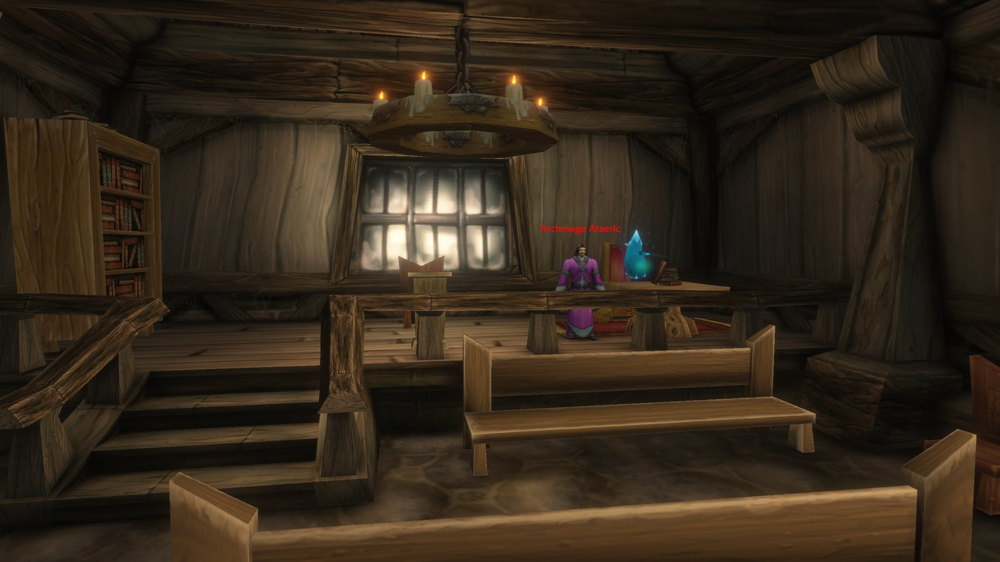
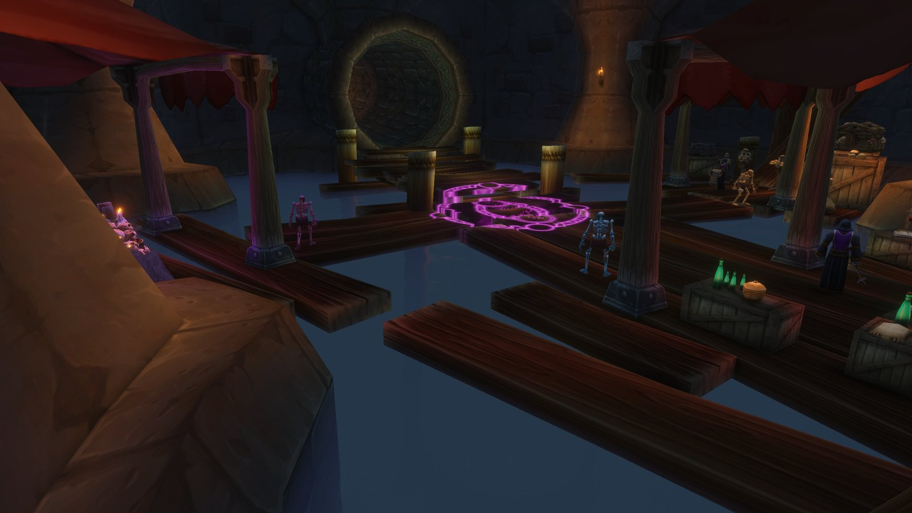

Der Tome of Dalaran auf der Beta von WoW Forever hat einen Zweck. Er beschwört Lyn the Ignored, einen versteckten Boss im Dungeon City of Dalaran. Das Buch beginnt als Black Tome in Shadowfang Keep und verwandelt sich an einem Kristall in Ambermill.

Seit dem Start der Beta tragen Spieler das Buch aus Shadowfang Keep, ohne zu wissen, wofür es gut ist. Der Dungeon City of Dalaran, für Level 28 bis 33, ist seit dem Build vom 8. Oktober auf der Beta. Kurz danach fanden Spieler den Beschwörungskreis.

## Der Black Tome

Spielt [Shadowfang Keep](/de/guides/dungeons/shadowfang-keep/) durch und besiegt den letzten Boss, <a class="wf-wh wf-plain" href="https://www.wowhead.com/forever/npc=4275">Archmage Arugal</a>. Steigt die Treppe hinten in seinem Raum hinauf. Auf einem Tisch voller Alchemiezutaten liegt der <a class="wf-wh wf-q1" href="https://www.wowhead.com/forever/item=276561">Black Tome</a>.

Sein Tooltip schickt euch zum Ambermill Leyline Focus. Das ist ein blauer Kristall im Rathaus hinten in Ambermill, in Silverpine Forest. Er steht neben <a class="wf-wh wf-plain" href="https://www.wowhead.com/forever/npc=2120">Archmage Ataeric</a>, bei /way 63.4 64.3. Benutzt den Black Tome am Kristall, und er wird zum <a class="wf-wh wf-q2" href="https://www.wowhead.com/forever/item=275989">Tome of Dalaran</a>.

## Lyn the Ignored beschwören

Nehmt das Buch mit in die [City of Dalaran](/de/guides/dungeons/city-of-dalaran/). Geht durch die Underbelly und an <a class="wf-wh wf-plain" href="https://www.wowhead.com/forever/npc=247126">Atrexis the Grave Knight</a> vorbei. Vor der Rampe rechts, die zur Arcane Anomaly führt, geht geradeaus weiter und räumt den kleinen Raum dahinter frei.

Dort liegt ein Beschwörungskreis auf dem Boden. Benutzt den Tome of Dalaran am Kreis, und Lyn the Ignored erscheint.

Was Lyn the Ignored fallen lässt und wie der Kampf abläuft, ist noch nicht bekannt. Die anderen Bosse des Dungeons stehen im [Guide zu City of Dalaran](/de/guides/dungeons/city-of-dalaran/).
