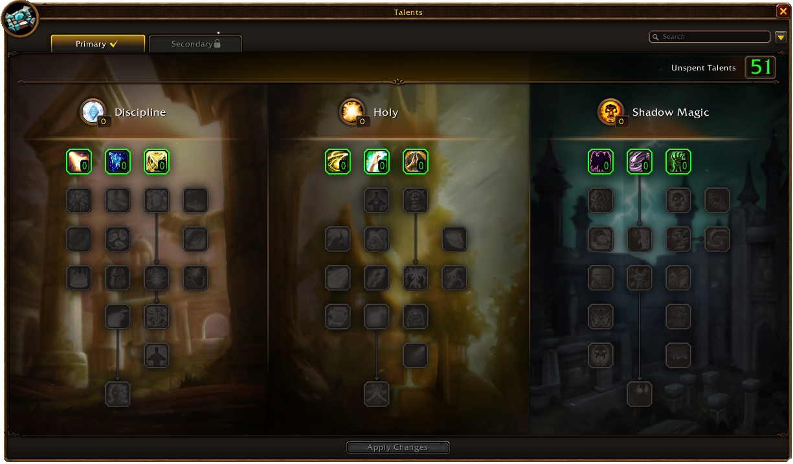
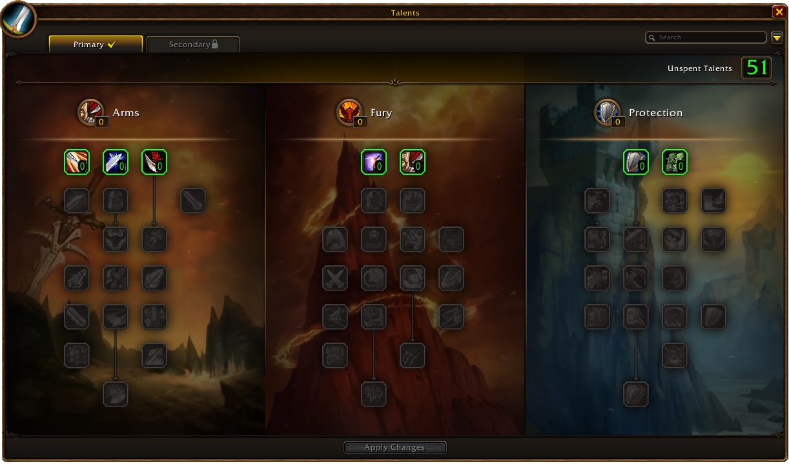

Blizzards zweiter Class Deep Dive zu WoW Forever behandelt Priest und Warrior. Jeder Priest bekommt Fear Ward und Devouring Plague auf Stufe 20, egal welches Volk. Warrior verlieren keine Rage mehr durch ihre eigene Rüstung, und kritische Treffer geben wieder mehr Rage.

Wie im [ersten Deep Dive](/de/news/hunters-get-foxes-and-druids-keep-potions-in-every-form/) bekommen die Talentbäume einen Meilenstein bei 16 Punkten neben denen bei 11, 21 und 31. Dual Specialization wird auf Stufe 40 frei. Alles kann sich in der Beta noch ändern, sagt Blizzard.

## Priest

Fear Ward und Devouring Plague sind keine Volkszauber mehr: Jeder Priest lernt beide auf Stufe 20. Divine Spirit wird auf Stufe 30 zur Grundfähigkeit, und Shadow Word: Death kommt auf Stufe 32. Es trifft sofort, kostet den Priest aber 10 % seiner maximalen Gesundheit, wenn das Ziel überlebt. Renew mehrerer Priests stapelt sich jetzt auf einem Ziel, und Prayer of Healing heilt die Gruppe des Ziels statt der eigenen.

Jedes Volk behält zwei Volkszauber, jetzt überarbeitet. Gnome Priests bekommen erstmals welche: Confounding Flash verwirrt bis zu fünf Gegner für 3 Sekunden, und Contingency Plan gibt einem Verbündeten Schild und Heilung, sobald er unter 35 % Gesundheit fällt. Dwarves bekommen Chastise, Humans Divine Grace und Undead Dark Sacrifice, das Gesundheit gegen Mana tauscht. Starshards trifft viel härter, bekommt aber 30 Sekunden Abklingzeit.

Discipline bekommt Penance bei 21 Punkten und Divine Aegis, einen Schild bei kritischen Heilungen. Holy Precision gibt bis zu 18 % Trefferchance auf Holy-Zauber, Heiler brauchen also keine Trefferausrüstung mehr. Holy bekommt Binding Heal bei 16 Punkten und endet in Prayer of Mending; Lightwell ist weg. Shadowform erlaubt jetzt jeden Zauber, der nicht heilt, und halbiert die Manakosten von Shadow-Zaubern. Shadow Weaving hilft nur noch dem Priest, der es anbringt.

## Warrior

Rage funktioniert anders. Rage aus erlittenem Schaden ignoriert Rüstung und Absorptionsschilde, als würde Rüstung immer 50 % abhalten. Rage aus verursachtem Schaden hängt vom Waffentempo ab, und kritische Treffer geben wieder 75 % mehr Rage, was die Launch-Beta nicht tat. Blizzard räumt außerdem Rage-Fehler in der Beta ein; die Ursache zu finden, kann ein paar Wochen dauern.

Tactical Mastery ist auf Stufe 14 Grundfähigkeit und behält 10 Rage beim Haltungswechsel. Victory Rush kommt auf Stufe 20. Recklessness, Retaliation und Shield Wall teilen keine Abklingzeit mehr, und die letzten beiden sinken auf 15 Minuten. Thunder Clap funktioniert in Defensive Stance und skaliert mit Attack Power, wie Rend.

Arms fasst die vier Waffenspezialisierungen in Weaponmaster zusammen und bekommt Spearing Strike, das sein Ziel vom Reittier holt. Fury bekommt Raging Blows, damit Whirlwind mit beiden Waffen trifft. Bloodthirst heilt nicht mehr, gibt aber 10 % Bewegungstempo. Protection bekommt Vanguard, womit Charge in Defensive Stance geht, dazu Bastion und Focused Rage.

## Meilensteintalente für den Priest

| Talent | Baum | Punkte |
|---|---|---|
| Soul Warding | Discipline | 16 |
| Penance | Discipline | 21 |
| Binding Heal | Holy | 16 |
| Prayer of Mending | Holy | 31 |
| Vampiric Embrace | Shadow | 16 |

## Meilensteintalente für den Warrior

| Talent | Baum | Punkte |
|---|---|---|
| Spearing Strike | Arms | 16 |
| Raging Blows | Fury | 16 |
| Vanguard | Protection | 16 |

Jedes Talent beider Klassen, Rang für Rang, steht im [Talentrechner](/de/talents/) für den [Priest](/de/talents/priest/) und den [Warrior](/de/talents/warrior/).
