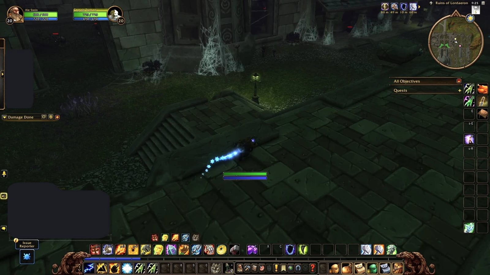
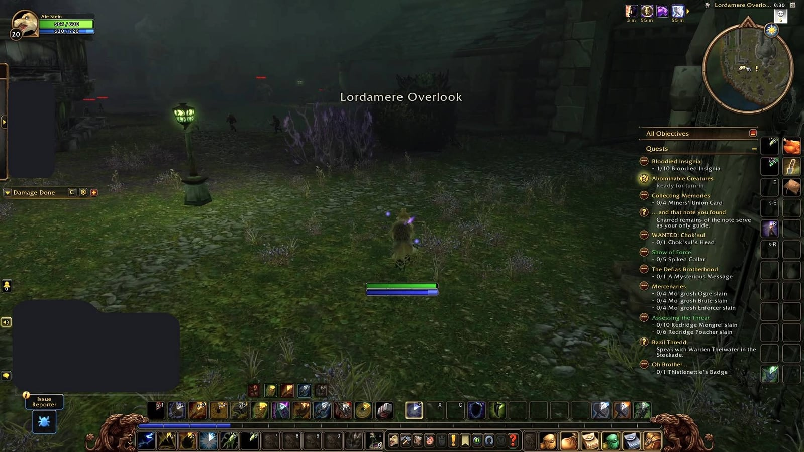

The Ruins of Lordaeron follow a U-shaped route with a few shortcuts, according to a new guide from Warcraft Tavern. A window skips the first spider packs and a broken pillar leads past The Baron. A rare captain only fights the Horde.

## The shortcuts

- **The first window.** Skip the large, web-covered gate after the stairs and jump through the window on the right.
- **The pillar.** Behind The Baron, a broken pillar leans against a low wall. Jump on it and over. Hunters and Warlocks dismiss their pet first.
- **The window to Bjork.** After The Abandoned, leave the courtyard by the narrow staircase, turn right and jump through a large window.

The portal itself is up a flight of stairs left of the front gate, at /way 72.4 11.6. Whoever dies inside comes back in the courtyard.

## Trash to watch

Stone Watchers pose as statues on the upper floors. In the fight they turn to stone again, immune to physical damage and regaining health, so they need magic in that phase. Skeletal Mages put Frost Armor on themselves, and Wailing Banshees curse their target's hit chance. During the waves before The Abandoned, undead can get stuck in the corridors and stall the event.

## A rare captain

The Lordaeron Captain has a small chance to spawn on the west side of the dungeon. He is friendly to the Alliance and cannot be killed by them; for the Horde he is a plain fight.

The full route in ten steps, with every quest and boss, is in the [Ruins of Lordaeron guide](/guides/dungeons/ruins-of-lordaeron/).

## What is not known

What the Lordaeron Captain drops and how often he spawns, the guide does not say.
