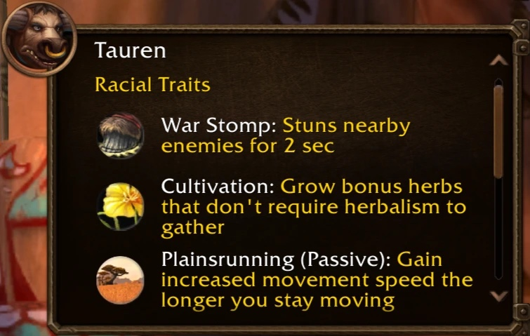

Cultivation, the new Tauren racial, now has a level requirement in World of Warcraft: Forever. Bots on the beta used it at level 5 to copy rare herbs in Winterspring. Since 24 September, Black Lotus can only be grown at level 60.

## What the bots did

Cultivation grows bonus herbs that need no Herbalism to pick. A Tauren copies a herb that is already in the world, and at first that worked at any level. Players on the beta soon saw what that meant.

On 18 September a player shared a screenshot on the classicwow subreddit. A search for Winterspring in the Who window found 18 players, nearly all level 5 Tauren Hunters in Everlook. The post got more than 4,500 upvotes and 1,400 comments.

<figure class="wf-embed wf-embed--reddit" data-wf-reddit="r/classicwow/comments/1wjkbe7/huge_exploit_found_involving_tauren_herb_racial">
  <button type="button" class="wf-embed__play">
    
    
      Huge EXPLOIT found involving Tauren Herb Racial
      Load the post from the classicwow subreddit.
    
  </button>
</figure>

The bots died their way north to copy herbs like Mountain Silversage, Icecap and Black Lotus, Icy Veins writes. On a beta capped at level 20 those herbs are of little use. Gold from the bots was being sold for real money, a player wrote on the official forums on 19 September.

## The new rule

Blizzard changed Cultivation in the [beta build of 24 September](/news/the-beta-returns-with-a-new-build-and-cheap-respecs/). Every herb now has a player level requirement, equal to the Herbalism skill needed to pick it, divided by 5. Herbs that need more than 300 skill can be grown at level 60.

> Cultivation now has a player-level requirement for every Herb. The level required is equal to the Herb's level required to pick it divided by 5. Herbs that require a higher than 300 Herbalism skill to pick can be Cultivated at player level 60.

Peacebloom stays open to a new character. For Black Lotus, at 300 skill, a Tauren has to be level 60.

## The cooldown

Icy Veins also writes that the cooldown went from 23 hours to 1 hour, to make players use the racial more often. The development notes of Blizzard do not mention the cooldown. A player on the forums already saw a 1 hour cooldown on 20 September, before the new build.

Whether the rule stops the bots, is not known. The racials of Forever are in the post about [the new race and class combinations](/news/orc-mages-and-undead-paladins-arrive/).
