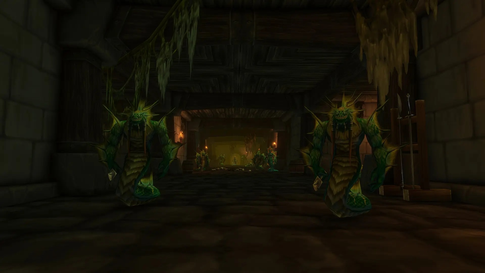

Monsters below the player's level give less experience on the beta of World of Warcraft: Forever than in Classic. The gap grows with the level difference, from a few percent to about a quarter per kill. Blizzard says it is intended.

Monsters of the player's own level give exactly as much as in Classic, a player found by comparing kills. Only lower monsters, green in the game, give less. In that comparison the loss ran from 4 to 20% per kill.

<figure class="wf-embed wf-embed--reddit" data-wf-reddit="r/classicwow/comments/1wxrwxw/green_mobs_give_less_xp_than_vanilla_the_formula">
  <button type="button" class="wf-embed__play">
    
    
      Green mobs give less XP than vanilla, the formula seems to use the mob's level instead of yours
      Load the post from the classicwow subreddit.
    
  </button>
</figure>

A bug report from 25 September gives a sharper example. A level 10 character killing a level 5 monster receives 40 experience in Forever and 54 in Classic Era. The player who posted the comparison suspects the formula now uses the level of the monster instead of the level of the player. That is not confirmed.

## Not a bug, says Blizzard

Aidan "Zirene" Moon, Senior Game Designer of WoW Forever, answered the bug report on 28 September, in a bug tracker the community runs on GitHub.

> This is Not A Bug.
>
> This is an intended part of the game now that there are various exp buffs in the game (like eating food).

The buffs he means are new in Forever. Food can raise the experience a player earns, and resting at a campfire builds rested experience, as described in the [camping guide](/guides/camping/). The lower experience from green monsters is meant to balance those bonuses.

## Dungeons were cut first

It is not the first cut to experience on the beta. Monsters in dungeons already gave less, so that a [first run pays off and repeat runs do not](/news/wow-forever-dungeon-experience-changes/). Since the level 30 build, [dungeon quests give 50% less bonus experience](/news/dungeon-quests-give-50-percent-less-bonus-experience/) as well.

Blizzard wants players to level in the open world rather than in dungeons. The player who measured the green monsters suspects the new formula hits monsters in dungeons a second time. Whether the values change before the launch on 4 November, Blizzard does not say.
