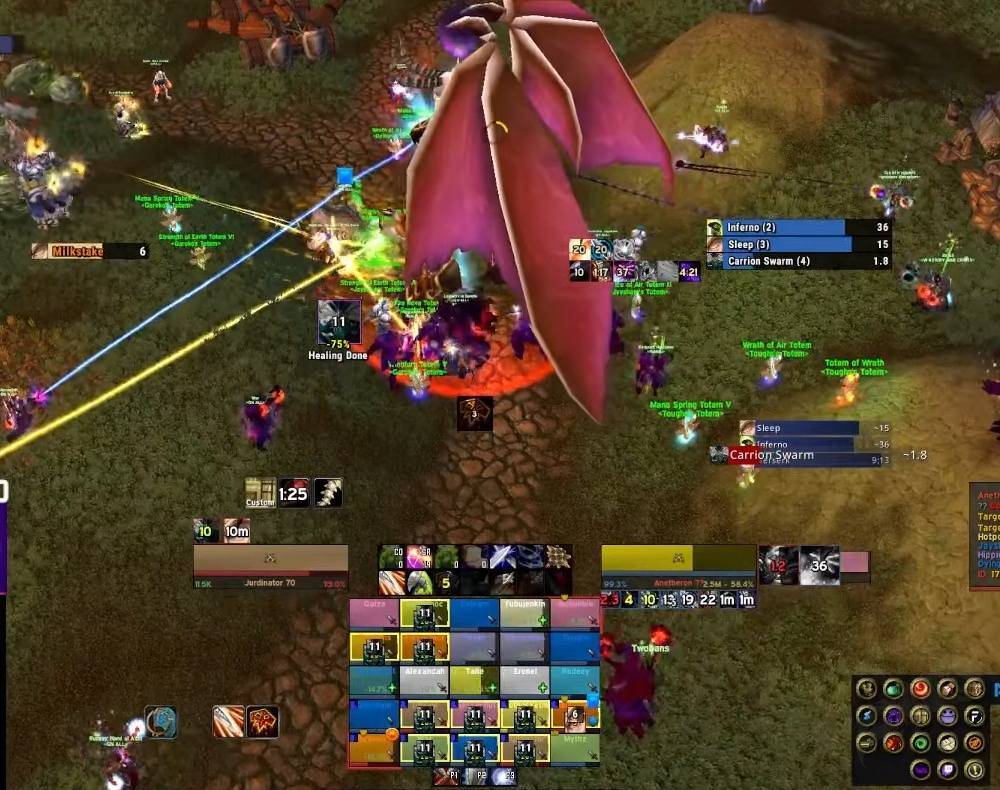
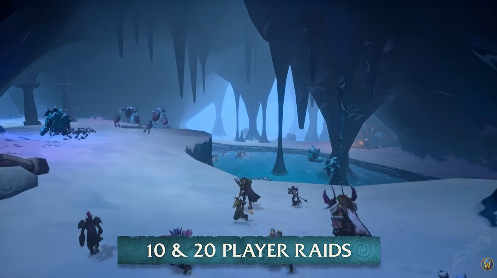

Buffs such as <a class="wf-wh wf-spell" href="https://www.wowhead.com/forever/spell=25289">Battle Shout</a> only reach your own group in World of Warcraft: Forever, as in Classic and TBC. A raid of 20 that wants every buff in every group fills up to 17 places that way. With raid-wide buffs, 12 are enough.

## Why party buffs shape a raid

In Classic and TBC, a buff such as Battle Shout, <a class="wf-wh wf-spell" href="https://www.wowhead.com/forever/spell=17007">Leader of the Pack</a> or <a class="wf-wh wf-spell" href="https://www.wowhead.com/forever/spell=10614">Windfury Totem</a> only works for the five players in the group of whoever brings it. From Wrath of the Lich King onwards, those buffs reach the whole raid. Forever keeps the old rule.

A melee group in TBC therefore wanted a Feral Druid, a Warrior, one or two Beast Mastery Hunters or Retribution Paladins and an Enhancement Shaman. The Shaman brought Windfury Totem or <a class="wf-wh wf-spell" href="https://www.wowhead.com/forever/spell=25359">Grace of Air Totem</a>. The Hunter and the Paladin brought Ferocious Inspiration and Improved Sanctity Aura, two talents from TBC.

With two or more melee groups, a raid needed at least two of each. That kept raids from filling up with the single strongest class. A weaker spec still had a place, because it brought a buff that nobody else had.

The downside showed in TBC Anniversary. Windfury Totem is so strong that a Warrior plays noticeably differently without it, with less damage and fewer actions per minute. Raids also start to look alike, and many raids in TBC took five Shamans.

For pickup groups that is a problem. A raid leader in trade chat can spend a long time looking for that one class or spec. That time then comes off the raid itself.

## The risk of class stacking

Buffs for the whole raid have a downside too, and it is called class stacking. Once every buff is covered, a raid fills the remaining places with the spec that deals the most damage. In Wrath of the Lich King, top guilds brought as many Unholy Death Knights as they could.

A raid then needs only one Shaman. The weaker specs lose their place, because one player already covers their buff.

## What it means for a raid of 20

Forever has raids for 10, 20 and 40 players. On 9 December the Barrow Deeps for 10 players and Hyjal Summit for 20 open, together with Onyxia's Lair for 40. Two of the three raids at launch are therefore for 10 or 20 players.

In a raid of 20 with party buffs, a composition that covers every buff in every group claims up to 17 of the 20 places. With buffs for the whole raid, 12 places are enough. The table shows how many of each spec such a raid needs.

| Spec | Party buffs | Raid buffs |
| --- | --- | --- |
| Protection Warrior | 1 | 1 |
| Protection Paladin | 1 | 1 |
| Fury Warrior | 1 | 0 |
| Retribution Paladin | 1 | 1 |
| Feral Druid | 2 | 1 |
| Enhancement Shaman | 2 | 1 |
| Arcane Mage | 1 | 1 |
| Affliction Warlock | 1 | 1 |
| Balance Druid | 1 | 0 |
| Elemental Shaman | 1 | 0 |
| Holy Paladin | 1 | 1 |
| Restoration Druid | 1 | 1 |
| Restoration Shaman | 1 | 1 |
| Discipline Priest | 1 | 1 |
| Marksmanship Hunter | 1 | 1 |
| **Total** | **17** | **12** |

Class stacking mostly matters to guilds that compete for rankings on Warcraft Logs. It pays off above all against bosses that are pure damage checks. The limits of party buffs reach every raid, including a pickup group from trade chat.

Blizzard is looking into it. In the [second developer podcast](/news/hybrids-deal-about-5-percent-less-damage/), the designers said that buffs such as Leader of the Pack and Moonkin Aura might work for the whole raid. A raid would then need fewer Druids and Shamans. It was only an idea. Whether the buffs change before the launch on 4 November, Blizzard has not said.
