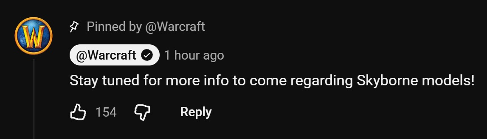

Blizzard promete más información sobre los modelos de los Skyborne. Lo dice en un comentario fijado bajo un nuevo vídeo sobre la raza en YouTube. Los Skyborne son la única raza de World of Warcraft: Forever sin modelos en definición estándar.

El comentario dice: «¡Atentos, llegará más información sobre los modelos de los Skyborne!». Blizzard no dice qué información será ni cuándo llegará.

Las demás razas de Forever tienen dos versiones de su modelo. Con la casilla High-Definition Models desactivada, los jugadores ven los modelos del juego original. Los Skyborne son nuevos y no tienen esa versión, igual que sus formas de Druid. Sus retratos también se ven igual en los dos modos, como muestran los [nuevos retratos SD y HD](/es/news/character-creation-now-has-sd-and-hd-portraits/).

## Qué muestra el vídeo

El vídeo se publicó el 5 de octubre a las 20.11, hora belga, y dura 6 minutos. Cuenta de dónde vienen los Skyborne. Son altos elfos que huyeron de Eldre'Thalas hace casi 10.000 años y se llaman a sí mismos los Shen'dorei. El Spirit of the Four Winds elevó su refugio hasta Skywall.

<figure class="wf-embed" data-wf-video="GmCSew3WWQo">
  <button type="button" class="wf-embed__play">
    
    
      Skyborne Lore &amp; Abilities
      Reproduce el vídeo. World of Warcraft en YouTube, 6 minutos.
    
  </button>
</figure>

Ahora los espíritus del viento han desaparecido. Los Windshapers quieren traerlos de vuelta, mientras que la High Order quiere dominar la magia de Skywall por sí misma. La facción decide una clase: solo los Skyborne de la Alianza pueden ser Mage, solo los de la Horda pueden ser Shaman. Warrior, Hunter, Rogue y Druid están abiertos a ambos, con nuevas formas de Druid.

El vídeo también menciona algunos detalles que el [primer resumen](/es/news/the-skyborne-choose-their-side/) no tenía. Myriaal Mistwake enseña a cada Skyborne Walk on Air con un salto desde una torre. La raza recibe su propia montura, el Galestrider, una grulla. Unos barcos voladores, los Skycutters, llevan a los Skyborne de Skywall a Azeroth.
