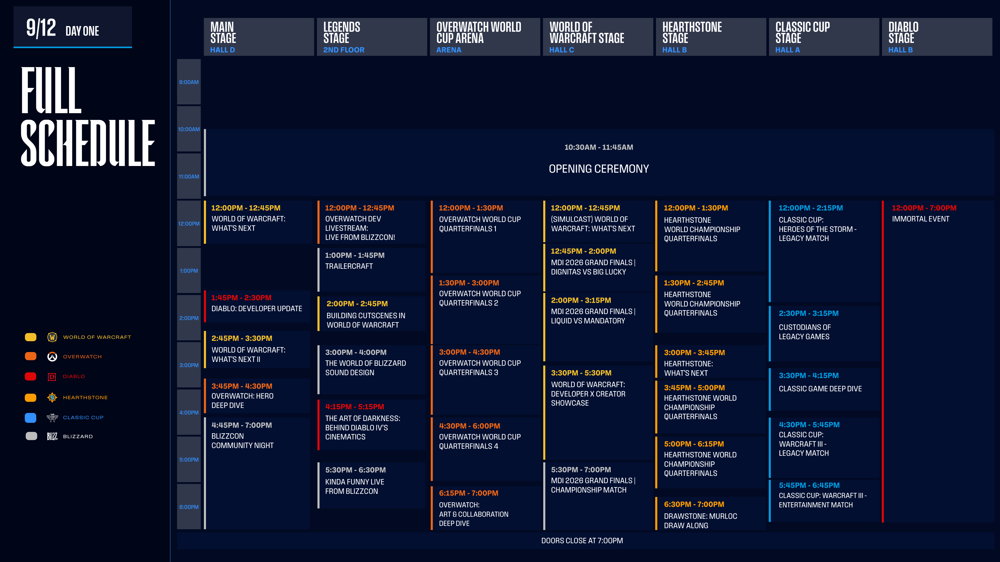
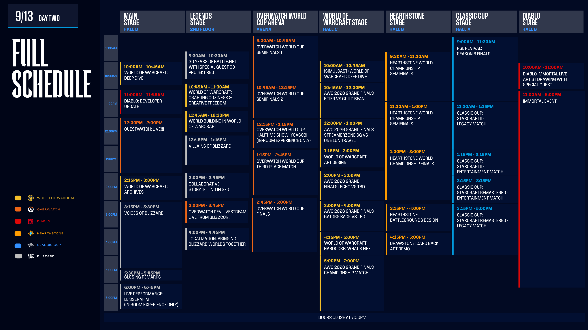
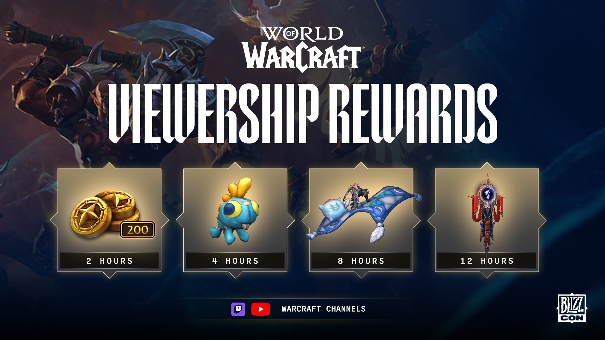

La BlizzCon 2026 se celebra el 12 y el 13 de septiembre en el Anaheim Convention Center. Para World of Warcraft hay dos paneles What's Next, un Deep Dive y un panel sobre Hardcore. Ver las retransmisiones da recompensas en el juego, según Blizzard.

## Retransmisiones

Blizzard retransmite gratis parte del programa en los canales de Warcraft en Twitch y YouTube. Eso incluye la Opening Ceremony, los paneles principales y las finales de esports.

Las actuaciones musicales y algunos otros segmentos solo se ven en la sala, según la guía de visualización de blizzcon.com. La actuación de Le Sserafim al final del segundo día es una de ellas.

## Primer día, 12 de septiembre

La Opening Ceremony empieza a las 19:30, hora de Bélgica. World of Warcraft: What's Next sigue a las 21:00 y What's Next II a las 23:45. Building Cutscenes in World of Warcraft empieza a las 23:00, el Developers x Creators Showcase a las 00:30 y la BlizzCon Community Night a la 01:45.

*El programa del primer día, en hora del Pacífico. Blizzard advierte de que los horarios pueden cambiar.*

## Segundo día, 13 de septiembre

El segundo día empieza a las 19:00, hora de Bélgica, con World of Warcraft: Deep Dive. Crafting Coziness and Creative Freedom sigue a las 19:45, World Building a las 20:45 y Art Design a las 22:15. El Design Deep Dive empieza a las 23:45 y World of Warcraft Hardcore: What's Next a la 01:15.

## Recompensas por ver

Las retransmisiones de Warcraft que cumplen los requisitos en Twitch y en el canal oficial de World of Warcraft en YouTube desbloquean recompensas a las 2, 4, 8 y 12 horas de visualización. Los requisitos varían según el juego, la retransmisión y la plataforma, según Blizzard. Quienes asistan en persona deben vincular su BlizzCon Pass a una cuenta de Battle.net antes del 18 de septiembre o perderán las recompensas.

El World of Warcraft BlizzCon Bundle contiene la montura voladora Rabbit'ath, el conjunto Garb of the Dawnfire Phoenix y el Perch of the Dawnfire Phoenix como decoración para el hogar. Está a la venta en la Battle.net Shop hasta el 28 de septiembre.

## Esports

Las Grand Finals del MDI 2026 se juegan el primer día, con el partido por el título a las 02:30, hora de Bélgica. Las Grand Finals de la AWC 2026 siguen el segundo día, con la final a las 02:00. Las dos competiciones comparten una bolsa de premios de 600.000 dólares.
