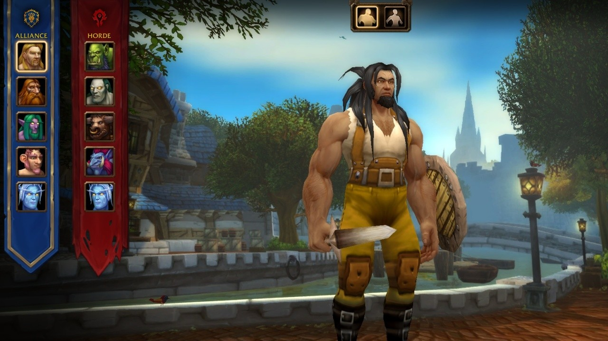
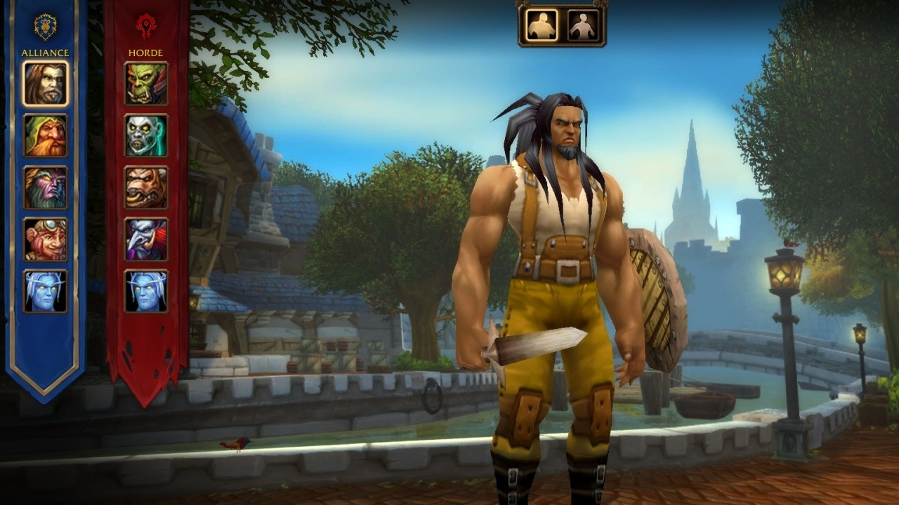

La creación de personaje de World of Warcraft: Forever ya tiene retratos SD y HD. Con los modelos de alta definición desactivados, las razas vuelven a mostrar los retratos antiguos. Hasta ahora siempre aparecían los retratos modernos de retail. Un build reciente de la beta recuperó los antiguos.

El interruptor es la casilla High-Definition Models, abajo a la derecha de la pantalla. Con la casilla marcada, las razas llevan los retratos del World of Warcraft actual. Sin ella, recuperan los retratos del juego original. El propio personaje también pasa al modelo antiguo. Solo los retratos de los Skyborne, la nueva raza, se ven igual en los dos casos.

No se sabe qué build trajo el cambio. Los jugadores habían pedido los retratos antiguos. El mismo interruptor funciona también [en la barbershop](/es/news/barbershops-in-wow-forever/), donde un jugador con los modelos antiguos edita su personaje en esos modelos.

A los jugadores que eligen las opciones clásicas les importa mucho que se vean exactamente como antes. Creadores de contenido como Xaryu piden a Blizzard un interruptor que devuelva toda la interfaz a su forma antigua. Blizzard no ha dicho si ese interruptor llegará.
