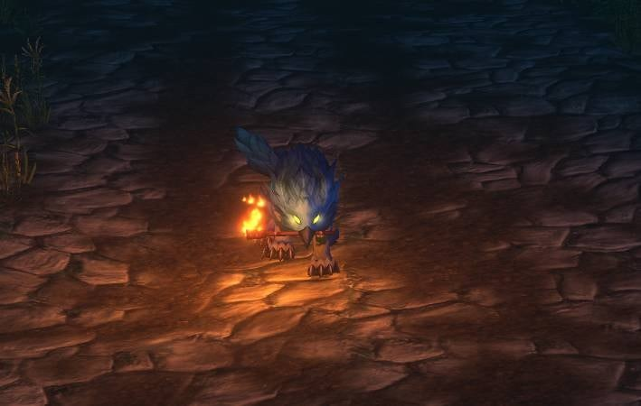
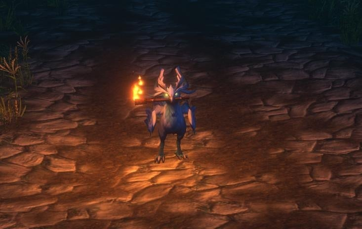

Los Druid de la beta de WoW Forever ya pueden usar la <a class="wf-wh wf-q2" href="https://www.wowhead.com/forever/item=280612">Night Watchman's Torch</a> en sus formas animales. La forma sujeta la antorcha con la boca. Hasta la última actualización de la beta, la antorcha no funcionaba con una forma activa, y los jugadores pedían este cambio.

La antorcha sale de un [guardia muerto en Duskwood](/es/news/a-dead-guard-in-duskwood-hands-out-a-torch/) que solo aparece de noche. Ilumina las zonas oscuras durante 5 minutos, y la nueva iluminación de Forever deja algunas totalmente negras.

Un jugador publicó la idea en Reddit hacia el 3 de octubre, y se hizo viral. El 9 de octubre el mismo jugador contó que Blizzard la había hecho realidad. Esa publicación superó los 9.600 votos en un día.

<figure class="wf-embed wf-embed--reddit" data-wf-reddit="r/classicwow/comments/1x1eu2f/6_days_ago_i_posted_a_suggestion_that_went_viral">
  <button type="button" class="wf-embed__play">
    
    
      6 days ago I posted a suggestion that went viral
      Cargar la publicación del subreddit classicwow.
    
  </button>
</figure>

Los jugadores mostraron la antorcha en Cat Form y en Travel Form. Funciona para los Druid Skyborne y también para los Druid Night Elf y Tauren, según jugadores de la beta.

<figure class="wf-embed wf-embed--reddit" data-wf-reddit="r/classicwow/comments/1x1bi5i/druid_forms_carry_the_torch_in_their_mouth_now">
  <button type="button" class="wf-embed__play">
    
    
      Druid forms carry the torch in their mouth now
      Cargar la publicación del subreddit classicwow.
    
  </button>
</figure>

Dónde está el guardia y cuándo aparece, está en la [guía de la Night Watchman's Torch](/es/guides/night-watchmans-torch/).
