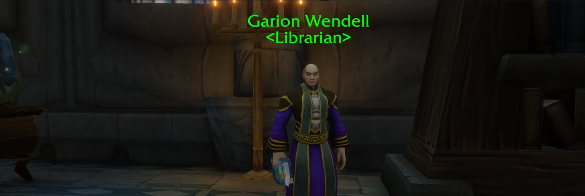

Una tercera recompensa por los libros de biblioteca se abre a nivel 30 en la beta de World of Warcraft: Forever. Por 25 libros, los jugadores eligen un arco, un escudo o una mano izquierda de nivel de objeto 45. Solo el arco se puede llevar enseguida.

Los libros están repartidos por todo Azeroth y se entregan al bibliotecario de cada facción, sea cual sea la clase del jugador. Las recompensas llegan en tres pasos, y la misión de 25 libros pide nivel 30.

| Libros | Misión | Recompensas, elige una |
|---|---|---|
| **10** | <a href="https://www.wowhead.com/forever/quest=78150">Friend of the Library</a> | <a class="wf-wh wf-q2" href="https://www.wowhead.com/forever/item=277203">Scholarly Pendant</a>, <a class="wf-wh wf-q2" href="https://www.wowhead.com/forever/item=277204">Erudite's Amulet</a> |
| **20** | <a href="https://www.wowhead.com/forever/quest=79536">Greater Friend of the Library</a> | <a class="wf-wh wf-q3" href="https://www.wowhead.com/forever/item=281634">Field Researcher's Loop</a>, <a class="wf-wh wf-q3" href="https://www.wowhead.com/forever/item=281635">Philanthropist's Ring</a> |
| **25** | <a href="https://www.wowhead.com/forever/quest=82208">Greater Friend of the Library</a> | <a class="wf-wh wf-q3" href="https://www.wowhead.com/forever/item=277254">Truthseeker's Bow</a>, <a class="wf-wh wf-q3" href="https://www.wowhead.com/forever/item=277258">Crest of Elucidation</a>, <a class="wf-wh wf-q3" href="https://www.wowhead.com/forever/item=277260">Researcher's Night Light</a> |

Las misiones de 20 y 25 libros llevan el mismo nombre. Las recompensas anteriores ya cambiaron más de una vez en la beta: los [collares por 10 libros](/es/news/necklaces-for-10-books-drop-to-green-quality/) bajaron a calidad verde, y el [anillo por 20 libros](/es/news/field-researchers-loop-now-fits-every-class/) perdió su restricción de clase.

## Los tres objetos nuevos

Los tres son azules, se ligan al recogerlos y tienen nivel de objeto 45.

| Objeto | Tipo | Stats | Requiere |
|---|---|---|---|
| <a class="wf-wh wf-q3" href="https://www.wowhead.com/forever/item=277254">Truthseeker's Bow</a> | Arco, 23,75 de daño por segundo | 7 Agility, 3 Stamina | Ningún nivel |
| <a class="wf-wh wf-q3" href="https://www.wowhead.com/forever/item=277258">Crest of Elucidation</a> | Escudo, 1580 de armadura | 12 Spirit, hasta 11 de sanación y 4 de daño con hechizos | Nivel 40 |
| <a class="wf-wh wf-q3" href="https://www.wowhead.com/forever/item=277260">Researcher's Night Light</a> | Mano izquierda | 12 Stamina, hasta 7 de daño con hechizos de Fire | Nivel 40 |

La descripción del arco no indica ningún nivel requerido, mientras que el escudo y la mano izquierda piden nivel 40. No se sabe si el arco también debería estar limitado al nivel 40. Por ahora, un Hunter de nivel 30 puede usarlo enseguida.

## Dónde entregar los libros

| Facción | Bibliotecario | Dónde |
|---|---|---|
| **Alianza** | <a class="wf-wh wf-plain" href="https://www.wowhead.com/forever/npc=211033">Garion Wendell</a> | Mage Tower, Stormwind City, /way 49.0 86.4 |
| **Horda** | <a class="wf-wh wf-plain" href="https://www.wowhead.com/forever/npc=211022">Owen Thadd</a> | The Magic Quarter, Undercity, /way 74.0 32.4 |

