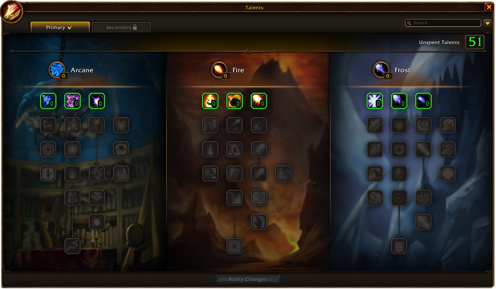
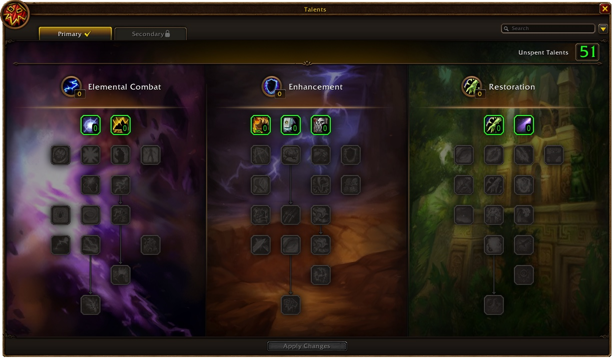

El nuevo análisis de clases de Blizzard para WoW Forever trata del Mage y el Shaman. Cada Mage aprende Frostfire Bolt a nivel 40, un hechizo que cuenta como Fire y como Frost. Los tótems del Shaman duran 5 minutos en lugar de 2, y los weapon imbues una hora.

Como en los análisis del [Hunter y el Druid](/es/news/hunters-get-foxes-and-druids-keep-potions-in-every-form/) y del [Priest y el Warrior](/es/news/warriors-keep-rage-through-armor-and-every-priest-gets-fear-ward/), los talentos empiezan a nivel 10, con hitos a 11, 16, 21 y 31 puntos. Los talentos, también los Legacy, se cambian con un instructor de clase en una capital. Dual Specialization se desbloquea a nivel 40. Todo puede cambiar aún durante la beta, dice Blizzard.

## Mage

Frostfire Bolt tiene un lanzamiento de 3 segundos y golpea como Fireball. Después deja daño en el tiempo y una ralentización en el objetivo. Usa el mayor daño de hechizos Fire o Frost del Mage, y la menor de las dos resistencias del objetivo. La mayoría de los talentos de Fire o Frost también lo refuerzan. Con Ignite e Ice Shards, un Frostfire Bolt crítico hace un 280 % de daño, calcula Blizzard.

Los Mages reciben además su propia profesión menor: Comprehension. Con Comprehend Scroll, en la pestaña General del libro de hechizos, leen pergaminos que sueltan las criaturas del mundo. Qué dan esos pergaminos, lo tienen que descubrir los jugadores. Cone of Cold dura menos, contra los granjeros de oro y los boosters que arrastran grandes grupos de criaturas. Mage Armor da más Mana con Spirit.

Arcane recibe Arcane Blast a 11 puntos. Aumenta el daño de todos los demás hechizos del Mage, y su propio coste de Mana, hasta 4 veces durante 8 segundos. Missile Barrage a 16 puntos puede hacer los siguientes Arcane Missiles el doble de rápidos y gratis. Arcane Mind da ahora Intellect en lugar de Mana máximo, y Magic Attunement pasa a ser básico.

Fire recibe Heating Up. Los críticos de Fireball, Frostfire Bolt, Fire Blast y Scorch reducen un 25 % el lanzamiento del siguiente Pyroblast, hasta 3 veces. Ignite es ahora un perjuicio propio de cada Mage, en lugar de uno compartido. Frost recibe Ice Lance a 11 puntos, con un 300 % más de daño contra objetivos congelados, y Fingers of Frost, que hace que un objetivo cuente como congelado. Ice Block pasa a 16 puntos, Cold Snap a 21 con un tiempo de reutilización de 10 minutos.

Improved Blizzard ralentiza ahora un 40 % en lugar de un 65 %. También eso va contra el farmeo de instancias con daño de área. Arcane Concentration e Impact se activan menos con hechizos de rango bajo. Los granjeros de oro pescaban procs gratis con hechizos baratos, dice Blizzard. La misma penalización vale para talentos parecidos de cada clase.

## Shaman

Los tótems tienen un tiempo de reutilización global de 1 segundo en lugar de 1,5. Los tótems con un beneficio duradero se quedan 5 minutos en lugar de 2, y los tótems de resistencia cubren toda la banda. Una nueva ventana muestra qué tótems están activos y cuánto les queda; con un clic derecho se quita uno. Los weapon imbues duran 60 minutos en lugar de 5 y se combinan con Sharpening Stones, Weightstones y Wizard Oil.

Call of the Elements, a nivel 20, desbloquea la barra de tótems. Un lanzamiento de 3 segundos coloca un juego de cuatro tótems, uno por elemento. Call of the Spirits a nivel 30 y Call of the Ancestors a nivel 40 añaden un segundo y un tercer juego. Totemic Recall destruye todos los tótems y devuelve el 25 % de su Mana. En la beta ese Mana aún no vuelve, un fallo conocido. Totemic Projection, a nivel 22, teletransporta todos los tótems hasta 30 metros.

Fire Nova Totem desaparece. El nuevo hechizo Fire Nova estalla en el Fire Totem ya colocado, tantas veces como quiera el Shaman. Windfury Totem y Flametongue Totem pasan a ser beneficios de grupo en lugar de encantamientos de arma, y no se combinan. Tranquil Air Totem desaparece. Lightning Bolt se lanza en 2,5 segundos desde el rango 4, Chain Lightning en 2 segundos.

Elemental Combat pierde Elemental Mastery. Con ese talento, los Shamans Elemental habrían sido demasiado fuertes en PvP al subir su daño en PvE, explica Blizzard. En su lugar, el árbol termina en Lava Burst a 31 puntos, con un 20 % más de daño contra un objetivo con Flame Shock. Lightning Overload puede lanzar gratis un segundo Lightning Bolt o Chain Lightning, con la mitad de daño.

Enhancement recibe Stormstrike a 16 puntos en lugar de 31, con 8 segundos de reutilización. Ahora refuerza un 20 % el siguiente Lightning Bolt, Chain Lightning o Earth Shock. Maelstrom Weapon puede hacer instantáneo Lightning Bolt. Rage of the Farseer, a 31 puntos, da un 30 % de velocidad de ataque durante 25 segundos, una versión personal de Bloodlust. Restoration recibe Water Shield a 11 puntos y termina en Riptide.

## Talentos de hito del Mage

| Talento | Árbol | Puntos |
|---|---|---|
| Arcane Blast | Arcane | 11 |
| Missile Barrage | Arcane | 16 |
| Ice Lance | Frost | 11 |
| Ice Block | Frost | 16 |
| Cold Snap | Frost | 21 |

## Talentos de hito del Shaman

| Talento | Árbol | Puntos |
|---|---|---|
| Call of Thunder | Elemental Combat | 16 |
| Earthbound | Elemental Combat | 21 |
| Lava Burst | Elemental Combat | 31 |
| Shamanistic Focus | Enhancement | 11 |
| Stormstrike | Enhancement | 16 |
| Spirit Weapons | Enhancement | 21 |
| Rage of the Farseer | Enhancement | 31 |
| Water Shield | Restoration | 11 |
| Mana Tide Totem | Restoration | 16 |
| Riptide | Restoration | 31 |

Qué talentos tiene Fire a 11, 16, 21 y 31 puntos, Blizzard no lo dice. Cada talento de ambas clases, rango a rango, está en la [calculadora de talentos](/es/talents/) para el [Mage](/es/talents/mage/) y el [Shaman](/es/talents/shaman/).
