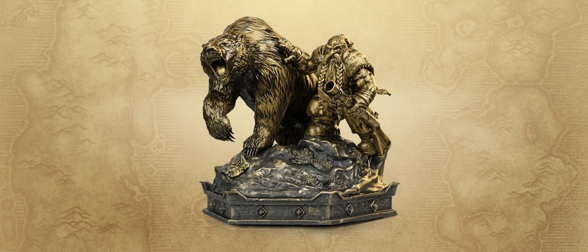
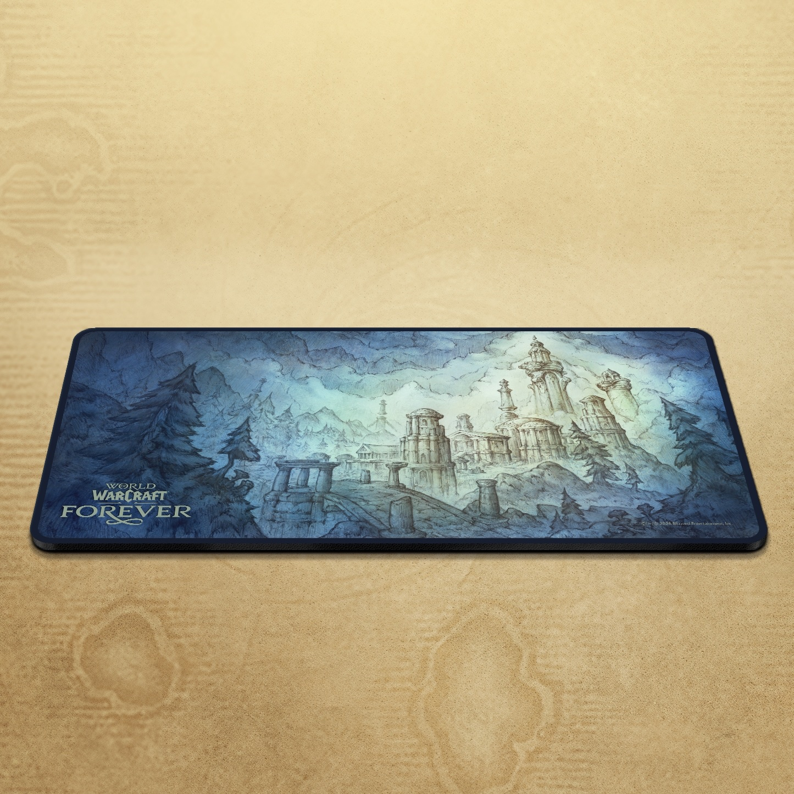
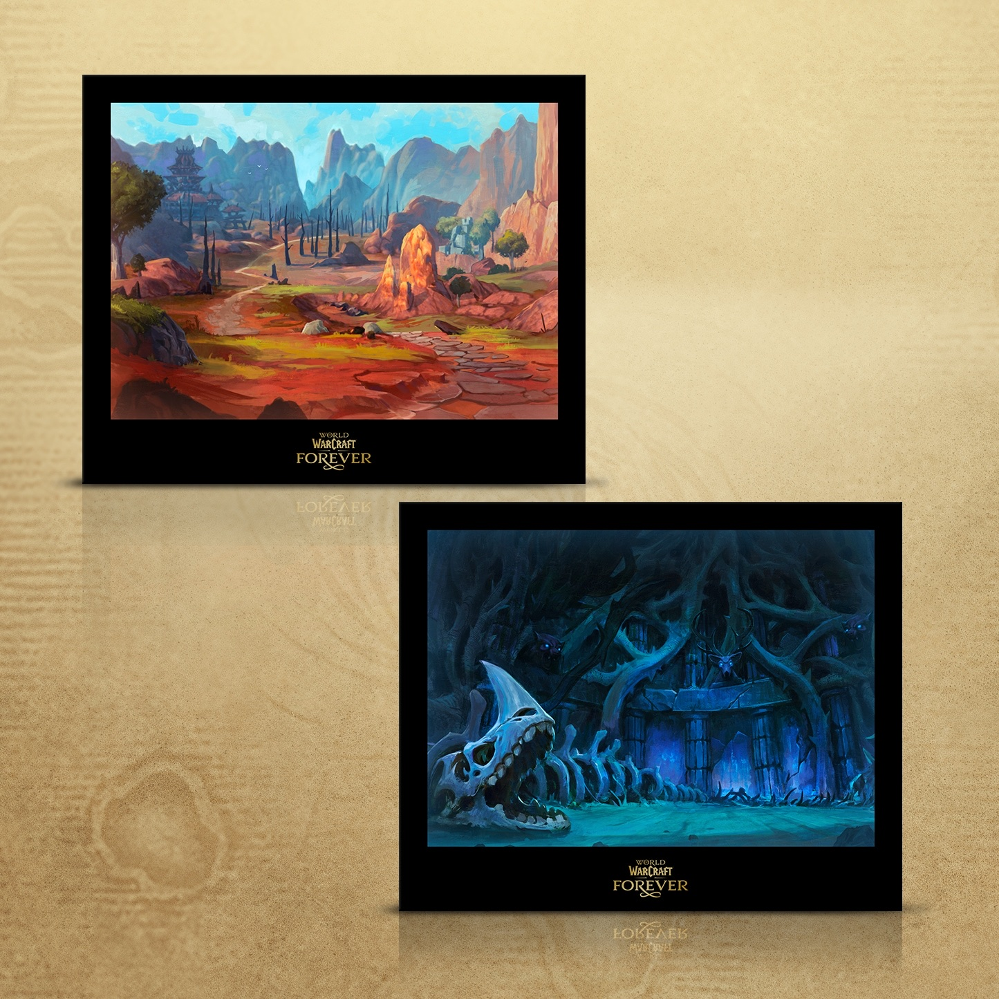
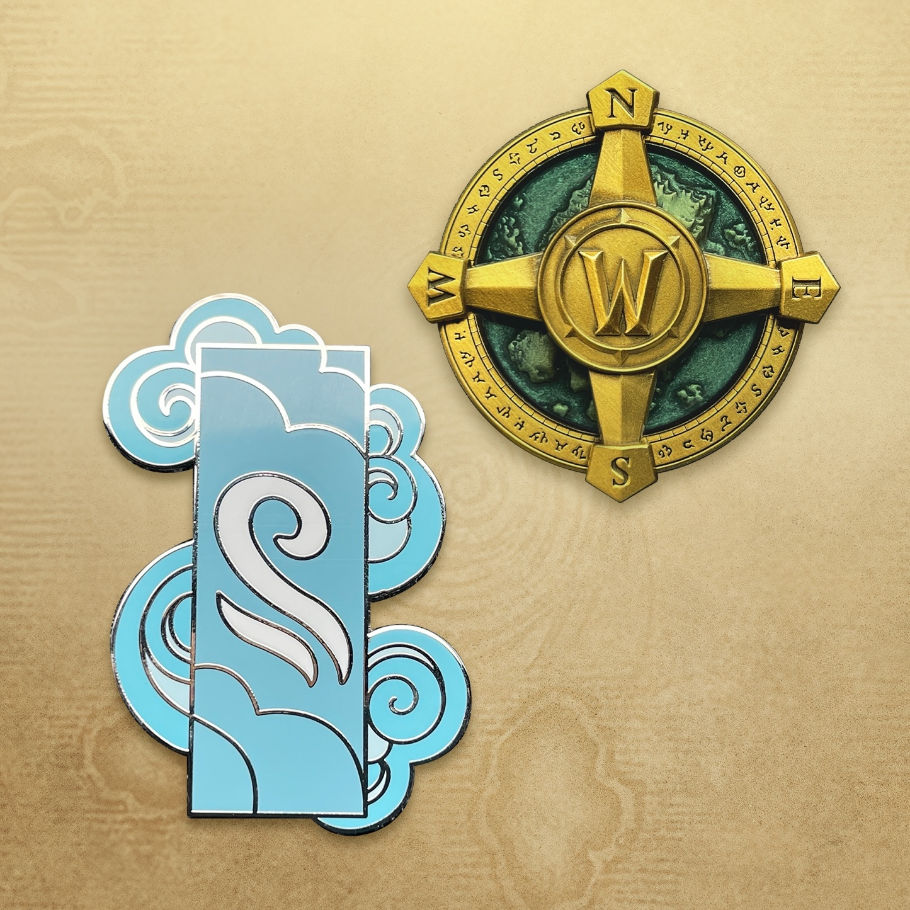
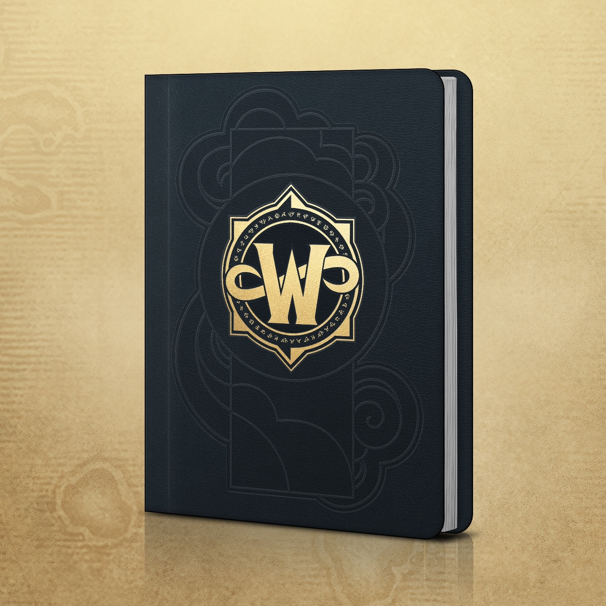
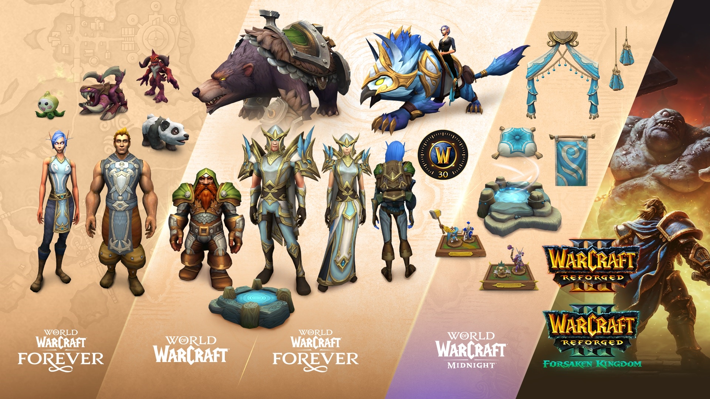

Blizzard pone a la venta más ejemplares de la Collector's Edition de World of Warcraft: Forever. La versión en inglés se puede pedir de nuevo desde el 24 de septiembre en Europa y otras cuatro regiones. Los ejemplares de este lote llegan en febrero de 2027.

El nuevo lote sale a la venta en Norteamérica, el Reino Unido, Europa, Australia y Nueva Zelanda, escribe Blizzard en una actualización de su anuncio. El momento exacto depende de cada tienda. En Australia y Nueva Zelanda la caja se vende en JB Hi-Fi y EB Games.

## Uno por hogar, entrega en febrero

La Blizzard Gear Store europea vende la Collector's Edition en reserva por 150 euros. Hay un límite estricto de un ejemplar por hogar, dice Blizzard.

Cuándo llega la caja depende del día del pedido, según la Gear Store. Los pedidos hechos antes del 24 de septiembre se envían en noviembre de 2026. Los pedidos desde el 24 de septiembre, en febrero de 2027. Forever sale el 4 de noviembre de 2026 a las 15.00 PST, las 00.00 en Bélgica del 5 de noviembre.

## Qué trae la caja

El contenido no ha cambiado desde el [anuncio](/es/news/world-of-warcraft-forever-announced-classic-plus/). La pieza central es una estatua del Dwarf y su oso de la cinemática, de 13 pulgadas, unos 33 centímetros.

Además trae una alfombrilla de Zephras Isle, dos láminas, dos pins de colección y un diario de viaje. Las láminas muestran un paisaje de roca roja y una guarida oscura tras el cráneo de un dragón. Un pin es una brújula con la W de Warcraft y el otro una nube azul pálido.

## El código digital

La caja incluye también un código para la Warcraft Forever Collection, que es el Skyborne Epic Pack más Warcraft III: Reforged y Warcraft III Reforged: Forsaken Kingdom. Desbloquea los Skyborne y Zephras Isle, el acceso a la beta, 30 días de Game Time y cosméticos para Forever y el WoW moderno. La lista completa por edición está en [la página de Forever](/es/forever/).

Las instrucciones del código de la beta llegan por correo, dice Blizzard. La beta dura hasta el 21 de octubre. Cuándo recibe ese correo quien compra del lote de febrero, Blizzard no lo dice.

## Jugar antes de que llegue la caja

Quien quiera antes las recompensas digitales puede comprar la Warcraft Forever Collection u otra edición en la Battle.net Shop. Algunas de esas compras dan un crédito en el saldo de Battle.net por el importe pagado, cuando el código de la Collector's Edition se canjea antes del 31 de diciembre de 2027. No todos los productos ni todas las mejoras cuentan, y a veces Customer Support tiene que aplicar el crédito, según un [artículo de soporte de Blizzard](https://support.blizzard.com/help/article/36942).

Las compras que cuentan incluyen también códigos de lanzamiento Invite-A-Friend. Llegan por correo desde el 20 de octubre y dejan jugar a un amigo del 4 al 11 de noviembre. Las compras como regalo no los incluyen.
