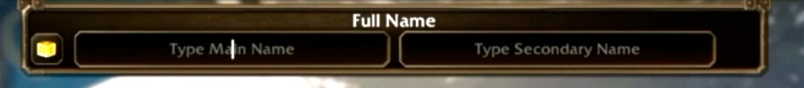

Blizzard retira el acceso a la beta a los jugadores que eligen un nombre de personaje ofensivo. El agente de soporte Vrakthris lo confirmó el 19 de septiembre en el foro de Customer Support. World of Warcraft: Forever da dos nombres a cada personaje, y eso dobla el espacio para la creatividad.

## Dos nombres por personaje

En Forever un personaje lleva un Full Name: un nombre principal y uno secundario, ambos escritos al crearlo. La combinación es única por región, porque Forever no tiene realms.

"La opción de nombre y apellido abre mucho espacio para... la creatividad, pero nuestras normas siguen en pie", escribe Vrakthris. Los nombres tienen que respetar la política de nombres, y el equipo de desarrollo de Forever va resolviendo los que le llegan.

## Qué pasa con la cuenta

Varios jugadores contaron lo mismo en el foro: el juego rechaza el inicio de sesión con el aviso de que la cuenta está suspendida de la beta. La página de apelación decía que no se había tomado ninguna medida contra su cuenta, así que allí no había nada que recurrir.

Ese correo sí existe, escribe Vrakthris, y lleva dentro el nombre de personaje que lo causó. Aconseja mirar en la carpeta de correo no deseado.

> Character names must adhere to our naming policies, including in Beta. If you violate those policies that may result in the removal of beta access.

## Quién lo aplica

La beta la llevan sobre todo QA y el equipo de desarrollo, escribe Vrakthris, así que allí la aplicación de las normas recae en ellos y no en el soporte habitual. Quien crea que hubo un error todavía puede presentar una apelación.

Añade que ninguno de los ejemplos que ha visto hasta ahora le parece apropiado, pero que la decisión no es suya. Si en el lanzamiento los nombres se resolverán con un cambio de nombre forzado en vez de con una retirada, Blizzard no lo dice.

## Por qué sale ahora

La beta abrió el 17 de septiembre y es una de las pruebas más grandes que Blizzard ha hecho nunca. El sistema de nombres es nuevo, el filtro nunca se construyó para un segundo nombre, y el hilo del foro llegó en dos días a 62 mensajes y más de 3.000 visitas.
