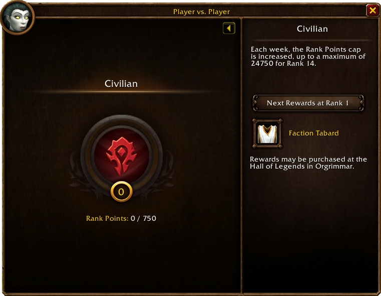

Blizzard ha explicado cómo funciona la progresión PvP en World of Warcraft: Forever. Se basa en dos partes: Honor y Rank Points. Los 14 rangos del juego original vuelven, con un tope semanal. Con Honor se compran un set azul y otro épico.

Blizzard describe el objetivo como accesible y familiar: el Honor System original, simplificado pero fiel a sus raíces. Cada temporada añade además tareas semanales, para que los jugadores tengan un motivo para seguir jugando PvP.

## Honor

El Honor es una moneda. Los jugadores lo ganan derrotando a otros jugadores, terminando campos de batalla y completando misiones PvP. Un campo de batalla destacado durante su semana especial da más Honor.

Blizzard también ha igualado el Honor que dan los distintos campos de batalla. Los jugadores deben poder jugar todos los mapas sin elegir Alterac Valley solo por el Honor, dice Blizzard.

## Rank Points

Los Rank Points vienen de los campos de batalla y las misiones PvP, también con un extra durante la semana especial. Hacen subir al jugador por los rangos del juego original, hasta High Warlord para la Horde y Grand Marshal para la Alliance.

Los rangos tienen un tope semanal. Según la pestaña PvP de la captura de Blizzard, el tope sube cada semana, hasta 24.750 Rank Points para el Rank 14. El Rank 1 pide 750 puntos.

La pestaña está en la ventana del personaje: pulsa C y abre Player vs. Player a la derecha. Muestra el rango, los Rank Points y las recompensas disponibles. Un jugador de la Horde las compra en el Hall of Legends de Orgrimmar.

## Dos sets de equipo

Con Honor se compran dos sets PvP, uno de calidad azul y otro de calidad épica. Una pieza épica pide la pieza azul más un Emboldened Seal, y esos sellos exigen un rango mínimo.

Blizzard también ha añadido objetos nuevos y revisados para especializaciones que no tenían equipo PvP. El Shaman, por ejemplo, recibe un set para sanadores, otro para cuerpo a cuerpo y otro para lanzadores de hechizos.

| Rango | Recompensa |
|---|---|
| **1** | Tabardo |
| **2** | Abalorio PvP |
| **3** | Capas |
| **4** | Collar |
| **5** | Pociones de combate |
| **6** | Tabardo |
| **7** | Estandarte de batalla |
| **8** | Ficha de mejora épica para brazales o cinturón |
| **9** | Ficha de mejora épica para botas |
| **10** | Ficha de mejora épica para guantes |
| **11** | Monturas |
| **12** | Ficha de mejora épica para piernas u hombreras |
| **13** | Ficha de mejora épica para pecho o casco |
| **14** | Armas épicas |

## Temporadas

El PvP funciona por temporadas. Cada temporada tiene un recorrido de tareas semanales que dan Honor y Rank Points. Tres tareas por temporada dan además un [Legacy Point](/es/news/legacy-points-one-per-challenge/). Como esas tareas forman parte del Legacy System, siguen disponibles en temporadas posteriores.

Blizzard no dice cuándo empieza la primera temporada PvP ni cuánto dura una temporada.
