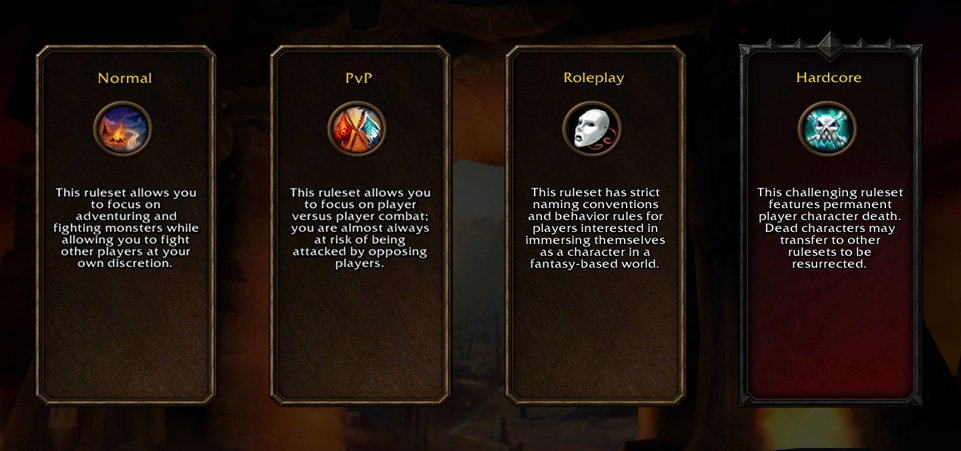
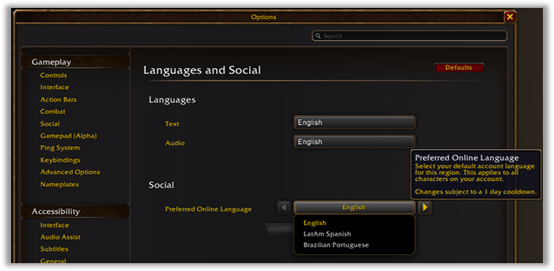

La pantalla donde se elige un realm ha desaparecido en World of Warcraft: Forever. El jugador elige un ruleset en su lugar, antes de crear un personaje. Blizzard explicó el 21 de septiembre cómo funciona. Esa elección decide a quién te encuentras y con quién puedes agruparte.

## Cuatro rulesets

Un ruleset funciona más como un ecosistema amplio de jugadores que como un realm suelto, escribe Blizzard. Hay cuatro:

* **Normal:** la experiencia corriente, con exploración, misiones y cooperación, y PvP solo cuando el jugador lo busca.
* **PvP:** cada paso por territorio disputado lleva peligro. En el juego se dice que allí un jugador corre casi siempre el riesgo de ser atacado por la facción contraria.
* **Roleplaying:** para quien quiera entrar más hondo en la ficción, con reglas más estrictas para nombres y conducta.
* **Hardcore:** la muerte es definitiva. Hardcore llegará algún tiempo después del lanzamiento, y Blizzard no dice cuándo.

## Con quién se puede jugar

Grupos, mazmorras y raids se quedan dentro de un ruleset. Agruparse entre rulesets no está soportado, escribe Blizzard, así que dos personajes de rulesets distintos no pueden hacer nada juntos. Los campos de batalla son la excepción y pueden mezclar jugadores de varios rulesets, salvo Hardcore, que queda aparte.

Encima de eso las facciones siguen separadas. Horda y Alianza todavía no pueden agruparse, y eso es lo que mantiene la guerra en Warcraft, escribe Blizzard.

## Cambiar es difícil a propósito

Un jugador no puede saltar entre rulesets. Jugar bajo otro significa crear allí un personaje nuevo.

Hardcore es la única excepción, y va en una sola dirección. Un personaje de Hardcore que muere puede pasar a otro ruleset, PvP incluido, para volver a la vida.

Las Collections y los Legacy Points valen para toda la cuenta a través de los rulesets. Hardcore va aparte: lo que se gana allí puede quedar disponible en otros sitios, pero el progreso de los demás rulesets nunca vuelve a Hardcore.

## Una sola facción en PvP

En el ruleset de PvP un jugador solo puede crear personajes de una facción. Si creas allí uno de la Alianza, la Horda se cierra, y al revés. En Normal, Roleplaying y Hardcore las dos facciones siguen abiertas.

Blizzard planea además sistemas para mantener a las dos poblaciones más cerca en PvP, en la línea de Season of Discovery, donde la creación de personajes de una facción podía limitarse un tiempo. Dos leads [dijeron lo mismo](/es/news/one-faction-per-player-on-pvp-rulesets/) en una entrevista con Game Informer el 20 de septiembre; es la primera vez que figura en un mensaje oficial.

## Una preferencia de idioma en la cuenta

El jugador también puede fijar un idioma preferido y encontrarse así con otros que eligieron el mismo. Está en el menú del juego bajo Options, luego Languages and Social bajo el epígrafe System, como Preferred Online Language.

El ajuste cuenta para toda la cuenta y para cada personaje en ella, y lleva una espera de 24 horas antes de poder cambiarse otra vez.
