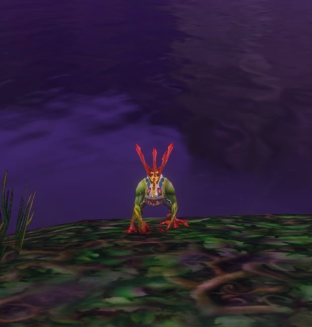
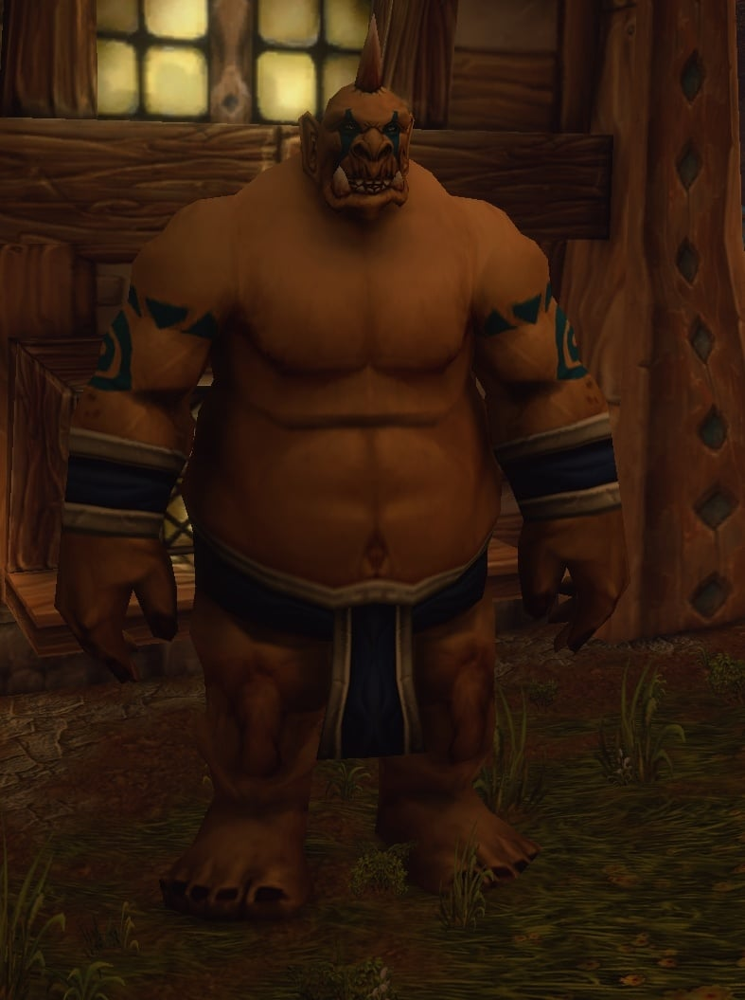
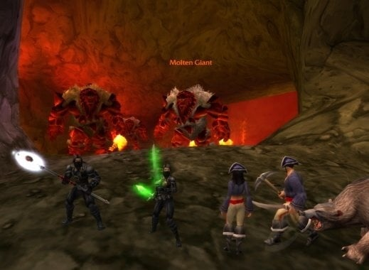

WoW Forever tiene una nueva receta de Cooking que transforma a quien la come. Savory Whimsyfin Delight convierte el Body Type 1 en Murloc y el Body Type 2 en Ogre, durante 60 minutos. La receta cae de monstruos en Redridge Mountains.

## Cómo funciona

<a class="wf-wh wf-q1" href="https://www.wowhead.com/forever/item=251525">Savory Whimsyfin Delight</a> es la versión de Forever de <a class="wf-wh wf-q1" href="https://www.wowhead.com/forever/item=6657">Savory Deviate Delight</a>, el plato de Classic que te convierte en ninja o en pirata. El antiguo sigue en el juego, escribe Wowhead, así que los dos disfraces siguen ahí.

La nueva forma depende del Body Type elegido al crear el personaje. El Body Type 1 se convierte en Murloc, el Body Type 2 en un gran Ogre. La forma dura 60 minutos, o hasta que el personaje muere.

## La receta

<a class="wf-wh wf-q2" href="https://www.wowhead.com/forever/item=251526">Recipe: Savory Whimsyfin Delight</a> pide Cooking 85 y cae de monstruos al azar, como el <a class="wf-wh wf-plain" href="https://www.wowhead.com/forever/npc=547">Great Goretusk</a> en <a class="wf-wh wf-plain" href="https://www.wowhead.com/forever/zone=44">Redridge Mountains</a>. El plato en sí pide un <a class="wf-wh wf-q1" href="https://www.wowhead.com/forever/item=251524">Whimsyfin</a> y <a class="wf-wh wf-q1" href="https://www.wowhead.com/forever/item=2678">Mild Spices</a>, según la receta de la beta.

Los Murlocs y los Ogres eran dos de las razas que más pedían los jugadores antes de Forever, escribe Wowhead. Ninguna de las dos es jugable.

## Lo que no se sabe

Dónde se pesca el Whimsyfin, la beta no lo muestra. Tampoco se sabe con qué frecuencia cae la receta, ni si la forma funciona en un campo de batalla.
