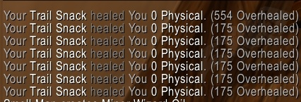

Student Fodder ya no da experiencia de descanso en World of Warcraft: Forever. En Season of Discovery esta mezcla de frutos secos daba cuatro barras, escribe Wowhead. En Forever cura, recupera parte de tu recurso y te hace más rápido.

Student Fodder es una recompensa de la cadena de misiones del <a class="wf-wh wf-q3" href="https://www.wowhead.com/forever/item=211527">Cozy Sleeping Bag</a>, que vuelve desde Season of Discovery. La cadena da cinco. La [guía del Cozy Sleeping Bag](/es/guides/cozy-sleeping-bag/) la recorre paso a paso.

Comer Student Fodder sigue curando al instante y recupera parte de la barra de recurso de tu clase. Además, ahora aplica <a class="wf-wh wf-spell" href="https://www.wowhead.com/forever/spell=1302113">Trail Snack</a>, que da un 60% más de velocidad de movimiento durante un momento, escribe Wowhead. Trail Snack también cura 175 de salud por tick con el tiempo.

Por qué ha desaparecido la experiencia de descanso, Blizzard no lo dice. Wowhead supone que Forever ya tiene suficientes formas de subir de nivel más rápido. Una [hoguera](/es/guides/camping/) da una barra de experiencia de descanso cada hora, casi toda la comida nueva da un 5% más de experiencia, y el Cozy Sleeping Bag hasta un 3% durante una hora. Los talentos Legacy también facilitan subir de nivel a los alters.
