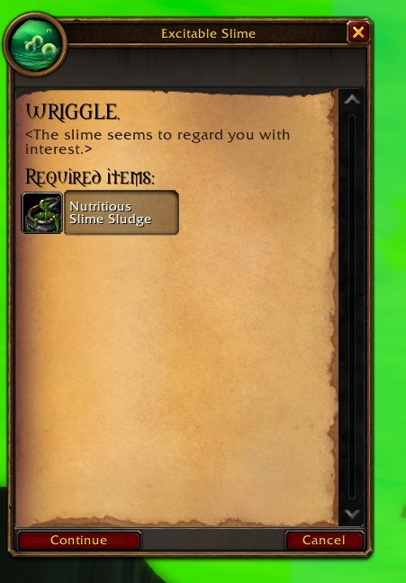
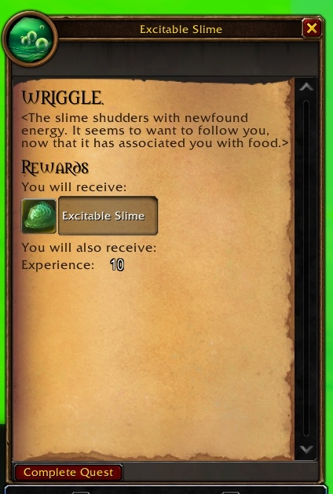
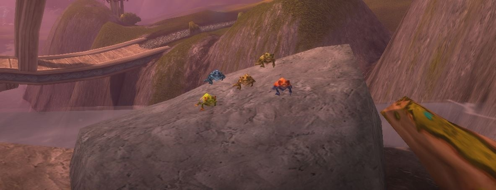

WoW Forever esconde tres mascotas nuevas por el mundo. Un crocolisco raro de los canales de Stormwind suelta la Baby Crocolisk. En Undercity, un limo entrega una mascota después de un baile. Una rana de Zephras Isle quiere una canción. Wowhead encontró las tres en la beta.

## Baby Crocolisk en Stormwind

La <a class="wf-wh wf-plain" href="https://www.wowhead.com/forever/npc=3581">Sewer Beast</a> patrulla los canales de Stormwind y suelta la <a class="wf-wh wf-q2" href="https://www.wowhead.com/forever/item=282047">Baby Crocolisk</a>. En la beta es un raro de nivel 50, y grandes grupos de banda de jugadores de nivel bajo la han derrotado, escribe Wowhead. No se sabe con qué frecuencia cae la mascota.

## Excitable Slime en Undercity

La segunda mascota no pide grupo de banda, solo algo de paciencia. Estos son los pasos:

1. **Compra la comida.** <a class="wf-wh wf-plain" href="https://www.wowhead.com/forever/npc=4612">Boyle</a>, el Sludge Seller de Undercity, vende <a class="wf-wh wf-q1" href="https://www.wowhead.com/forever/item=278265">Nutritious Slime Sludge</a> en /way 56.2 64.6.
2. **Busca el limo.** Salta al canal y busca un <a class="wf-wh wf-plain" href="https://www.wowhead.com/forever/npc=269452">Excitable Slime</a> que patrulla por allí.
3. **Baila.** Selecciónalo y usa /dance hasta que te devuelva el baile. Hacen falta varios intentos.
4. **Acepta la misión.** El limo ofrece entonces <a href="https://www.wowhead.com/forever/quest=97583">WRIGGLE.</a>. Si parece cansado, dice la misión, vuelve a bailar con él.
5. **Dale de comer.** Entrégale el Nutritious Slime Sludge y el <a class="wf-wh wf-q1" href="https://www.wowhead.com/forever/item=275682">Excitable Slime</a> es tuyo, con 10 de experiencia de regalo.

Si más tarde usas /dance ante la mascota, baila contigo estés donde estés.

## Musical Gustjumper en Zephras Isle

El <a class="wf-wh wf-q1" href="https://www.wowhead.com/forever/item=268109">Musical Gustjumper</a> está en Zephras Isle, la zona inicial de los Skyborne, en /way 51.5 72.3. Hasta un personaje de nivel 1 llega, a menudo sin combatir, [escribe Wowhead](https://www.wowhead.com/forever/news/how-to-get-the-new-musical-gustjumper-pet-in-wow-forever-383087). Sigue el camino hacia el sur desde Thendal Village y cruza un pequeño campo hasta las cascadas. No bajes por el sendero que hay debajo.

En lo alto de la cascada, un grupo de Musical Gustjumpers está sobre una roca. Salta al tronco para llegar hasta ellos. Selecciona una rana y usa /sing. Te responde cantando, el grupo desaparece y a tu lado, en el tronco, aparece una rana en la que puedes hacer clic. Haz clic y aprendes la mascota.

## Aprendidas, no cargadas

Los tres objetos dicen "Teaches you how to summon this companion". La mascota pasa a ser un hechizo y ya no ocupa sitio en las bolsas. La base de datos de Wowhead marca cada mascota como de toda la cuenta, así que una mascota aprendida una vez estaría para cada personaje. Blizzard no lo ha dicho.

Cada mascota de los archivos de WoW Forever, con su origen, está en la nueva [guía de mascotas](/es/guides/pets/). Las tres tienen su propia página: la [Baby Crocolisk](/es/guides/pets/baby-crocolisk/), el [Excitable Slime](/es/guides/pets/excitable-slime/) y el [Musical Gustjumper](/es/guides/pets/musical-gustjumper/).
