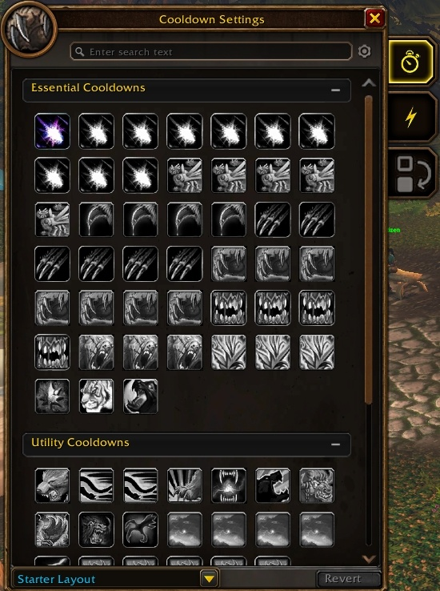
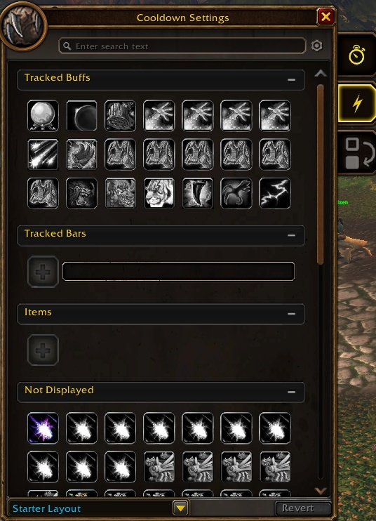

Le Cooldown Manager de retail peut désormais être testé dans la bêta de WoW Forever. Il est arrivé dans Midnight avec le patch 12.0, quand Blizzard a limité ce que peuvent faire les addons. Druid, Mage, Priest, Warrior et Warlock peuvent l'essayer, écrit Wowhead.

## Pourquoi il convient à Forever

Forever a les mêmes restrictions d'addons que Midnight et tourne sur le même client que retail, écrit Wowhead. C'est pourquoi le gestionnaire a pu être repris. Il prend les informations clés de la barre de buffs et de la barre d'action et les place où le joueur le souhaite, selon les [notes de développement](https://us.forums.blizzard.com/en/wow/t/wow-forever-beta-development-notes-updated-september-24/2360696) du 24 septembre.

## L'activer

Le gestionnaire est désactivé par défaut. Blizzard place l'option dans Options, sous Gameplay Enhancement ; Wowhead l'a trouvée sous Options, Advanced Options. Une fois activé, Edit Mode déplace les sorts suivis sur l'écran, et /cdm ouvre la liste de ce qui est affiché.

## La fenêtre de réglages

La fenêtre Cooldown Settings range les sorts en Essential Cooldowns et Utility Cooldowns sur son premier onglet. Le deuxième contient Tracked Buffs, Tracked Bars, Items et une liste de ce qui est Not Displayed. En bas se trouve une disposition, Starter Layout par défaut, avec un bouton pour la rétablir.

## Ce que Blizzard veut entendre

Blizzard demande surtout aux testeurs quels sorts ils veulent voir suivis par défaut.

> The most desired feedback for this feature is currently: spells that you wish were tracked by default.

Le gestionnaire ne gère pas encore les rangs de sorts ; cela viendra dans une prochaine mise à jour de la bêta. Les autres classes deviendront testables plus tard, sans date annoncée par Blizzard. Ce qu'il ne peut pas encore suivre, comme les Healthstones, les temps de recharge des familiers et les améliorations d'arme, figure dans [la liste des problèmes connus](/fr/news/ten-known-issues-arrive-with-the-new-beta-build/).
