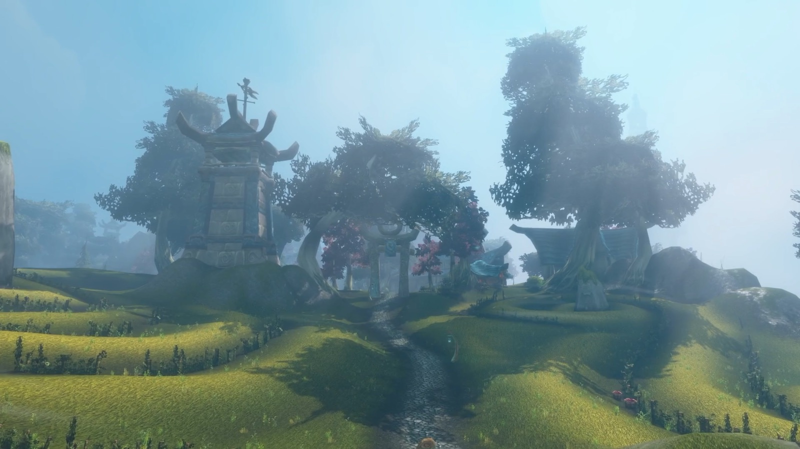
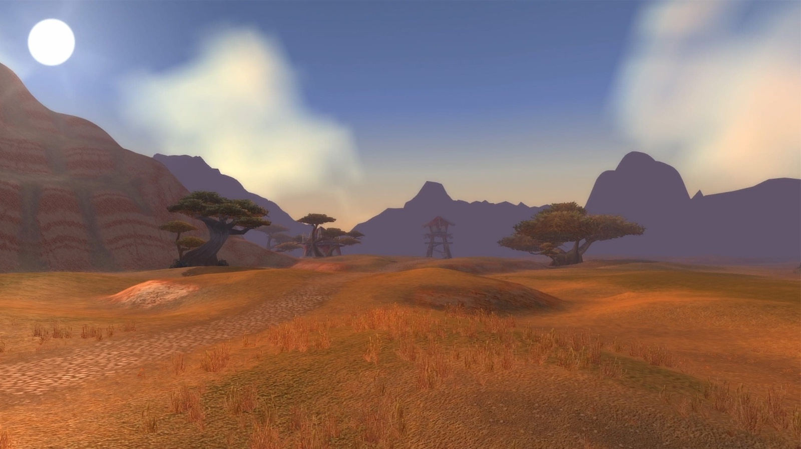

World of Warcraft: Forever reçoit quatre nouvelles zones au lancement : Mount Hyjal, Shen'Dralas, Riverglades et Zephras Isle. C'est ce qu'écrit Wowhead, sur la base des panels de la BlizzCon. Trois ports et plus de 1 000 nouvelles quêtes viennent avec elles.

## Les quatre nouvelles zones

Mount Hyjal est la zone de fin de jeu et abrite les premiers raids à 20 et à 10 joueurs, Hyjal Summit et les Barrow Deeps. Forever se déroule après Warcraft III, donc le squelette d'Archimonde repose encore près de Nordrassil.

Shen'Dralas se situe entre Mulgore et Desolace. La zone poursuit l'histoire des Shen'dralar et celle des tribus centaures de Desolace, écrit Wowhead. Des quêtes s'ajoutent autour des donjons Razorfen Downs et Maraudon.

Riverglades comble le vide entre le milieu de la trentaine et le début de la quarantaine. Les joueurs y arrivent depuis Steamwheedle Port ou par un nouveau passage de Redridge vers les Burning Steppes. Des Ogres et le Twilight's Hammer y vivent, et le nouveau donjon Krol'dok Stronghold s'y trouve.

Zephras Isle est la zone de départ des Skyborne, la première nouvelle race. Elle couvre les niveaux 1 à 12 et explique d'où viennent les Skyborne : des elfes échappés de Dire Maul avec l'aide des élémentaires d'air d'Al'Akir. Après le niveau 12, les joueurs rejoignent les zones de leur propre faction.

## Trois ports pour circuler

Southshore trouve enfin une utilité à son quai et devient une escale entre Menethil Harbor et Auberdine. Steamwheedle Port reçoit un bateau qui emmène les joueurs à travers le continent vers Riverglades. Stormwind Harbor est celui que les joueurs connaissent déjà, ajouté dans Wrath of the Lich King.

## Ce qui change dans les zones de départ

Chaque zone de départ reçoit de nouveaux PNJ, de nouvelles quêtes et de nouvelles expériences par rapport à WoW Classic, déclare le Lead Content Designer Evan Lee selon Wowhead. Le contenu que les joueurs connaissent reste en place à côté. Desolace et les Wetlands reçoivent de gros paquets de quêtes, pour paraître moins vides.

## Quand se déroule l'histoire

Forever se situe en l'an 1 de World of Warcraft, avant l'ouverture du Dark Portal et avant le départ des joueurs vers Northrend, déclare le Senior Game Designer Josh Greenfield. L'Executive Producer Holly Longdale place le jeu juste après la campagne de l'extension Warcraft III Forsaken Kingdom.

## Le voyage avant la destination

Les développeurs ont insisté à la BlizzCon : le voyage pèse plus lourd que la destination. L'Associate Production Director Clayton Stone cite le camping, les tradeskills et les talents Legacy comme les fonctions qui poussent les joueurs à s'arrêter et à regarder autour d'eux.

Quelles zones suivront après le lancement n'a pas été annoncé.
