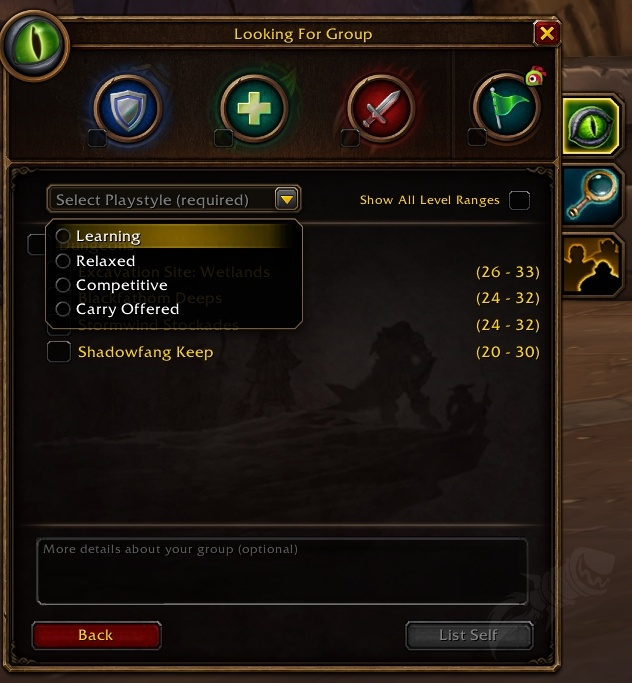
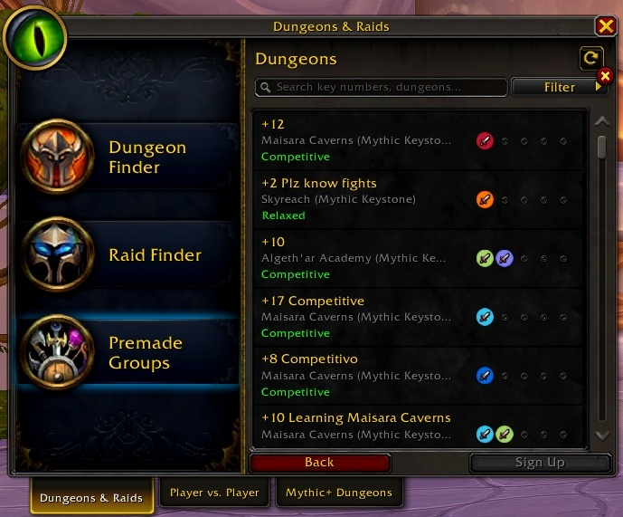

La fenêtre Looking For Group de la bêta de World of Warcraft: Forever a un nouveau champ obligatoire. Avant de s'inscrire pour un donjon, les joueurs choisissent un style de jeu. Il y a quatre options : Learning, Relaxed, Competitive et Carry Offered.

Le choix se trouve dans un menu déroulant en haut de la fenêtre, au-dessus de la liste des donjons. Sans style de jeu, impossible de rejoindre la file. Le champ de texte pour décrire le groupe reste facultatif.

Ces étiquettes viennent du jeu moderne. Dans World of Warcraft: Midnight, les groupes de la recherche de groupes prédéfinis affichent déjà Learning, Relaxed ou Competitive, surtout pour les clés Mythic+.

Forever n'a ni Mythic+ ni donjons chronométrés. Ce que Competitive signifie pour un donjon dans Forever, Blizzard ne l'a pas expliqué.

Carry Offered est la quatrième option. Un carry est en général un service payant, souvent contre de l'or. Blizzard n'autorise pas les [raids GDKP dans Forever](/fr/news/gdkp-not-allowed-in-wow-forever/). On ne sait pas si les carries payants sont permis.

On ne sait pas non plus quand ce champ est arrivé sur la bêta, ni s'il vaut aussi pour les raids.
