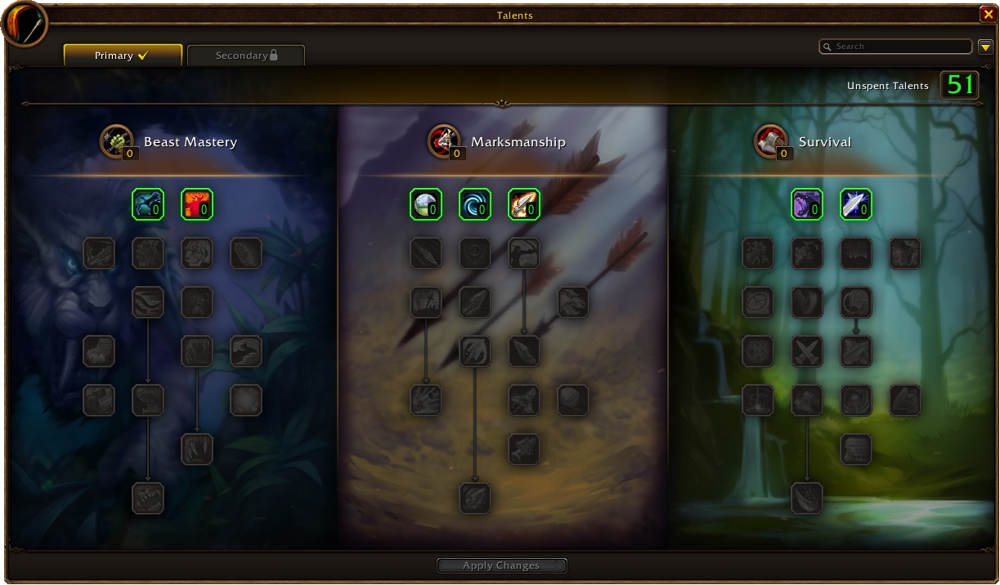
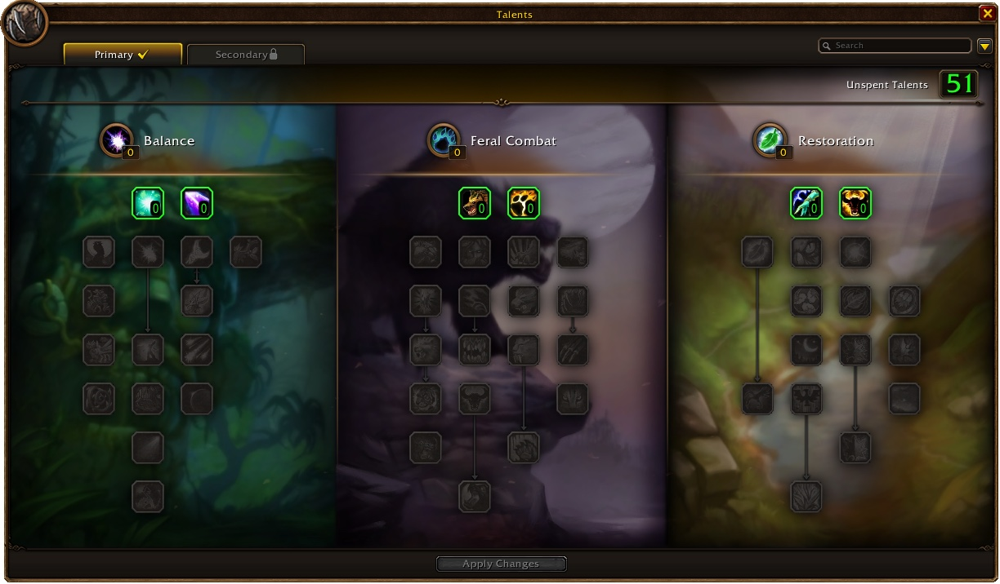

Blizzard a publié sa première plongée dans les classes de WoW Forever, consacrée au Hunter et au Druid. Aimed Shot devient une capacité de base, les pièges fonctionnent en combat et les Foxes arrivent comme famille de familiers. Les Druids peuvent boire des potions sans quitter leur forme.

Chaque arbre de talents garde les rangées du patch 1.12 et ses talents paliers à 11, 21 et 31 points, et en gagne un nouveau à 16 points. Les talents se changent chez un maître de classe d'une capitale, et la Dual Specialization se débloque au niveau 40. Capacités et talents peuvent encore changer pendant la bêta, précise Blizzard.

## Hunter

Aimed Shot est désormais une capacité de base au niveau 20. Il partage son temps de recharge avec Multi-Shot au lieu d'Arcane Shot. Les pièges se posent en combat, avec un temps de recharge de 30 secondes, et les pièges de feu et de givre ne partagent plus leur temps de recharge. Scorpid Sting réduit de 2 % les chances de toucher de la cible au lieu de sa Strength et de son Agility.

Les familiers tirent leurs caractéristiques de l'équipement de leur Hunter, mais ne reçoivent plus les buffs des joueurs. Chaque famille apprend Bite ou Claw et Dive ou Dash, plus une capacité propre : un Swipe qui touche trois cibles pour le Bear, un Dismember qui réduit de moitié les soins pour le Crocolisk, un Furious Howl pour le Wolf. Les Foxes forment une nouvelle famille avec Trickster's Dance, qui augmente l'esquive et la vitesse d'attaque pendant 12 secondes. La famille Owl s'appelle désormais Bird of Prey.

Les arbres partent dans trois directions. Beast Mastery reçoit Focused Fire et Summon Hawk, qui appelle jusqu'à deux Hawks. Marksmanship reçoit Lone Wolf, 20 % de dégâts en plus sans familier, et Sniper Shot, une incantation de 4 secondes à 45 mètres de portée. Survival se tourne vers le corps à corps avec Strider Kick et Lacerating Strikes, qui fait saigner Mongoose Bite.

## Druid

Les formes ne gênent plus. Les potions et presque tous les consommables similaires fonctionnent en Bear, Cat et Dire Bear Form sans les rompre, tout comme les enchantements d'arme, les effets comme Crusader et le Windfury Totem. La plupart des portes et objets s'ouvrent en forme, et les raciaux comme Shadowmeld et War Stomp fonctionnent aussi. Les bombes d'ingénierie restent en grande partie interdites, sauf de nouvelles recettes SAF-T et EZ-Thro.

En forme, les attaques automatiques infligent les dégâts par seconde de l'arme équipée. Nature's Grasp et Omen of Clarity deviennent des capacités de base, aux niveaux 10 et 20. Lacerate arrive au niveau 42 comme saignement cumulable, et Revive offre aux Druids une résurrection hors combat au niveau 12. Tiger's Fury disparaît.

Balance reçoit Eclipse, Insect Swarm à 16 points et Overgrowth pour trois cibles enracinées à la fois. Feral a deux talents à 16 points : Shifting Power pour les félins et Primal Bite pour les ours, que Blizzard a préféré à Mangle. Berserk couronne l'arbre à 31 points. Restoration fait remonter Swiftmend à 16 points et se termine par Wild Growth.

Furor met désormais fin au "bear-weaving" : l'énergie accumulée hors de Cat Form est perdue en passant en ours. Shifting Power ramène le power shifting de façon plus simple. Shifting Power et Improved Shifting Power ne sont pas encore sur la bêta et arrivent avec le build de la semaine prochaine, écrit Blizzard.

## Talents paliers du Hunter

| Talent | Arbre | Points |
|---|---|---|
| Summon Hawk | Beast Mastery | 16 |
| Lone Wolf | Marksmanship | 11 |
| Trueshot Aura | Marksmanship | 21 |
| Sniper Shot | Marksmanship | 31 |
| Counterattack | Survival | 16 |
| Strider Kick | Survival | 21 |
| Lacerating Strikes | Survival | 31 |

## Talents paliers du Druid

| Talent | Arbre | Points |
|---|---|---|
| Nature's Splendor | Balance | 11 |
| Insect Swarm | Balance | 16 |
| Feral Charge | Feral Combat | 11 |
| Shifting Power, Primal Bite | Feral Combat | 16 |
| Leader of the Pack | Feral Combat | 21 |
| Berserk | Feral Combat | 31 |
| Gift of the Earthmother | Restoration | 11 |
| Swiftmend | Restoration | 16 |
| Wild Growth | Restoration | 31 |

Chaque talent des deux classes, rang par rang, figure dans le [calculateur de talents](/fr/talents/) pour le [Hunter](/fr/talents/hunter/) et le [Druid](/fr/talents/druid/). Blizzard promet des plongées dans les autres classes au fil de la bêta.
