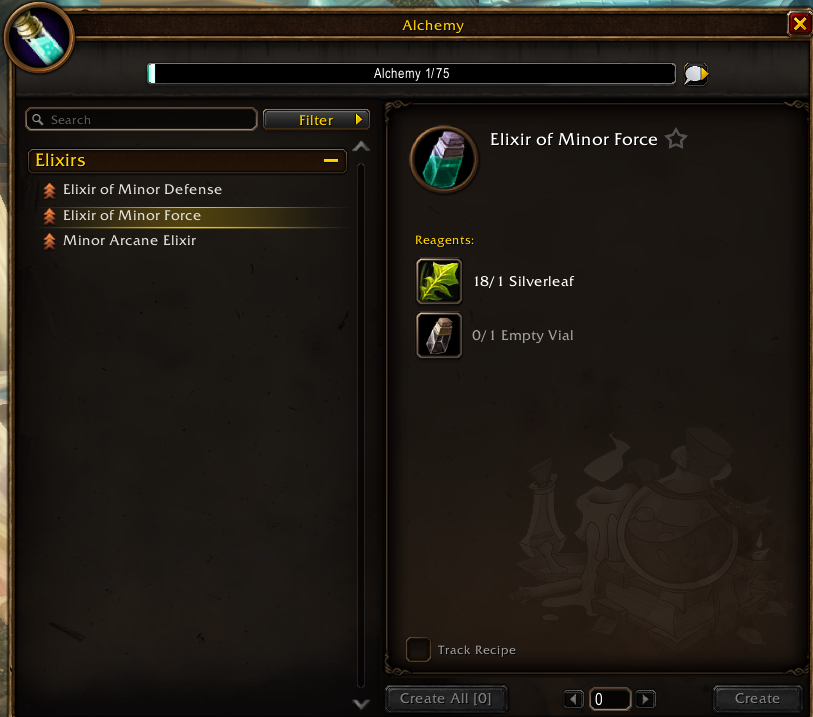
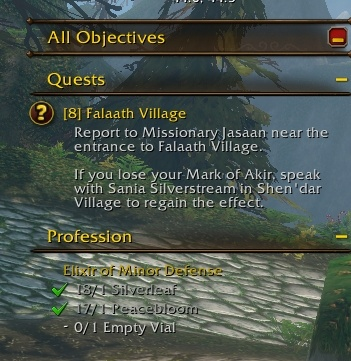
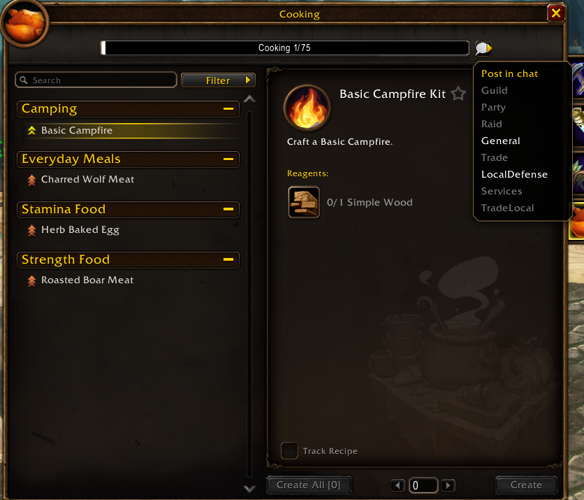

Les métiers de WoW Forever reçoivent trois facilités. Une recette peut se suivre comme une quête, tout un livre de recettes peut être lié dans la discussion, et de nouveaux filtres trient les recettes. Wowhead a montré les trois depuis la bêta.

## Suivre une recette

La fenêtre du métier a une nouvelle case, Track Recipe, en bas près de Create All.

La cocher affiche les composants à droite de l'écran, sous les quêtes, dans la même liste que les objectifs. C'est utile pour acheter des matériaux à l'Auction House ou les récolter dans le monde, écrit Wowhead.

## Lier le livre de recettes

Une petite bulle de discussion se trouve à droite de la barre de compétence. Un clic ouvre un menu qui publie le livre de recettes dans le canal de son choix, comme Guild, Party, General ou Trade. Les autres joueurs cliquent sur le lien et voient la compétence et chaque recette.

## De nouveaux filtres

Forever ajoute [plus de 600 nouvelles recettes](/fr/news/professions-camping-and-legacy-points-in-wow-forever/), et de nouveaux filtres aident à trouver la bonne :

- **Has skill up** n'affiche que les recettes qui font encore monter la compétence.
- **Have materials** n'affiche que ce qui peut être fabriqué tout de suite.
- **Slots** limite la liste à un emplacement d'équipement, comme les bijoux.
- **La barre de recherche** trouve une recette par son nom.
