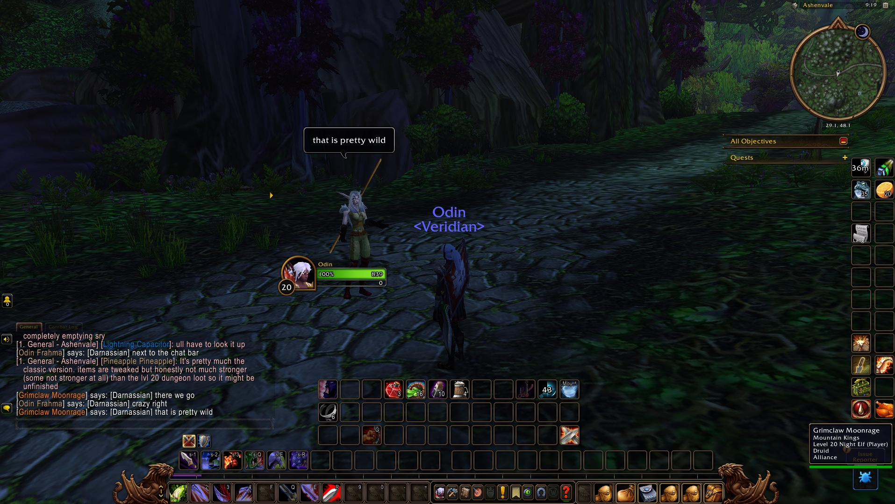

Un Skyborne de la Horde peut parler avec des elfes de l’Alliance dans World of Warcraft: Forever. Un joueur de la bêta l’a montré sur Reddit. Les deux camps parlent le Darnassian, et les fichiers de la bêta donnent cette langue aux trois races d’elfes.

<figure class="wf-embed wf-embed--reddit" data-wf-reddit="r/classicwow/comments/1wo5ern/elves_can_cross_talk_between_factions_in_wow">
  <button type="button" class="wf-embed__play">
    
    
      Elves can cross talk between factions in WoW Forever
      Charger le message du subreddit classicwow.
    
  </button>
</figure>

Le message vient de l’utilisateur Reddit Odin_69, le 23 septembre, et compte plus de 660 votes positifs et 285 commentaires. Wowhead en a parlé le 28 septembre.

## Ce que montre la capture

Deux personnages de niveau 20 se tiennent sur une route d’Ashenvale. L’un est Odin, un Skyborne de la Horde selon le message ; l’autre est Grimclaw Moonrage, un Druid Night Elf de l’Alliance. Dans le chat, tous deux écrivent en Darnassian, comme « crazy right » et « that is pretty wild », et la conversation va dans les deux sens.

Normalement, un joueur de l’autre faction ne voit que des mots brouillés. Une langue commune contourne cela : un joueur choisit le Darnassian dans le chat, et quiconque la connaît peut lire.

## Ce que disent les fichiers

Les fichiers du client de la bêta le confirment. Dans le build 1.60.1.70009, publié sur wago.tools, le Darnassian appartient à trois races : Night Elf, High Order Skyborne et Windshaper Skyborne. Les High Order parlent aussi le Common, les Windshapers l’Orcish.

En pratique, cela ouvre une seule ligne entre les factions. Un Windshaper de la Horde peut parler avec chaque Night Elf et chaque High Order Skyborne de l’Alliance. Les deux factions Skyborne commencent ensemble sur Zephras Isle et descendent des mêmes [Highborne exilés](/fr/news/the-skyborne-choose-their-side/).

## Bug ou choix

Blizzard n’a pas dit si c’est voulu. Wowhead rappelle que Blizzard a toujours séparé la Horde et l’Alliance, et que ce pourrait être un reste du départ commun des Skyborne. Beaucoup de joueurs sur Reddit saluent la chose pour le roleplay.

On ne sait pas si la langue restera à la sortie du 4 novembre.
