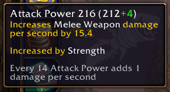
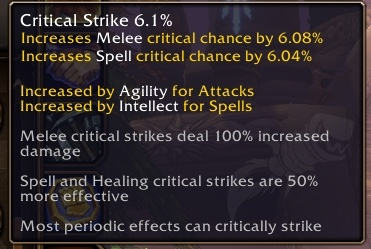
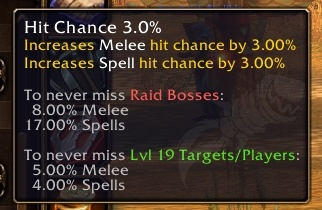
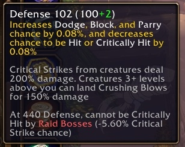

La fiche de personnage de World of Warcraft: Forever dit au joueur ce que fait chaque stat. Survoler une ligne donne une explication complète au lieu d'une vague, écrit Wowhead après la bêta. Les chiffres qui comptent pour les raids et pour tanker y figurent aussi.

## Ce que l'ancienne fiche ne disait pas

Chaque version de WoW avant Cataclysm décrivait ses stats de façon vague, écrit Wowhead, et laissait le reste au joueur. Forever met l'explication dans la fiche même, en visant ceux qui y débarquent.

L'infobulle d'Attack Power montre à quel point cela devient simple. Elle donne le chiffre, ce qu'il augmente, le fait que la Strength l'alimente, et la conversion : chaque tranche de 14 Attack Power ajoute 1 dégât par seconde.

## Une seule ligne de Crit pour les attaques et les sorts

Hit et Crit valent dans Forever pour toutes les écoles et ne sont plus séparés en melee, spell et ranged, écrit Wowhead. La fiche l'affiche sur une seule ligne.

Une seule stat ne veut pas dire un seul chiffre. Dans l'infobulle, 6,1% de Critical Strike donnent 6,08% en corps à corps et 6,04% pour les sorts, et la ligne en dessous indique que l'Agility alimente le côté attaque et l'Intellect le côté sorts.

L'infobulle répond aussi aux questions que les joueurs posent sans cesse, écrit Wowhead. Un coup critique au corps à corps fait 100% de dégâts en plus, un coup critique de sort ou de soin est 50% plus efficace, et la plupart des effets périodiques peuvent faire un critique.

## Combien de Hit suffit

L'infobulle de Hit fait le calcul qu'un joueur irait sinon chercher ailleurs.

À 3,0% de Hit Chance, elle liste ce que demande le fait de ne jamais rater : 8,00% en corps à corps et 17,00% en sorts contre les boss de raid, et 5,00% et 4,00% contre une cible ou un joueur de niveau 19. Le niveau de cette seconde ligne suit le personnage, donc le chiffre bouge avec lui.

## Les chiffres qu'il faut à un tank

Defense reçoit le même traitement, avec les deux seuils qui décident si un tank peut encaisser un pic.

Chaque point augmente l'esquive, le blocage et la parade de 0,08% et baisse d'autant la chance d'être touché ou touché en critique. Une créature fait un critique à 200% de dégâts, et une qui dépasse le joueur de trois niveaux ou plus peut placer un coup écrasant à 150%.

À 440 de Defense, un personnage ne peut plus être touché en critique par les boss de raid, soit 5,60% de chance de critique en moins chez eux. Ces deux chiffres sont ce que les joueurs appellent le defense cap et l'avoidance cap, écrit Wowhead, qui souligne que la Defense continue d'aider au-delà de ce point.
