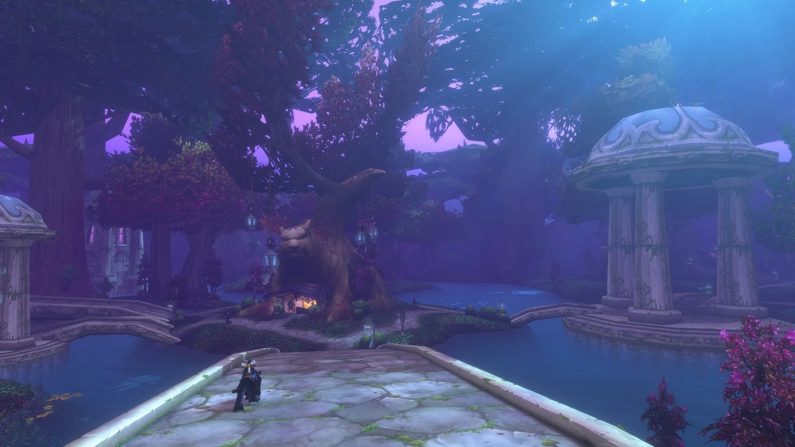

Un nouveau venu dans World of Warcraft a demandé sur X aux vétérans le conseil qu’ils auraient aimé connaître avant leur première aventure. Les réponses sont devenues un petit guide du débutant pour WoW Forever, écrit Icy Veins.

Trenton Reed a posé la question le 2 octobre. WoW Forever réunit des joueurs de la première heure, des joueurs de retour et de parfaits débutants comme lui, a-t-il écrit. Il ne cherchait pas le build parfait, mais le conseil que personne ne lui avait donné.

<figure class="wf-embed wf-embed--x" data-wf-x="2106124201329295718">
  <button type="button" class="wf-embed__play">
    
    
      Trenton Reed demande un conseil aux vétérans
      Charger le message de X.
    
  </button>
</figure>

## Prenez votre temps

Le conseil le plus fréquent : ne vous pressez pas. Plusieurs vétérans ont recommandé aux nouveaux de ne pas se noyer dans les guides avant même d’avoir joué. Partez à l’aveugle, essayez différentes techniques et découvrez le monde par vous-même. Icy Veins ajoute son propre conseil : faites des captures d’écran des moments marquants, pour un album de votre voyage.

## Ne restez pas seul

L’aspect social est souvent revenu. Faites-vous des amis et faites vos quêtes ensemble, ou soyez simplement gentil avec les autres. Blizzard expérimente des systèmes sociaux comme un outil de recherche de groupe, mais rencontrer d’autres joueurs autrement en vaut toujours la peine, écrit Icy Veins. Même un /wave peut illuminer la journée de quelqu’un.

## Utilisez vos consommables

Plusieurs réponses conseillent aux nouveaux joueurs d’utiliser leurs potions et élixirs pendant la montée en niveau, au lieu de les garder pour le moment parfait. Assignez tôt vos techniques et consommables à des touches, pour qu’un combat difficile ne vous prenne pas au dépourvu.

## Prenez chaque point de vol

Les points de vol sont revenus sans cesse. Parlez au maître de vol dans chaque nouvelle ville, préviennent les vétérans : un point de vol manqué transforme un futur trajet en très longue marche. Forever ajoute aussi de nouveaux points, voir l’[article sur les onze nouvelles routes](/fr/news/five-new-flight-points-bring-eleven-new-routes/).

## N’affrontez pas Hogger au niveau 8

Les nouveaux n’ont pas besoin de tout savoir avant de commencer, conclut Icy Veins : choisissez ce qui semble amusant, explorez et faites-vous des amis en chemin. Le conseil le plus important vient de slayzdam : n’affrontez pas <a class="wf-wh wf-plain" href="https://www.wowhead.com/forever/npc=448">Hogger</a> au niveau 8.

<figure class="wf-embed wf-embed--x" data-wf-x="2106130909414261162">
  <button type="button" class="wf-embed__play">
    
    
      slayzdam : ne combattez pas Hogger au niveau 8
      Charger le message de X.
    
  </button>
</figure>

D’autres conseils de joueurs du monde entier se trouvent dans le [fil sur X](https://x.com/trentreed27/status/2106124201329295718).
