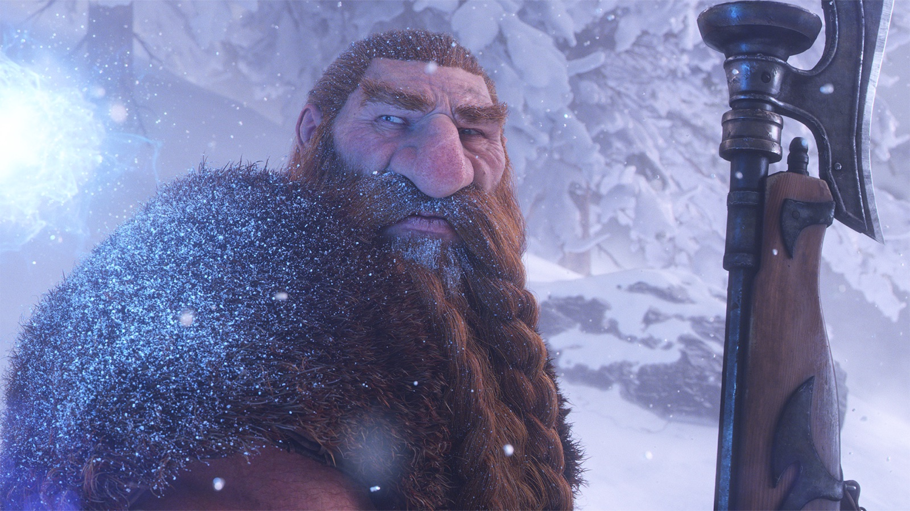

World of Warcraft: Forever supporta ufficialmente i controller. L'oro per una cavalcatura passa al riding training, che costa 100 o 1.000 monete d'oro a seconda del livello, e la prima cavalcatura è gratuita. Lo dice Blizzard in un'intervista con Sportskeeda, riassunta da Wowhead.

## Il supporto ai controller stavolta è ufficiale

Su WoW retail un controller funziona tecnicamente, ma non bene, dice Blizzard. In Forever il supporto è ufficiale. Il team lo definisce anche una funzione di accessibilità, per chi non può o non vuole stare davanti a tastiera e mouse.

## L'oro sta nell'addestramento

Un obiettivo costoso per il proprio oro fa bene, e l'economia ha bisogno di pozzi d'oro, dice Blizzard. Per questo il costo è passato alla riding skill: 100 monete al livello basso e 1.000 a quello alto. La cavalcatura che segue non costa nulla.

## Dove si colloca il gioco nella linea temporale

Forever si svolge un paio d'anni dopo Warcraft III e comincia lo stesso giorno in cui World of Warcraft uscì, nel novembre 2004, dicono il Senior Game Designer Michael Nuthals e il Principal Game Designer Kris Zierhut. Il gioco segue una linea temporale accanto, che si separa proprio in quel primo giorno.

I Forsaken Paladins sarebbero stati un grande cambiamento in WoW Classic, dove l'Orda non aveva Paladins e la regola era non cambiare nulla. In Season of Discovery, tenere separati Shamans e Paladins per fazione ha creato problemi peggiori che darli a entrambe le parti, quindi il team ha lasciato cadere quella divisione.

## Storie piccole, e una città da Warcraft I

Il team vuole che i giocatori frughino negli angoli di Azeroth. Nei Riverglades ci sono riferimenti a Warcraft I, tra cui una città in rovina chiamata Sunnyglade. Tenere piccole le storie lascia spazio a quelle che i giocatori scrivono da soli, dice Blizzard.

Le missioni sono state aggiunte dove la scelta era scarsa, soprattutto nelle zone dal livello 30 al 50. Un alt può così seguire un percorso diverso dal primo personaggio. Nuovi dungeon, zone e percorsi di livellamento arriveranno dopo il lancio, anche se Blizzard non dice quando.

## Oggetti che cambiano a seconda del luogo

Ogni boss riceve un chase item che rende utile tornare. Gli oggetti possono avere effetti che funzionano solo in certi ambienti, come foreste, montagne o sottoterra, e bonus contro tipi di creatura come Worgen, Dwarves o Dragons.

I contenuti devono restare disponibili il più possibile, dice Blizzard, perché la progressione è orizzontale e i giocatori restano al livello 60. Il team non prevede nulla come il vecchio Naxxramas, sparito per sempre.
