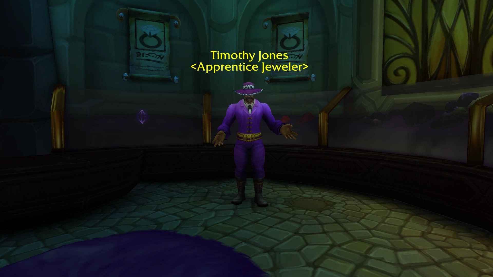
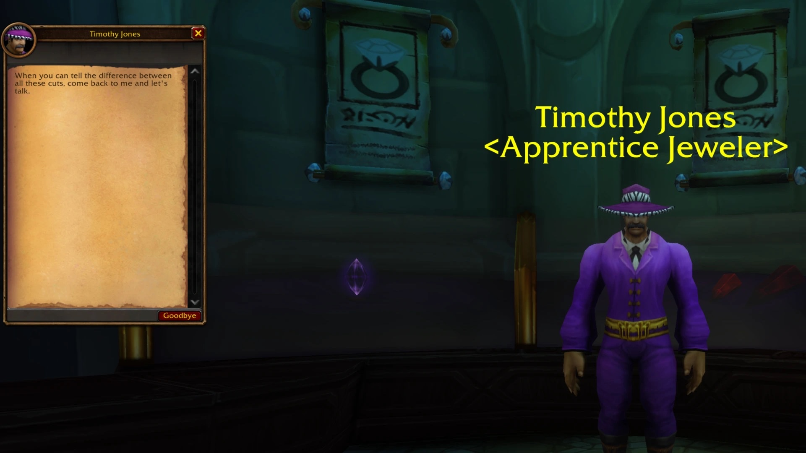
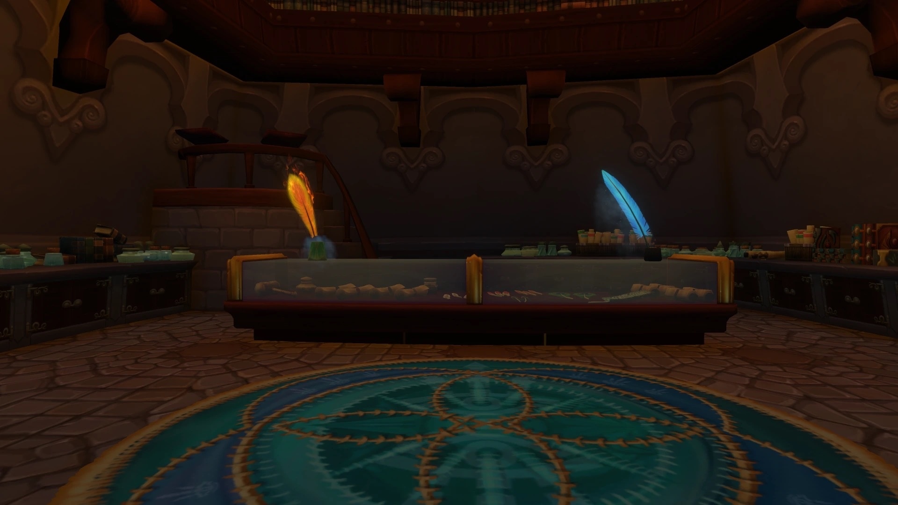
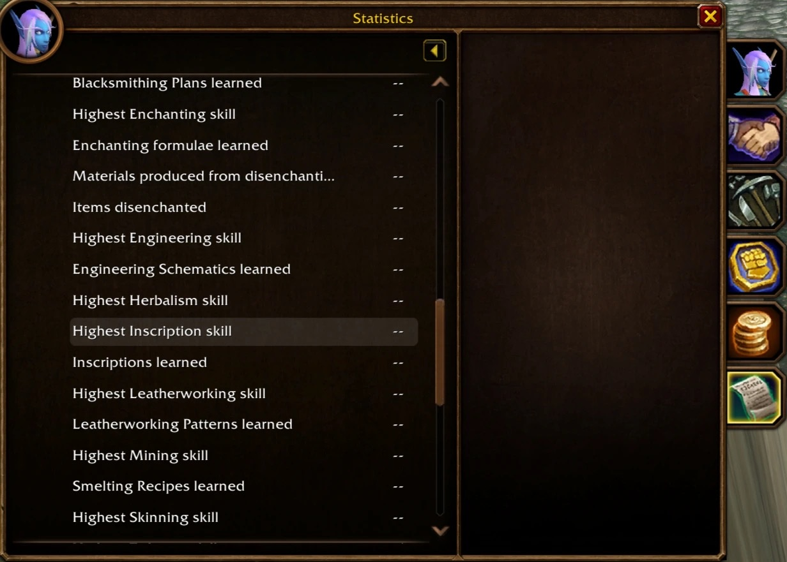

Dalaran, nella beta di Forever, porta tracce di due professioni che Classic non ha mai avuto. Una gioielleria ha un apprendista gioielliere, un negozio di scribi è vuoto e il pannello Statistics conta Inscription. Blizzard non ne ha annunciata nessuna.

## Jewelcrafting

Nel Magus Commerce Exchange, il quartiere commerciale di Dalaran, si trova Cartier & Co. Fine Jewelry. Due Jewelry Vendors, Harold Winston e Tiffany Cartier, vendono anelli costosi. Accanto a loro c'è Timothy Jones, un Apprentice Jeweler, già segnalato nel [primo articolo su Dalaran](/it/news/dalaran-opens-on-the-beta-for-the-alliance-only/).

Per ora non insegna nulla. A chi gli parla dice soltanto questo:

> When you can tell the difference between all these cuts, come back to me and let's talk.

Timothy Jones condivide il nome con Tim Jones, Lead Classic Designer di Blizzard.

## Inscription

Altrove nel Magus Commerce Exchange c'è The Scribes' Sacellum, il negozio di Inscription. Nella beta non c'è nessuno al bancone.

La pianta del Magus Commerce Exchange viene dalla Dalaran di Wrath of the Lich King, dove esistevano entrambe le professioni. I due negozi potrebbero essere solo un residuo di allora.

Il [pannello Statistics](/it/news/a-statistics-pane-counts-kills-gold-and-deaths/) della finestra del personaggio va nell'altra direzione. Sotto Professions elenca Highest Inscription skill e Inscriptions learned, tra le professioni di Classic. Jewelcrafting non compare in quell'elenco.

Blizzard non ha detto se Forever avrà nuove professioni, né quando.
