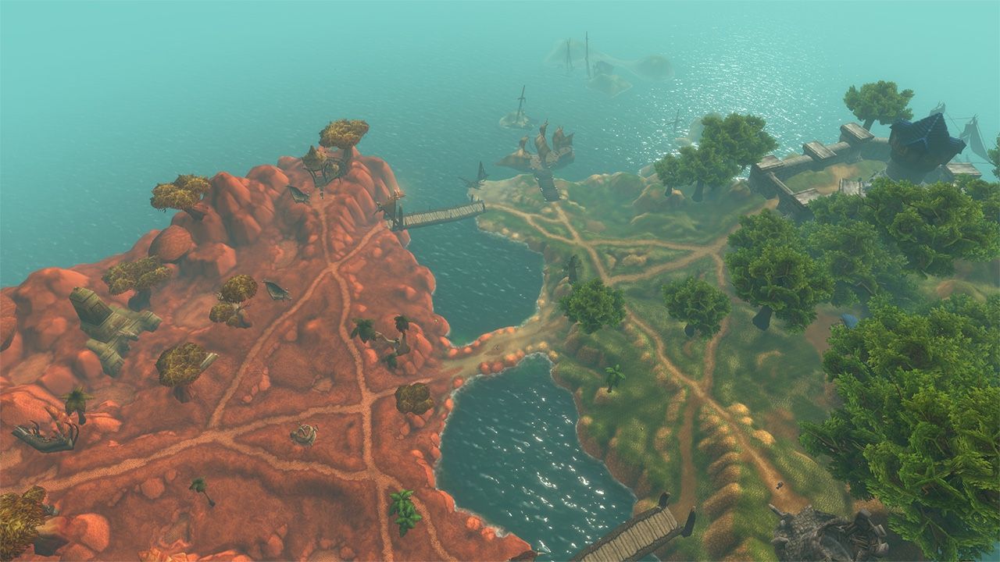
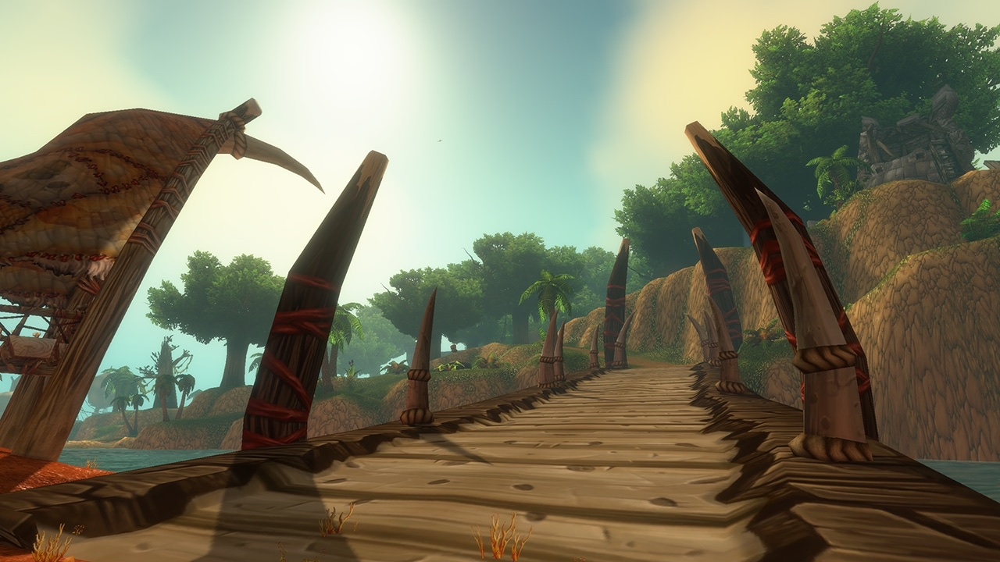
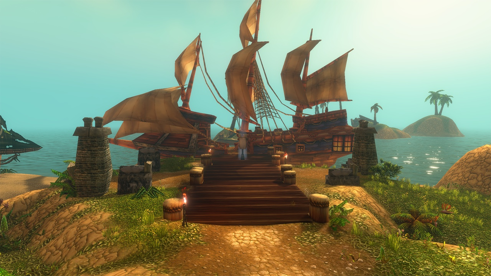
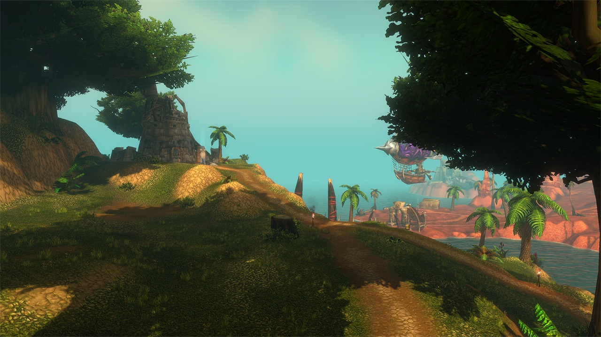
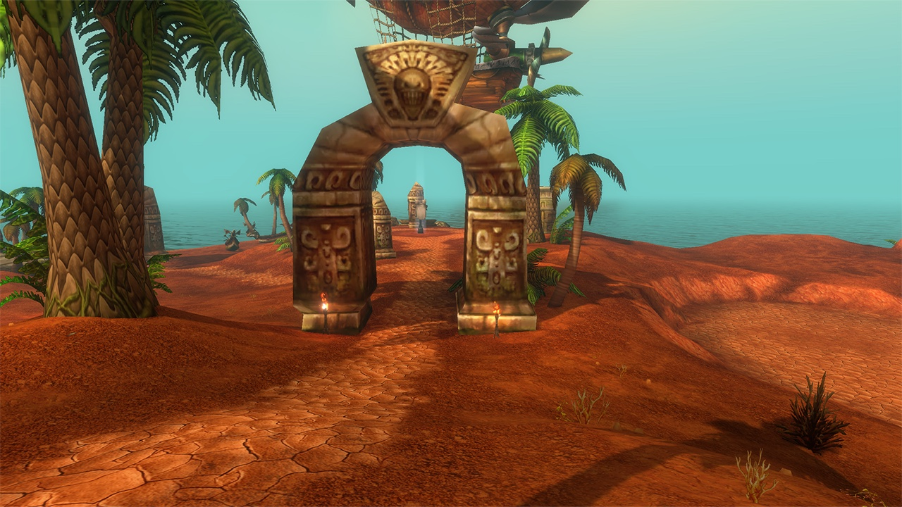
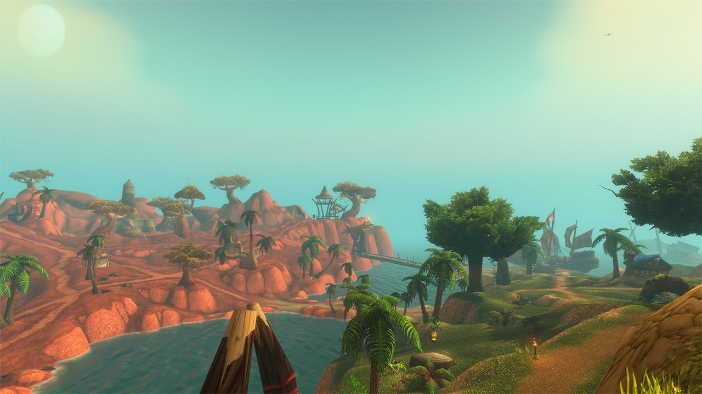
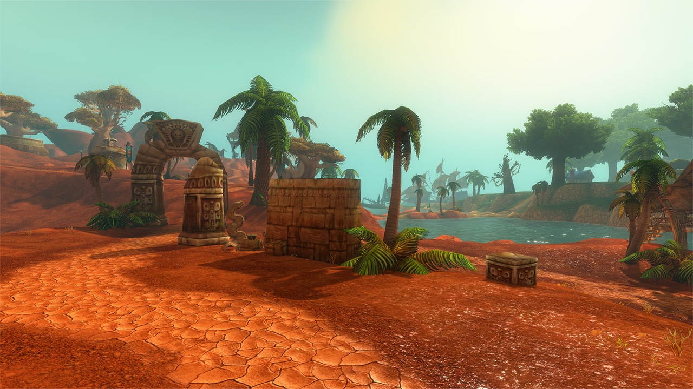
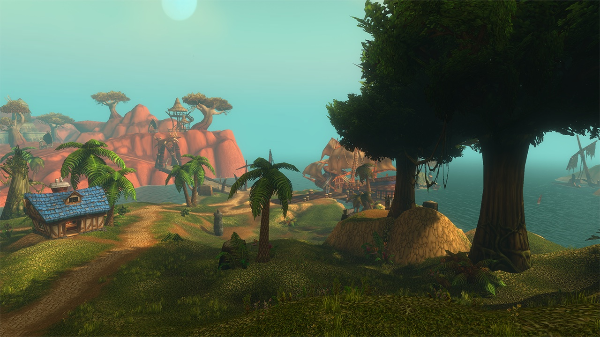
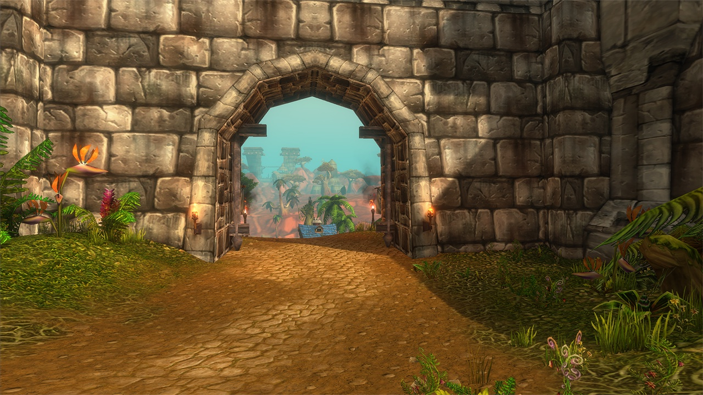

World of Warcraft: Forever riceve un nuovo campo di battaglia: le Darkspear Islands, al largo di Dustwallow Marsh. Due squadre da 15 si contendono quattro punti di cattura e una bandiera al centro. Possono partecipare i giocatori dal livello 30 al 60.

La Horde combatte come Darkspear Raiders, l'Alliance come Theramore Expeditionary Force. Vince la prima squadra che arriva a 2.000 punti, dice Blizzard.

| | |
|---|---|
| **Tipo** | 15 contro 15, punti di cattura con una bandiera |
| **Luogo** | Al largo di Dustwallow Marsh |
| **Livelli** | Da 30 a 60 |
| **Vittoria** | Prima squadra a 2.000 punti |
| **Fazioni** | Darkspear Raiders (Horde), Theramore Expeditionary Force (Alliance) |

## Conquistare e tenere

Le squadre guadagnano punti tenendo i quattro punti di cattura sulle isole. Più ne controlla una squadra, più in fretta sale il suo punteggio. Al centro della mappa c'è una bandiera. Chi la porta a una base conquistata dalla propria squadra guadagna punti in più.

## Come entrare

Un maestro di battaglia in ogni grande capitale mette i giocatori in coda per il campo di battaglia. In The Barrens c'è una seconda strada. La Horde ha una base dei Darkspear Raiders sulla Merchant Coast, l'Alliance una base della Theramore Expeditionary Force a Northwatch. Da lì un portale porta in battaglia. Nella Underbelly di [Dalaran](/it/news/dalaran-opens-on-the-beta-for-the-alliance-only/), Bimble Sparkfingers è il maestro di battaglia per le isole.

Le due basi in The Barrens hanno anche venditori con ricompense di reputazione e missioni per il campo di battaglia.

## Due reputazioni

Ogni schieramento ha la sua reputazione: i Darkspear Raiders o la Theramore Expeditionary Force. Con una reputazione più alta, i venditori offrono equipaggiamento e consumabili: monili, anelli, mantelli, armi e pezzi d'armatura.

I giocatori consegnano Marks of Honor nelle missioni di reputazione. A Exalted si sblocca una breve serie di missioni che dà la tabarda propria della fazione. Quali oggetti vendano i venditori, e a quale reputazione, Blizzard non lo dice.
