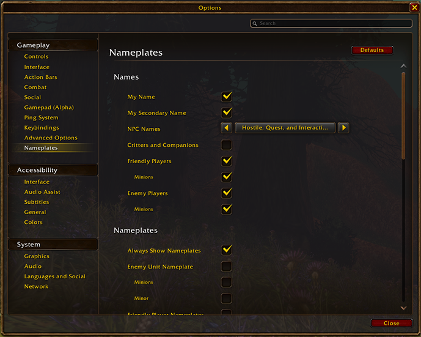

Ogni personaggio di World of Warcraft: Forever porta due nomi. Insieme formano un nome completo che deve essere unico dentro una regione. Blizzard ha spiegato il sistema il 21 settembre. Si riduce a un nome e a un cognome.

## È la coppia a contare

Un nome che qualcun altro ha già preso non è perso da sé, scrive Blizzard. A dover essere libera è la combinazione intera. Due personaggi possono portare lo stesso nome finché i loro nomi completi restano diversi.

Siccome Forever non ha realm, quel controllo corre su un'intera regione invece che su un server. Blizzard lo definisce parte del tenere i nomi riconoscibili nel tempo.

## Che cosa può fare un secondo nome

Il secondo nome serve ad allargare la scelta e non a restringerla, scrive Blizzard. Può richiamare una famiglia, un luogo, una reputazione o qualcosa che funziona come un titolo.

Blizzard fa il suo esempio: Asha Brightvale, Thalen Brightvale e Mira Brightvale condividono un secondo nome in stile familiare mentre ognuno tiene un nome diverso. Una gilda può fare lo stesso con un tema comune, purché ogni combinazione completa sia ancora libera nella regione.

## Spegnere il secondo nome

Chi lo vuole più sobrio può nascondere il secondo nome nel mondo. Si trova nel menu di gioco sotto Options, poi Nameplates, come la casella My Secondary Name.

Il secondo nome sparisce allora sopra il personaggio, scrive Blizzard, ma in chat continua a comparire.

## Le regole non si sono allentate

I nomi seguono il codice di condotta del gioco. Certe parole, grafie e sequenze di caratteri ripetuti restano vietate, così come i nomi che creano confusione o si spacciano per Blizzard o per il team di World of Warcraft.

Dividere una parola vietata tra i due nomi non aiuta, scrive Blizzard, perché il sistema può valutare le due parti insieme. Blizzard [aveva già tolto l'accesso alla beta](/it/news/offensive-names-cost-players-their-beta-access/) ad alcuni giocatori per il loro nome, prima nello stesso fine settimana.

## Prenotare un nome

La Early Name Reservation va dal 27 ottobre al 3 novembre 2026, per gli acquisti che ne danno diritto. I nomi vanno in ordine di arrivo, e un nome desiderato non è mai garantito.

Chi si vede la combinazione presa o rifiutata dovrà sceglierne un'altra, oppure ripiegare sul generatore di nomi casuali del gioco.
