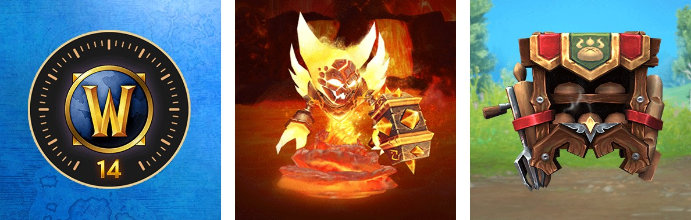

McDonald's Australia offre tre ricompense per World of Warcraft nella sua app MyMacca's. Ognuna costa 2.000 punti: 14 giorni di Game Time, la mascotte Lil' Ragnaros o il Portable Bakery, un oggetto cosmetico per la schiena. L'offerta dura fino al 22 gennaio 2027.

La promozione segue una campagna precedente, in cui i clienti australiani potevano scambiare punti MyMacca's con l'accesso alla beta di World of Warcraft: Forever. Come quella, vale solo in Australia, attraverso il programma fedeltà di McDonald's.

## Le tre ricompense

Il codice di Game Time dà 14 giorni di gioco, contati dal momento in cui viene riscattato su Battle.net. Forever è incluso in un normale abbonamento o nel Game Time, quindi quei giorni valgono anche per Forever, come ha detto Blizzard all'[annuncio](/it/news/world-of-warcraft-forever-announced-classic-plus/).

Lil' Ragnaros è una mascotte, un piccolo Firelord su una pozza di lava. Il Portable Bakery è un oggetto di transmog per la schiena: una cassa di legno piena di panini, con un mattarello e una forchetta sul lato.

La mascotte e l'oggetto per la schiena funzionano solo finché l'account ha Game Time o un abbonamento attivo, secondo le condizioni. Non è detto se compaiono anche in Forever. La [pagina di McDonald's Australia](https://www.mcdonalds.com/au/en-au/partner-rewards/world-of-warcraft.html) parla di World of Warcraft in generale e non nomina Forever. Lil' Ragnaros finora non è comparso nei dati della beta di Forever.

## Come riscattare una ricompensa

1. **Apri l'app MyMacca's** e vai su Rewards & Deals.
2. **Scorri fino a Partner Rewards** e scegli una delle tre ricompense.
3. **Copia il codice** che l'app mostra dopo lo scambio dei punti.
4. **Accedi a Battle.net**, oppure crea un account gratuito.
5. **Vai su Account e Redeem Code**, inserisci il codice e segui i passaggi.

I passaggi sulla pagina parlano di 1.000 punti, mentre il resto della pagina ne chiede 2.000 per ricompensa. Quale delle due cifre addebiti l'app, dalla pagina non è chiaro.

## Limiti e date

Ogni ricompensa si può riscattare una volta per account MyMacca's e una volta per account di World of Warcraft, fino a esaurimento scorte. La mascotte e l'oggetto per la schiena non si possono riscattare su un account che li possiede già. L'offerta non è destinata ai minori di 15 anni.

I codici sono disponibili nell'app fino al 22 gennaio 2027 e vanno riscattati su Battle.net entro il 31 gennaio 2027. Blizzard fornisce le ricompense ma non organizza la promozione, secondo le condizioni.

## Fuori dall'Australia

Solo un account MyMacca's australiano può scambiare punti con le ricompense. I codici invece si riscattano su Battle.net. Non è confermato che un codice australiano funzioni anche su un account di un'altra regione. Con i codici beta della campagna precedente sembrava funzionare. Le condizioni vietano comunque di rivendere un codice.
