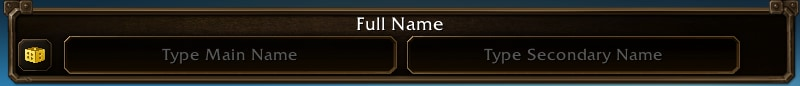

Blizzard toglie l'accesso alla beta ai giocatori che scelgono un nome di personaggio offensivo. L'addetto al supporto Vrakthris lo ha confermato il 19 settembre sul forum Customer Support. World of Warcraft: Forever dà due nomi a ogni personaggio, e questo raddoppia lo spazio per la creatività.

## Due nomi per personaggio

In Forever un personaggio porta un Full Name: un nome principale e uno secondario, entrambi scritti alla creazione. La combinazione è unica per regione, perché Forever non ha realm.

"La scelta di un nome e un cognome apre molto spazio alla... creatività, ma le nostre regole restano in vigore", scrive Vrakthris. I nomi stessi devono rispettare le regole sui nomi, e il team di sviluppo di Forever smaltisce quelli che vengono segnalati.

## Che cosa succede all'account

Diversi giocatori hanno raccontato la stessa cosa sul forum: il gioco rifiuta l'accesso con il messaggio che l'account è sospeso dalla beta. La pagina di ricorso diceva che sul loro account non era stato preso alcun provvedimento, quindi lì non c'era nulla da contestare.

Quella mail esiste eccome, scrive Vrakthris, e dentro c'è il nome di personaggio che l'ha causata. Consiglia di guardare nella posta indesiderata.

> Character names must adhere to our naming policies, including in Beta. If you violate those policies that may result in the removal of beta access.

## Chi la fa rispettare

La beta è gestita soprattutto dal QA e dal team di sviluppo, scrive Vrakthris, quindi lì l'applicazione delle regole spetta a loro e non al supporto abituale. Chi pensava che ci fosse stato un errore poteva allora ancora presentare ricorso. Dal 24 settembre non è più così: il team Customer Service non gestisce ricorsi sui nomi, [scrive lo sviluppatore Fwoibles](/it/news/forced-renames-follow-offensive-names-on-the-beta/).

Aggiunge che nessuno degli esempi visti finora gli sembra appropriato, ma che la decisione non è sua. Da allora Blizzard fa entrambe le cose. Il 24 settembre ha iniziato a imporre un cambio di nome ai nomi fuori dalle regole, e ha riservato la perdita dell'accesso alla beta ai peggiori.

## Perché esce adesso

La beta ha aperto il 17 settembre ed è una delle prove più grandi mai fatte da Blizzard. Il sistema dei nomi è nuovo, e la discussione sul forum è salita in due giorni a 62 messaggi e più di 3.000 visite. Blizzard [ha esposto le regole lui stesso](/it/news/every-character-gets-a-first-and-a-second-name/) più tardi il 21 settembre, e lì scrive che il sistema valuta insieme le due parti di un nome.
