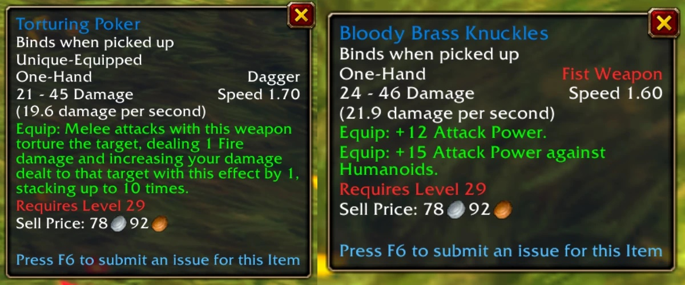
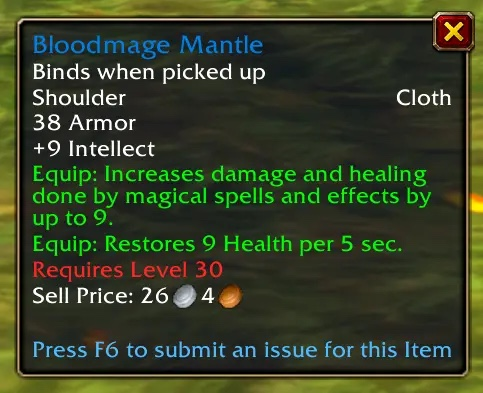
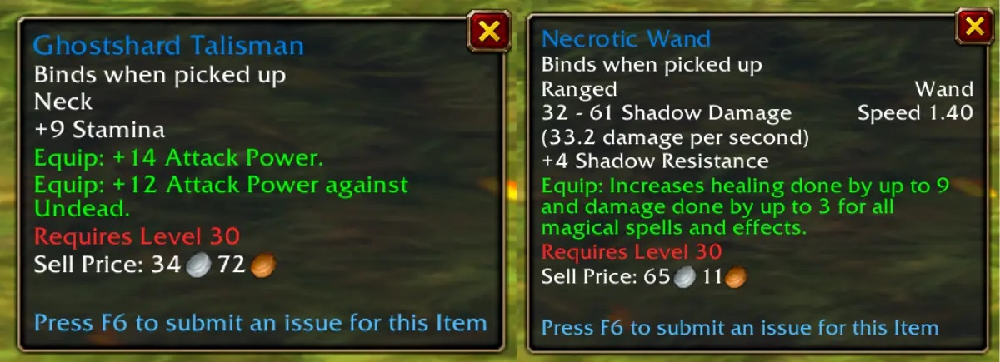
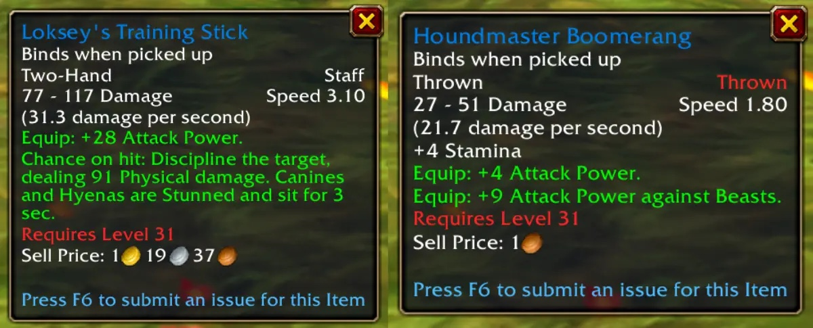
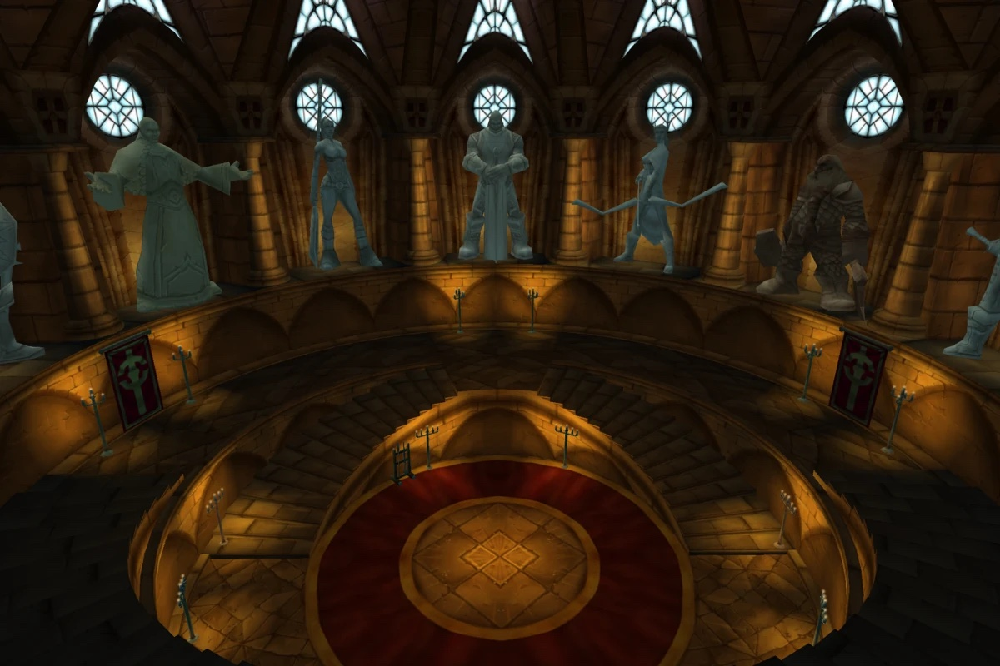

Gli oggetti di Scarlet Monastery cambiano sulla beta di World of Warcraft: Forever. Al livello 30 i tester trovano oggetti bianchi e verdi diventati blu, con effetti nuovi. Anche il set Chain of the Scarlet Crusade riceve nuovi bonus, scrive Icy Veins.

Non tutte le ali sono già state completate. Gli oggetti qui sotto vengono da Graveyard e Library. I dati vengono da Today in WoW, secondo Icy Veins.

## Graveyard

<a class="wf-wh wf-q3" href="https://www.wowhead.com/forever/item=7682">Torturing Poker</a> di Interrogator Vishas non infligge più una quantità fissa di danni da Fuoco. Ogni colpo in mischia ora tortura il bersaglio per 1 danno da Fuoco e aumenta quel danno di 1, fino a 10 cumuli. Il pugnale richiede qualche colpo, ma a 10 cumuli ogni attacco infligge 10 danni da Fuoco in più.

<a class="wf-wh wf-q3" href="https://www.wowhead.com/forever/item=7683">Bloody Brass Knuckles</a>, sempre di Vishas, era un'arma da pugno bianca. Ora è blu, con 12 di Attack Power e altri 15 contro gli Humanoids.

<a class="wf-wh wf-q3" href="https://www.wowhead.com/forever/item=7684">Bloodmage Mantle</a> di Bloodmage Thalnos passa da verde a blu. Le spalline di stoffa danno 9 di Intellect, fino a 9 di danni e cure magiche, e rigenerano 9 punti salute ogni 5 secondi. Icy Veins le vede utili per i Warlock che usano Life Tap.

Il raro Azshir the Sleepless lascia cadere due oggetti modificati. <a class="wf-wh wf-q3" href="https://www.wowhead.com/forever/item=7731">Ghostshard Talisman</a> dava solo Stamina e Spirit. Ora dà 9 di Stamina, 14 di Attack Power e altri 12 contro gli Undead. <a class="wf-wh wf-q3" href="https://www.wowhead.com/forever/item=7708">Necrotic Wand</a> diventa una bacchetta da cura: fino a 9 di cure, 3 di danni magici e 4 di Shadow Resistance.

## Library

<a class="wf-wh wf-q3" href="https://www.wowhead.com/forever/item=7710">Loksey's Training Stick</a> di Houndmaster Loksey prima serviva solo contro le Beasts. Il bastone ora dà 28 di Attack Power e una probabilità a ogni colpo di infliggere 91 danni fisici. Canines e Hyenas colpiti restano storditi per 3 secondi e si siedono.

Loksey lascia cadere anche un nuovo Houndmaster Boomerang. L'arma da lancio dà 4 di Stamina, 4 di Attack Power e altri 9 contro le Beasts. Come ogni boomerang, torna in mano dopo il lancio. L'oggetto non è ancora nei file della build 1.60.1.70178.

## Nuovi bonus per Chain of the Scarlet Crusade

I dataminer hanno trovato due nuovi effetti per [Chain of the Scarlet Crusade](https://www.wowhead.com/forever/item-set=163). Per quanto sa Icy Veins, nessun pezzo del set è ancora caduto sulla beta. I file della build riportano questi bonus:

| Pezzi | Bonus |
|---|---|
| 2 | +10 Shadow Resistance |
| 3 | +30 Attack Power contro gli Undead |
| 4 | <a class="wf-wh wf-spell" href="https://www.wowhead.com/forever/spell=1293674">Enraging Light</a>: subire danni dà il 15% di probabilità che i tuoi attacchi in mischia infliggano 20 danni Sacri per 10 secondi, il triplo contro gli Undead |
| 5 | +1% di probabilità di colpire |
| 6 | <a class="wf-wh wf-spell" href="https://www.wowhead.com/forever/spell=1293670">Scarlet Guardian</a>: subire danni al 20% di salute o meno dà uno scudo che assorbe danni per 10 secondi, una volta ogni 4 minuti |

Icy Veins lo definisce un set forte per i tank e per chi livella da solo. Se funziona così nel gioco, lo dirà solo il primo drop.

Quali dungeon sono aperti sulla beta, e a che livello, è nella [guida ai dungeon](/it/guides/dungeons/).
