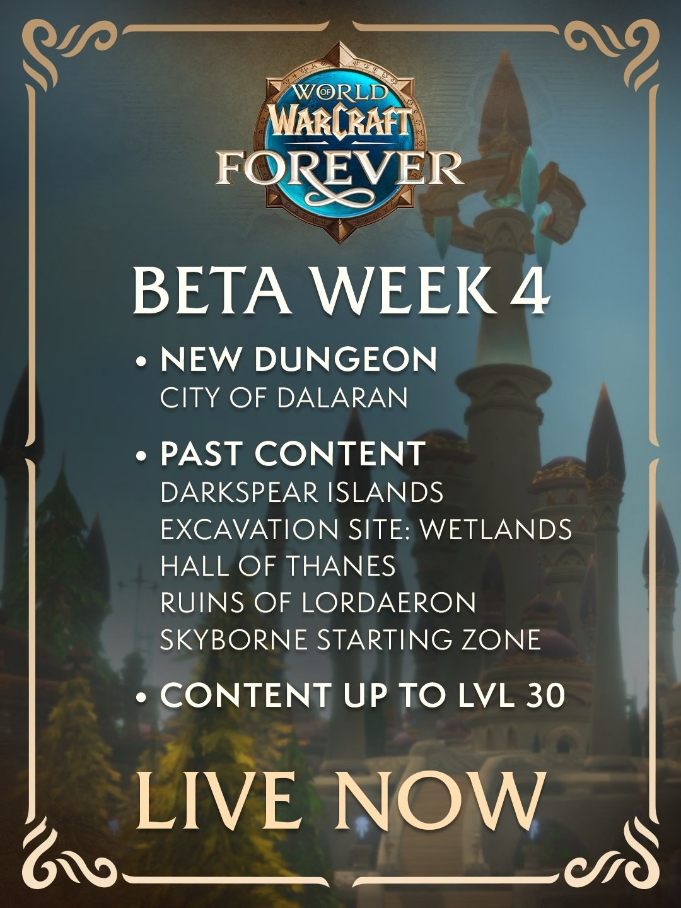

De dungeon City of Dalaran kan getest worden op de beta van World of Warcraft: Forever. Hij opende met een nieuwe build op 8 oktober, de vierde week van de beta. Het maximumlevel blijft 30, en alles van de vorige weken blijft beschikbaar.

Blizzard zette de wijzigingen in de ontwikkelnotities op de forums. De build brengt ook [20% meer experience in dungeons](/nl/news/dungeon-kills-give-20-percent-more-experience/), [nieuwe waarden voor veel spellranks](/nl/news/every-new-spell-rank-is-now-an-upgrade/), [wands die weer zilver opbrengen](/nl/news/crafted-wands-sell-for-silver-again/) en [level 40 voor Truthseeker's Bow](/nl/news/truthseekers-bow-now-requires-level-40/).

## Wat er in week 4 zit

| Inhoud | Status | Meer |
|---|---|---|
| **City of Dalaran** | Nieuw deze week | [Dungeongids](/nl/guides/dungeons/city-of-dalaran/) |
| **Darkspear Islands** | Uit eerdere weken | [Post](/nl/news/darkspear-islands-pits-15-players-against-15/) |
| **Excavation Site: Wetlands** | Uit eerdere weken | [Dungeongids](/nl/guides/dungeons/excavation-site-wetlands/) |
| **Hall of Thanes** | Uit eerdere weken | [Dungeongids](/nl/guides/dungeons/hall-of-thanes/) |
| **Ruins of Lordaeron** | Uit eerdere weken | [Dungeongids](/nl/guides/dungeons/ruins-of-lordaeron/) |
| **Startgebied van de Skyborne** | Uit eerdere weken | [Post](/nl/news/the-skyborne-choose-their-side/) |
| **Maximumlevel** | 30 | [Route 1 tot 60](/nl/routes/1-60/) |

Hoe je de dungeon bereikt, als Alliance door de riolen en als Horde met een sleutel, staat in de [gids over de City of Dalaran](/nl/guides/dungeons/city-of-dalaran/). De laatste bazen liggen boven level 30.

## Gevechten en Rage

Spelers kunnen weer meerdere wapens wisselen binnen één global cooldown, bijvoorbeeld met een macro van een tweehandig wapen naar een zwaard en schild. Enkele bugs in de Rage die je krijgt door schade zijn opgelost. Rage hing af van de gezondheid van de speler in plaats van die van de aanvaller, dus meer Stamina gaf minder Rage. Absorbs, critical strikes en crushing blows tellen nu correct mee.

Blizzard veranderde ook de basis voor die Rage. Ze was afgestemd op een Warrior met 50% armor, wat bij een tank past maar niet bij een Warrior die quest. Nu ligt de basis tussen 20% en 40%, afhankelijk van het level. De gemiddelde Warrior of Druid zou meer Rage moeten krijgen door schade, zegt Blizzard.

## Legacy, interface en PvP

- Elke betaspeler heeft de Legacy Challenge voltooid en krijgt 16 Legacy Points om het systeem te testen. Een respec van Legacy Points kost op de beta 1 zilver. Plan ze in de [Legacy-calculator](/nl/talents/legacy/); hoe de punten werken, staat in de [post over de 16 punten](/nl/news/every-beta-tester-gets-16-legacy-points/).
- De Cooldown Manager ondersteunt nu elke class, alle racials en trinkets. Consumables volgen later.
- Voicechat kan via Discord, gekozen door de partyleider. Advertenties in de Group Finder kunnen een voicemodus kiezen.
- Het inspectievenster is nieuw, en de Quest Log toont het soort quest en het vereiste level.
- Critical strikes in PvP hebben geen verminderd effect meer.
- Monsters zonder loot kun je weer aanklikken, zoals in Classic.

## Quests

De nieuwe quests van de Gelkis en de Magram in Desolace beginnen nu op level 35 (was 30), en hun beloningen vragen level 35 na een komende hotfix. Quests en monsters rond Shadowvale en Bandarion Keep in Tirisfal Glades liggen hoger in level. Stitches is weer vijandig als hij Darkshire binnenwandelt, en de Lazy Peons in Durotar zijn, in de woorden van Blizzard, luier.
