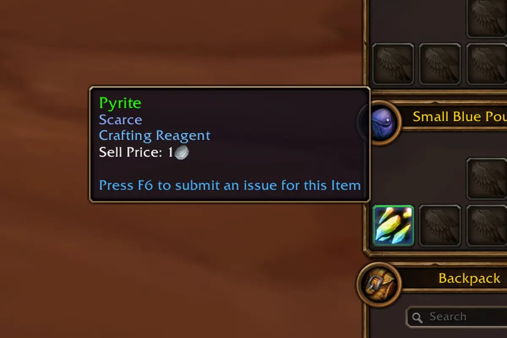
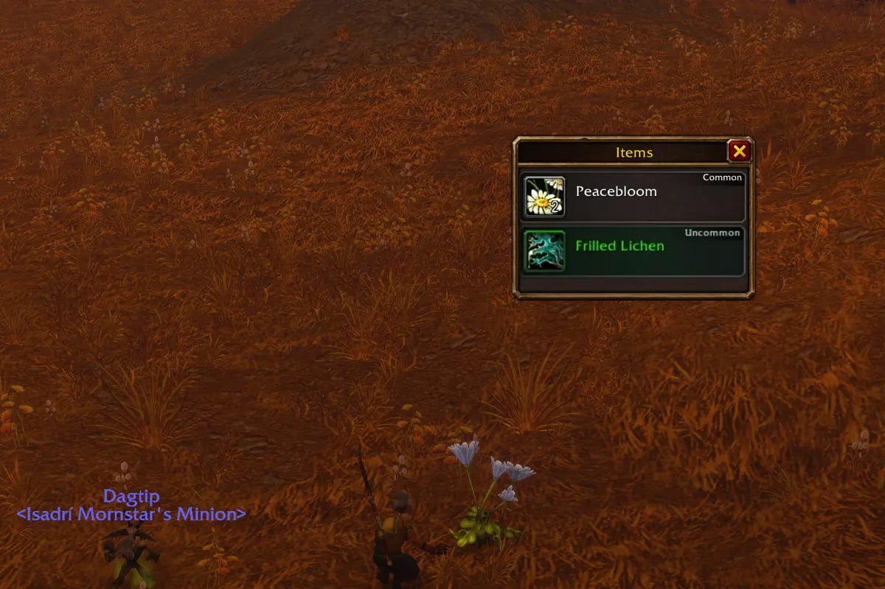

De verzamel-tradeskills van WoW Forever hebben een nieuw soort materiaal. Scarce-materialen hebben geen eigen nodes, maar vallen af en toe uit elk kruid, elk erts of elke gevilde beast. Op de beta zijn er drie bekend, een per tradeskill.

## De drie materialen

| Tradeskill | Scarce-materiaal |
|---|---|
| Mining | <a class="wf-wh wf-q2" href="https://www.wowhead.com/forever/item=249391">Pyrite</a> |
| Herbalism | <a class="wf-wh wf-q2" href="https://www.wowhead.com/forever/item=249399">Frilled Lichen</a> |
| Skinning | <a class="wf-wh wf-q2" href="https://www.wowhead.com/forever/item=249427">Pristine Leather</a> |

Het item zegt zelf Scarce in zijn tooltip. Het is een zeldzamere extra bovenop de gewone buit, schrijft Icy Veins.

## Waarvoor ze dienen

Alle drie gaan ze in nieuwe recepten van andere tradeskills. Frilled Lichen zit in <a class="wf-wh wf-spell" href="https://www.wowhead.com/forever/spell=1248757">Enchant Weapon - Insight</a>, dat bij het casten van een spell je Spirit 10 seconden kan verdubbelen, en in <a class="wf-wh wf-q2" href="https://www.wowhead.com/forever/item=249409">Cerulean Dye</a> van Alchemy. Die kleurstof gaat in veel recepten van Tailoring.

Ook Pyrite duikt op bij Tailoring, bijvoorbeeld in <a class="wf-wh wf-q3" href="https://www.wowhead.com/forever/item=253899">Shining Boots</a>. Pristine Leather gaat in Leatherworking, zoals de <a class="wf-wh wf-q3" href="https://www.wowhead.com/forever/item=252504">Brawler's Leather Hood</a>, en in Blacksmithing en Tailoring.

## Wat er later komt

<a class="wf-wh wf-q2" href="https://www.wowhead.com/forever/item=249425">Bauxite</a> en <a class="wf-wh wf-q2" href="https://www.wowhead.com/forever/item=249426">Pitchblende</a> staan in de bestanden als Scarce-materialen voor Mining, schrijft Icy Veins. Vanaf welke skill ze verschijnen en of Herbalism en Skinning er ook meer krijgen, zegt Blizzard niet.
