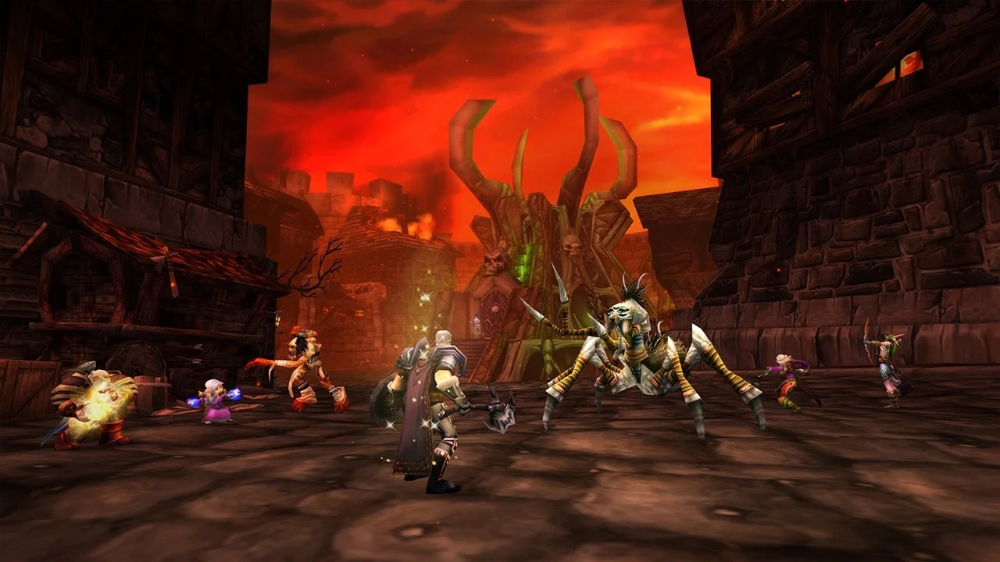
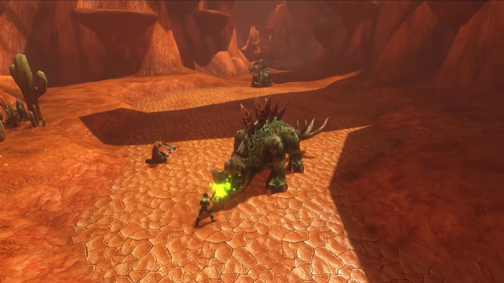
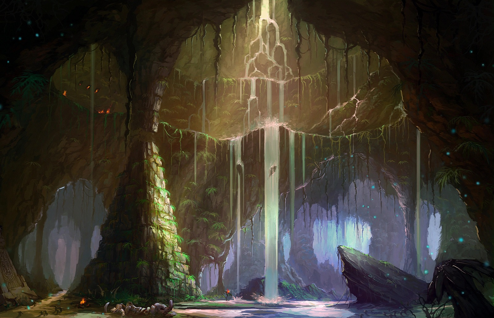

Spelers op de beta van World of Warcraft: Forever levelen vaak alleen, schrijft Icy Veins. Volle zones maken van questen een wedloop om objectives, en een groep heeft meer drops nodig. Dungeons leveren sinds de laatste nerfs ook minder op.

Het artikel van Zweihander verscheen op 4 oktober om 15.19 uur Belgische tijd. Het verzamelt klachten van Reddit en de forums van Blizzard, en doet zelf ook een paar voorstellen.

## Terug naar de open wereld

In Classic gaven elite mobs in dungeons 2,5 keer zoveel experience, volgens Icy Veins. Spelers liepen daarom steeds dezelfde dungeons. Forever haalt bijna alle experience weg bij mobs in dungeons en verschuift die naar de dungeonquests, zoals [Blizzard in september aankondigde](/nl/news/wow-forever-dungeon-experience-changes/). Monsters doden in een dungeon geeft nu minder dan alleen buiten questen.

## Volle zones

Met meer spelers buiten wordt de wedloop om questobjectives groter. Layers hangen nu aan een zone, dus elke layer zit vol spelers, schrijft Icy Veins. Vroeger kon je op een rustige layer ongestoord questen. Op de subreddit classicwow hoopt een speler dat de volle layers alleen voor de beta zijn.

<figure class="wf-embed wf-embed--reddit" data-wf-reddit="r/classicwow/comments/1wp7zyy/way_overpopulated_layers_i_hope_its_just_for_the">
  <button type="button" class="wf-embed__play">
    
    
      Way overpopulated layers, i hope its just for the beta
      Laad de post van de subreddit classicwow.
    
  </button>
</figure>

Questitems op de grond hebben te weinig spawnplaatsen en komen traag terug. Bij elke spawn van een questmob wachten meerdere spelers. Escortquests zijn het ergst: ze komen vaak maar om de 5 tot 15 minuten terug, en de timer start pas als de vorige escort voorbij is. Blizzard verhoogde de respawn in meerdere zones, maar volgens Icy Veins helpt dat nauwelijks.

## Waarom een groep niet helpt

Questdrops en objecten worden in een groep niet gedeeld. Elk extra lid betekent meer drops verzamelen voor de groep verder kan, dus weigeren spelers uitnodigingen, schrijft Icy Veins.

Blizzard verdeelt questdrops al gelijkmatiger over een groep, met [bescherming tegen pech](/nl/news/quest-drops-in-a-group-get-bad-luck-protection/). Dat vlakt het geluk uit, maar verhoogt de dropkans niet. Shared tagging, waarbij spelers buiten een groep credit krijgen voor dezelfde kill, komt er niet: [Aggrend sloot dat uit](/nl/news/aggrend-rules-out-shared-tagging/) in september.

<figure class="wf-embed wf-embed--x" data-wf-x="2101711250342453367">
  <button type="button" class="wf-embed__play">
    
    
      Aggrend over shared tagging
      Laad de post van X.
    
  </button>
</figure>

## Minder uit dungeons

Sinds de betapatch van 1 oktober geven dungeonquests [50% minder bonusexperience](/nl/news/dungeon-quests-give-50-percent-less-bonus-experience/). Alleen de bonus die Forever toevoegde, valt lager uit; de basisexperience blijft. Zonder experience van mobs levert dezelfde run nu nog minder op, volgens Icy Veins.

Icy Veins neemt Wailing Caverns als voorbeeld. Deviate Hides kan meerdere runs vragen, de dungeon is lang en de trash kan niet overgeslagen worden. Wie na een uur met twee of drie quests buitenkomt, heeft weinig reden voor een tweede run. Zijn je quests klaar, dan biedt een dungeon bijna niets meer, dus anderen helpen kost ook tijd.

Questbeloningen en drops uit dungeons verloren met de patch van 1 oktober ook stats, bevestigde Senior Game Designer Aidan Moon, bekend als Zirene, op de forums. Spelers zagen blauwe beloningen veranderen in zwakkere groene versies, zoals de [halskettingen voor 10 boeken](/nl/news/necklaces-for-10-books-drop-to-green-quality/).

## Skips en nieuwe spelers

Omdat mobs in dungeons bijna geen experience geven, slaan groepen alles over wat geen gear laat vallen en geen quest heeft. Voor veteranen is dat snel, voor nieuwe spelers ontmoedigend, schrijft Icy Veins. Dungeons om te levelen, die groepsspel zouden moeten leren, gaan lijken op runs uit de endgame, met sprongen en routes die nieuwkomers niet kennen.

Op de subreddit classicwow schrijft redlow0992 dat nieuwe spelers zich slecht voelen in groepen van veteranen die de halve dungeon overslaan. Veteranen raken op hun beurt gefrustreerd door nieuwkomers die de sprongen niet kennen.

<figure class="wf-embed wf-embed--reddit" data-wf-reddit="r/classicwow/comments/1wv184k/dungeon_xp_nerfs_created_a_toxic_meta">
  <button type="button" class="wf-embed__play">
    
    
      Dungeon XP Nerfs Created a Toxic Meta
      Laad de post van de subreddit classicwow.
    
  </button>
</figure>

## Tanks en healers

Tank- en healspecs levelen alleen trager dan damagespecs, dus de nerfs raken hen het hardst. Dual Specialization komt vrij op level 40 en kost 50 goud, te veel voor veel nieuwe spelers, volgens Icy Veins. Het stelt voor om zowel de prijs als het level te verlagen. Op de subreddit wowforever vragen healers Blizzard om hen niet te vergeten.

<figure class="wf-embed wf-embed--reddit" data-wf-reddit="r/wowforever/comments/1wvmi4k/healers_the_50_dungeon_quest_xp_nerf_blizzard">
  <button type="button" class="wf-embed__play">
    
    
      Healers and the 50% Dungeon Quest XP Nerf
      Laad de post van de subreddit wowforever.
    
  </button>
</figure>

Icy Veins vraagt zich af of gedeelde questdrops in een groep de Classic-ervaring echt zouden schaden. Of Blizzard voor de launch op 4 november iets verandert, is niet bekend.
