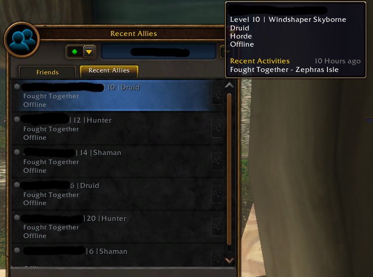
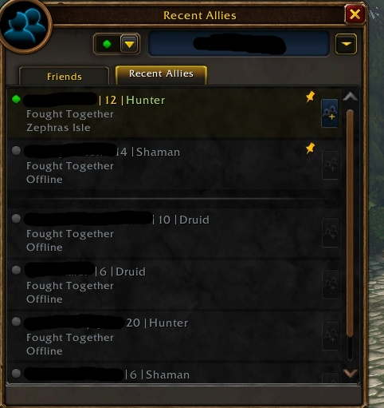

World of Warcraft: Forever houdt een lijst bij van elke speler met wie een personage in een groep zat. Het venster Recent Allies staat naast de Friends List en bewaart naam, level, class, plaats en activiteit. Wowhead toonde het uit de beta.

## Wat de lijst bewaart

Elke keer dat een speler met iemand in een groep zit, komt er een regel bij in Recent Allies, schrijft Wowhead. Die bewaart de naam, het huidige level, de class, de plaats waar de twee elkaar tegenkwamen en wat ze samen deden. Wie online is, krijgt een knop die hem met één klik uitnodigt.

Op de schermafdrukken uit de beta staat bij elke regel Fought Together. De tooltip toont ook het ras, de factie en hoe lang geleden de activiteit was.

Een recente bondgenoot is vast te pinnen, zodat de naam altijd bovenaan de lijst blijft. Wie vaak genoeg met dezelfde speler optrekt, kan hem nog altijd aan de vriendenlijst toevoegen.

Hoeveel spelers de lijst bewaart en hoe lang een regel blijft staan, schrijft Wowhead niet.

## Deel van een sociaal ontwerp

Forever leunt op samen spelen, en Blizzard zei in meerdere interviews dat wrijving daarbij helpt. In [een interview met Game Informer](/nl/news/one-faction-per-player-on-pvp-rulesets/) noemden twee leads het lopen naar een dungeon of een lange vlucht een moment waarop spelers met elkaar praten. In een interview met Windows Central zei het team hetzelfde omgekeerd: haal de wrijving weg en het spel wordt eenzamer, schrijft Wowhead.

Het ontbreken van [shared tagging](/nl/news/aggrend-rules-out-shared-tagging/) past in dat beeld. Alleen de eerste speler of groep die een mob raakt, krijgt de kill, en dat duwt spelers naar een groep. Wowhead ziet Recent Allies als het vervolg daarop: wie groept voor een bezette mob of een dungeon, houdt een lijst namen over om later weer op te zoeken.
