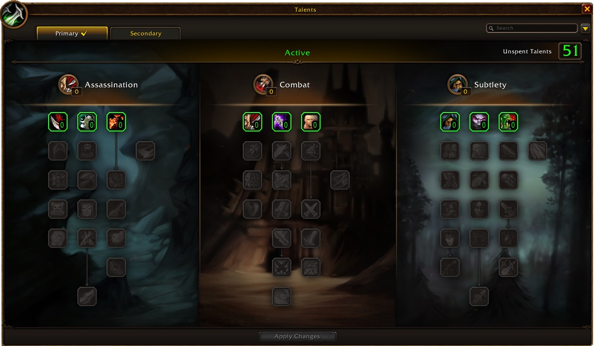
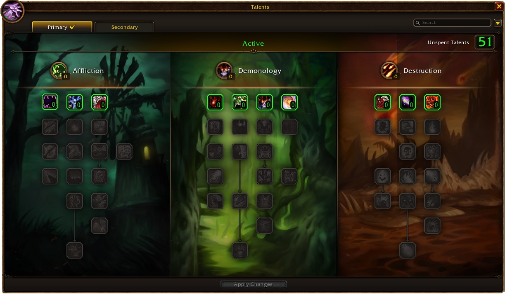

De class deep dive van Blizzard over de Rogue en de Warlock is uit. Rogues in WoW Forever kunnen bijlen voor één hand dragen, en Sap haalt hen niet meer uit Stealth. Warlocks krijgen Banes: Curse of Agony en Curse of Doom worden een aparte soort spell, naast hun Curses.

De talentbomen volgen dezelfde opbouw als in de deep dive over de [Mage en de Shaman](/nl/news/mages-get-frostfire-bolt-shamans-get-lava-burst/): talenten vanaf level 10, mijlpalen op 11, 16, 21 en 31 punten, en Dual Specialization op level 40. Alles kan tijdens de beta nog veranderen, zegt Blizzard.

## Rogue

Poisons krijgen meer charges en blijven op het wapen naast Sharpening Stones en Weightstones. Sap haalt de Rogue niet meer uit Stealth, zodat hij een extra monster uit een pull kan halen. Distract verlaagt nu ook 10 seconden lang hoe goed vijanden Stealth opmerken. Vijandige spelers merken wel dat er een Rogue in de buurt is. Feint verlaagt twee keer zoveel threat.

Expose Armor haalt nu evenveel armor weg als 5 keer Sunder Armor op ongeveer hetzelfde level. Warriors kunnen Sunder Armor nog altijd op hetzelfde doelwit gebruiken om threat op te bouwen. Rogues kunnen ook bijlen voor één hand leren. Struikrovers en vogelvrijen dragen in verhalen vaak een bijl, legt Blizzard uit, en het extra wapentype geeft meer keuze in loot.

Assassination draait om Poisons. Mutilate, op 21 punten, slaat met twee dolken, raakt harder tegen vergiftigde doelwitten en geeft 2 Combo Points. Met Improved Poisons gaat een Poison vaak af zonder een charge te gebruiken. De boom eindigt in Venom, een finisher die Poisons 30% meer schade geeft. Cold Blood schuift naar 16 punten.

Combat voegt de vier wapenspecialisaties samen in Hack and Slash, met een bonus voor Axes erbij. Maces negeren nu een deel van de armor van het doelwit in plaats van te stunnen. Flawless Execution, op 16 punten, maakt Eviscerate 10 Energy goedkoper. Aggression helpt nu ook Backstab, zodat Combat rond Backstab of Sinister Strike gebouwd kan worden.

Subtlety krijgt Premeditation op 16 punten, met een duur van 20 seconden. Door Cutthroat maakt Backstab soms een Ambush zonder Stealth mogelijk. Quietus versterkt Sinister Strike, Ghostly Strike en Hemorrhage tegen doelwitten onder 35% health. Thousand Cuts, op 31 punten, maakt bij elke tik van Rupture de volgende Hemorrhage of Backstab goedkoper. Sleight of Hand en Deadliness verdwijnen.

## Warlock

Curse of Agony en Curse of Doom worden Banes. Banes dragen de schade, Curses het nut, en elke Warlock kan maar één Bane op een doelwit houden. Curse of the Elements geldt nu voor alle magische schade, en Curse of Shadows verdwijnt. Firestone en Spellstone worden weapon imbues die samengaan met Wizard Oil. Firestone geeft Fire-schade en crit, Spellstone Shadow-schade en spell haste.

Life Tap groeit mee met Spirit. Drain Soul krijgt per tik een groeiende kans op een Soul Shard, tot er zeker een komt. Demonen groeien nu mee met de stats van hun Warlock.

Affliction eindigt in Wrack, een drain die de andere Shadow-schade over tijd 10% harder laat raken. Pandemic verhoogt de bonus op critical strikes van schade over tijd en drains met tot 100%. Curse of Exhaustion schuift naar 16 punten en vertraagt met 30%. Improved Curse of Weakness, Grim Reach en Dark Pact zitten bij de zes talenten die verdwijnen.

Demonology krijgt Demonic Sacrifice op 11 punten, met effecten die 2 uur duren. Fel Domination schuift naar 16 punten en Soul Link naar 21. Demonic Pact, op 31 punten, houdt het offer vast als een andere demon opgeroepen wordt. De Warlock heeft dan Demonic Sacrifice en Master Demonologist tegelijk. Beide talenten stonden al in de [video Class Highlights](/nl/news/warlocks-keep-their-sacrifice-and-their-demon/).

Destruction krijgt Conflagrate op 16 punten en Bane of Havoc op 21. Die Bane kopieert 15% van alle schade op andere doelwitten naar het vervloekte doelwit. De boom eindigt in Incinerate, met 25% meer schade tegen een doelwit met Immolate. Destructive Reach schuift naar de eerste rij en werkt nu voor elke spell die schade doet. Devastation en Emberstorm verdwijnen.

## Mijlpaaltalenten van de Rogue

| Talent | Boom | Punten |
|---|---|---|
| Cold Blood | Assassination | 16 |
| Mutilate | Assassination | 21 |
| Venom | Assassination | 31 |
| Flawless Execution | Combat | 16 |
| Premeditation | Subtlety | 16 |
| Thousand Cuts | Subtlety | 31 |

## Mijlpaaltalenten van de Warlock

| Talent | Boom | Punten |
|---|---|---|
| Curse of Exhaustion | Affliction | 16 |
| Wrack | Affliction | 31 |
| Demonic Sacrifice | Demonology | 11 |
| Fel Domination | Demonology | 16 |
| Soul Link | Demonology | 21 |
| Demonic Pact | Demonology | 31 |
| Conflagrate | Destruction | 16 |
| Bane of Havoc | Destruction | 21 |
| Incinerate | Destruction | 31 |

Elk talent van beide classes, rank per rank, staat in de [talentcalculator](/nl/talents/) voor de [Rogue](/nl/talents/rogue/) en de [Warlock](/nl/talents/warlock/).
