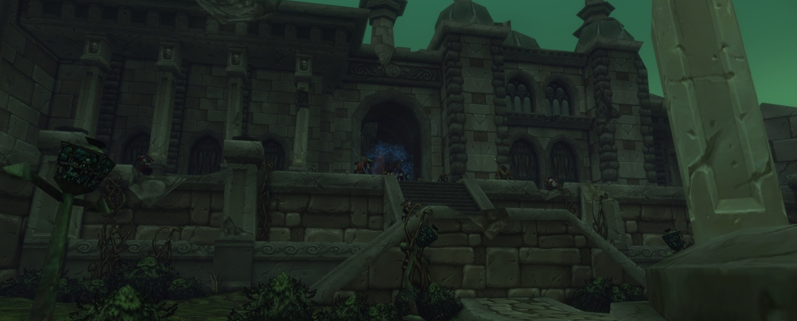
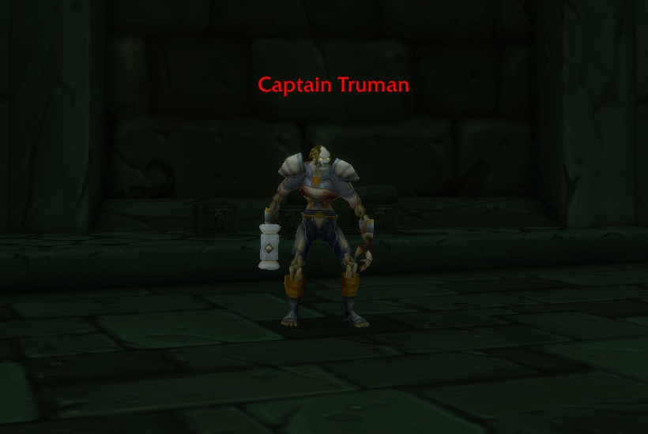
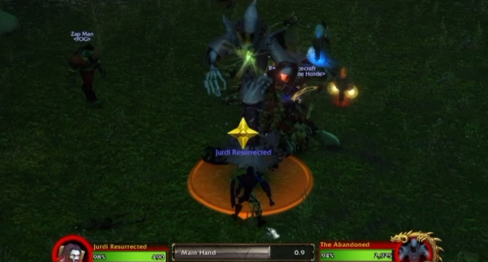

De Ruins of Lordaeron is de dungeon boven de Undercity in World of Warcraft: Forever, voor level 15 tot 20. Wowhead publiceerde een walkthrough. De zes bazen kunnen in willekeurige volgorde. De Horde vindt er zes quests, de Alliance vier.

<figure class="wf-embed" data-wf-video="VbryA5eOUHI">
  <button type="button" class="wf-embed__play">
    
    
      Ruins of Lordaeron Dungeon Guide: All Quests, Bosses and Loot
      Speel de video af. Jurdi op YouTube, 28 minuten.
    
  </button>
</figure>

De walkthrough komt van Jurdi, die ook die van [de Hall of Thanes](/nl/news/the-hall-of-thanes-has-four-bosses-and-five-quests/) schreef. Hij speelde de dungeon in de beta en noemt hem niet-lineair, met geheimen die je makkelijk mist. De eindbaas is level 20, schrijft Wowhead, zonder te zeggen welke van de zes dat is.

## Waar hij ligt

De ingang ligt in de open ruïnes van Lordaeron, de stad boven de Undercity, meteen links na de poort, schrijft Wowhead. De Spirit Healer staat vlak buiten, dus een wipe kost weinig tijd.

Voor de Horde is het een korte wandeling vanuit Brill. De Alliance heeft een lange reis: de boot van Stormwind Harbor naar Auberdine, dan de boot naar Menethil Harbor en door naar Southshore, en van daar naar het noorden langs Dalaran en door Silverpine Forest, volgens de dungeongids van Wowhead. Skyborne aan de kant van de Alliance slaan het meeste over met een portaal van de Mage Tower in Stormwind naar Dalaran.

## Zes quests voor de Horde, vier voor de Alliance

Vier quests van de Horde beginnen buiten de dungeon. The Wrath of Rath'mael komt van Deathguard Kristof bij de karavaan tussen Brill en de Undercity. A Frightened Request komt van Tabitha Heartweaver bij The Sepulcher in Silverpine Forest. The New Plague begint in het Apothecarium en Light's Justice in het Royal Quarter van de Undercity.

Twee andere beginnen binnen. The Baron laat het Abominable Head vallen, dat Unending Torment start, een reeks van vijf stappen in de Undercity. Een Crest of Lordaeron ligt ergens in de dungeon, op een van meerdere plekken, en start een quest met dezelfde naam voor beide facties.

De Alliance vindt alles binnen. Captain Truman, vriendelijk voor de Alliance en vijandig voor de Horde, wacht bij de ingang met Abominable Creatures. Undead laten Bloodied Insignias vallen, een Blood-Stained Letter bij Rath'mael start Remember That I Love You, en de Crest gaat naar Stormwind.

Elke quest geeft tot 9.750 experience. In het spel kleuren ze rood, zelfs op level 17, omdat de quests level 21 en 22 zijn, maar de dungeon lukt op 17, zegt Wowhead.

| Beloning | Soort | Quest |
|---|---|---|
| The Stitcher | Eenhandige mace, Horde | Light's Justice |
| Gnarled Necromancer's Staff | Staff | The Wrath of Rath'mael |
| Slain Baron's Signet | Ring | Abominable Creatures |
| Tarnished Locket | Halsketting, Alliance | Remember That I Love You |

Elke quest met zijn questgever, coördinaten en alle beloningen staat in de [gids over de Ruins of Lordaeron](/nl/guides/dungeons/ruins-of-lordaeron/).

## Zes bazen in willekeurige volgorde

**Witherfang** is een spin die met twee kleinere spinnen door King's Alley patrouilleert. Ruim eerst de trash op zijn pad op, zodat hij alleen komt. Zijn Leech Poison kan van de tank gehaald worden.

**The Baron** is een abomination wiens Knockout hard aankomt en de tank snel kan doden. Hou de tank op volle gezondheid en stun hem zo vaak mogelijk, schrijft Wowhead.

**Viktor the Vile** mis je makkelijk. Een groep moet eerst de Kindled Flame in een schouw van een gebouw bij het kerkhof aansteken en vijf golven adds verslaan. Hij slaat hard, dus de tank heeft aggro nodig voor de rest meedoet. In de beta verschijnt hij soms niet.

**The Abandoned** komt tevoorschijn na drie golven adds in Market Street. Hij cast Frost Nova en vertraagt wie hem in melee raakt, maar zijn Life Drain op de tank telt het meest. Een stun voor het einde van de cast houdt die tegen.

**Bjork** cast alleen een kort Anti-Magic Shield. Wowhead noemt hem een makkelijke baas.

**Rath'mael** zet een Flamestrike op de grond waar de tank stond. Stap eruit en vecht verder op een nieuwe plek.

## Dichte trash

De trash slaat minder hard dan in de Hall of Thanes, schrijft Wowhead, maar de groepjes staan dicht op elkaar. Twee tegelijk pullen gaat makkelijk, en groepen zonder crowd control hebben het moeilijk, vooral op een laag level. Paladins doen het goed vanaf level 20, als ze Exorcism leren, dat undead raakt.

## Wat niet zeker is

Blizzard geeft de dungeon een bereik van 15 tot 20. Wowhead houdt het op 16 tot 23 in het nieuwsartikel en op 16 tot 22 in zijn dungeongids. Viktor the Vile verschijnt in de beta niet altijd. Of dat voor de launch op 4 november opgelost is, is niet bekend.

Dungeons in Forever geven minder experience van monsters bij een tweede run, dus een groep die Viktor of de Crest mist, heeft minder reden om terug te komen, schrijft Wowhead.
