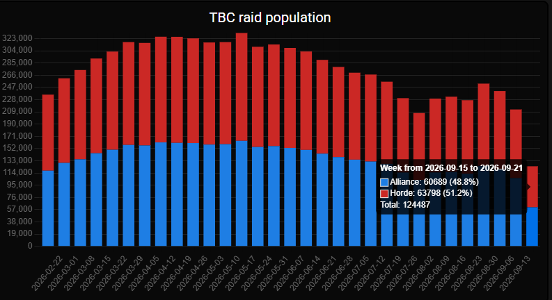
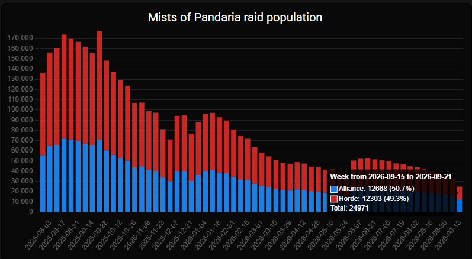

TBC Anniversary verloor 88.334 raiders in de week dat de beta van World of Warcraft: Forever opende. Het aantal zakte van 212.821 naar 124.487, volgens Ironforge.pro, dat de logs van Warcraft Logs uitleest. MoP Classic verloor een kwart.

## TBC Anniversary

Ironforge.pro telde 212.821 raiders in TBC Anniversary van 8 tot 14 september. Van 15 tot 21 september waren het er 124.487, een daling van 41 procent. De beta van Forever opende op 17 september, midden in die tweede week.

Forever verschijnt pas op 4 november, en gegarandeerde toegang tot de beta zit in het Skyborne Epic Pack van 59,99 euro. Wowhead verwachtte daarom dat TBC Anniversary tot de launch een sterke raidpopulatie zou houden.

De grafiek toont ook dat de daling eerder begon. Op de piek in mei raidden er in één week meer dan 320.000 spelers. In de week van de beta waren Alliance en Horde bijna gelijk: 60.689 tegen 63.798.

TBC Anniversary zit in fase 3, met [Black Temple en Hyjal Summit](/nl/bis/tbc/p3/). Zul'Aman en Sunwell Plateau moeten nog komen. Of Wrath of the Lich King Anniversary daarna volgt, is niet bekend, schrijft Wowhead.

## MoP Classic

In MoP Classic zakte de raidpopulatie in dezelfde twee weken van 33.125 naar 24.971, volgens Ironforge.pro. Die versie zit sinds juni in haar laatste fase, toen [Siege of Orgrimmar](/nl/news/mop-classic-siege-of-orgrimmar/) opende.

Spelers van MoP Classic wachten op nieuws over wat er met hun personages gebeurt, schrijft Wowhead. Velen spelen ze al sinds WoW Classic in augustus 2019 verscheen. Wat Blizzard met hen van plan is, is niet aangekondigd.

## Wat de cijfers niet tonen

Ironforge.pro telt alleen raiders die in logs op Warcraft Logs staan. Raids die niemand logt, ontbreken in de telling.

Wowhead leest de daling als spelers die in de beta van Forever zitten of wachten op de plannen van Blizzard voor beide versies. Of de raiders na de beta terugkomen, is niet bekend.
