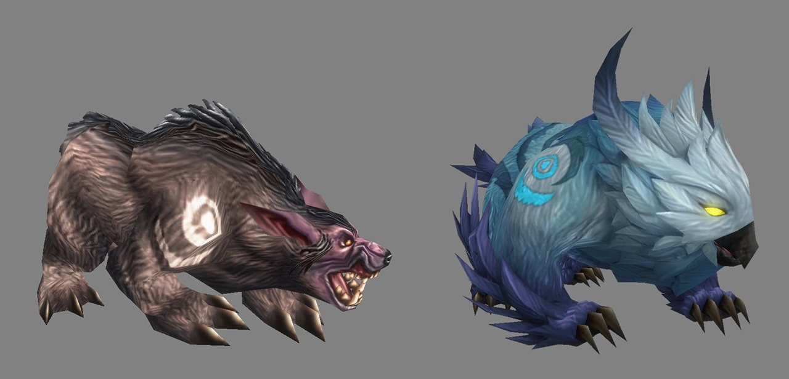
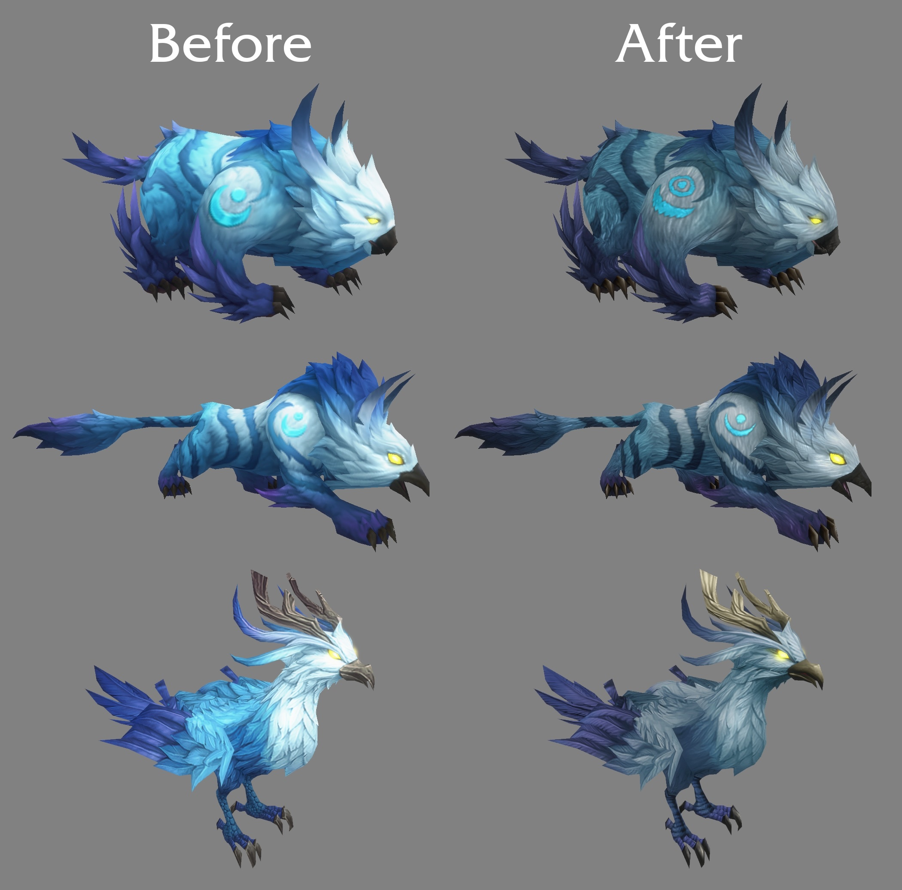

De Skyborne krijgen modellen in standaarddefinitie, voor de personages van spelers en voor hun Druid forms. Ze komen begin 2027, zegt Blizzard. Tot nu toe zijn de Skyborne het enige ras in World of Warcraft: Forever zonder SD-modellen. Ook de HD Druid forms krijgen nieuwe textures.

Bij elk ander ras kunnen spelers kiezen tussen de originele modellen en HD-modellen. Toen die keuze gemaakt werd, ging de aandacht naar de rassen van het originele spel, omdat veel spelers aan die modellen gehecht zijn. Spelers vonden dat de HD Skyborne te veel opvallen in een wereld van SD-modellen, en Blizzard is het daarmee eens:

> "However, we have heard feedback that the HD Skyborne can be jarring by contrast when placed in the same world as the SD models and world, and we agree."

Het beeld bovenaan deze post is een vroeg werkbeeld van de SD Skyborne. Blizzard deelt meer dichter bij de release. Op 5 oktober [beloofde Blizzard al meer informatie](/nl/news/blizzard-promises-more-on-the-skyborne-models/) over de modellen van het ras, in een reactie onder een video.

## Nieuwe vacht voor de HD Druid forms

WoW Forever wil de stijl van het originele spel bewaren en spelers toch meer keuze geven, schrijft Blizzard. Sommige ideeën pasten daar niet goed genoeg bij. De HD Druid forms van de Skyborne zijn het eerste voorbeeld dat het team opnieuw bekijkt.

De forms worden minder zacht, krijgen een vacht met meer detail en minder verzadigde kleuren. De Skyborne komen uit een exotische omgeving en hun forms mogen dat tonen, zegt Blizzard, maar ze mogen niet botsen met de andere wezens in de wereld.

Wanneer de nieuwe HD forms op de beta komen, zegt Blizzard niet.
