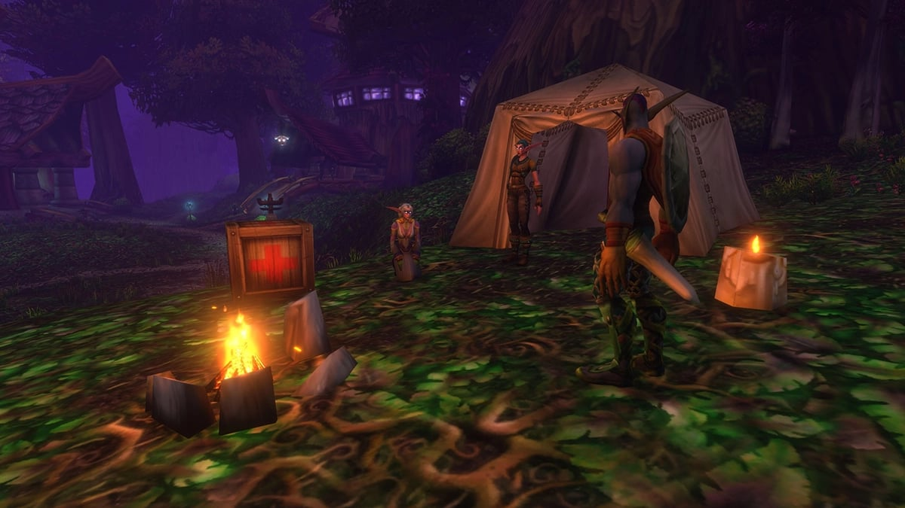
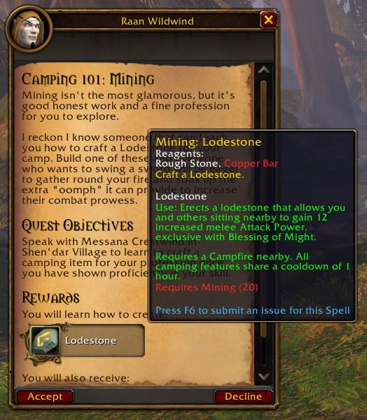
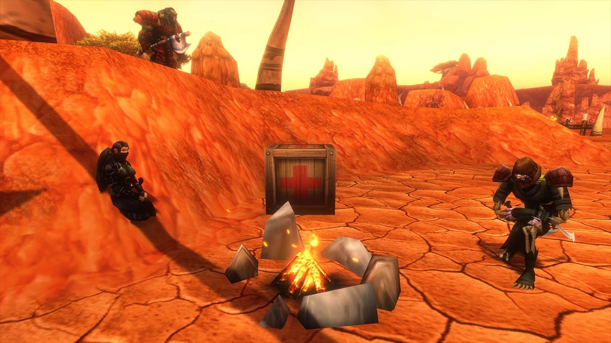

Camping ist ein neues System in WoW Forever. Jemand zündet ein Lagerfeuer an, jeder Beruf stellt ein Objekt dazu, und wer eine Minute dort sitzt, bekommt die Buffs. Höhere Stufen bringen Werkbänke, einen Händler und einen Reparaturroboter.

## Auf einen Blick

| | |
|---|---|
| Lagerfeuer | Cooking, einmal nutzbar, brennt etwa 10 Minuten |
| Abklingzeit des Lagerfeuers | 5 Minuten |
| Objekte pro Lager | 3, 5 oder 10, je nach Lagerfeuer |
| Objekte pro Charakter | 1, mit einer gemeinsamen Abklingzeit von 1 Stunde |
| Die Buffs bekommen | Setz dich (/sit) 1 Minute ans Feuer |
| Objekte der Stufe 1 | Skill 20, vom Lehrer oder aus der Quest Camping 101 |
| Stufe 2 und 3 | Skill 140 und 300, aus Blueprints |

## Das Lagerfeuer

Jedes Lager beginnt mit einem Lagerfeuer aus Cooking. Du brauchst <a class="wf-wh wf-q1" href="https://www.wowhead.com/forever/item=4471">Flint and Tinder</a> und ein Stück Holz. Rechtsklick auf das Kit, einen Platz wählen, und das Feuer brennt etwa 10 Minuten.

| Lagerfeuer | Blueprint | Kit nutzbar ab | Holz | Platz für |
|---|---|---|---|---|
| <a class="wf-wh wf-spell" href="https://www.wowhead.com/forever/spell=1229737">Basic Campfire</a> | Cooking-Lehrer | Cooking 1 | <a class="wf-wh wf-q1" href="https://www.wowhead.com/forever/item=4470">Simple Wood</a> | 3 Objekte |
| <a class="wf-wh wf-spell" href="https://www.wowhead.com/forever/spell=1283400">Journeyman Campfire</a> | <a class="wf-wh wf-q2" href="https://www.wowhead.com/forever/item=273087">Blueprint: Journeyman Campfire</a> (Cooking 90) | Cooking 140 | <a class="wf-wh wf-q1" href="https://www.wowhead.com/forever/item=11291">Star Wood</a> | 5 Objekte |
| <a class="wf-wh wf-spell" href="https://www.wowhead.com/forever/spell=1291341">Expert Campfire</a> | <a class="wf-wh wf-q2" href="https://www.wowhead.com/forever/item=273101">Blueprint: Expert Campfire</a> (Cooking 200) | Cooking 220 | <a class="wf-wh wf-q1" href="https://www.wowhead.com/forever/item=272941">Thick Logs</a> | 10 Objekte |

Der Journeyman-Blueprint droppt in The Deadmines und Wailing Caverns, schreibt Warcraft Tavern. Für den Expert-Blueprint ist noch keine Quelle bekannt.

## So funktionieren die Buffs

An einem Feuer bekommst du <a class="wf-wh wf-spell" href="https://www.wowhead.com/forever/spell=1283391">Campfire Nearby</a>. Tipp /sit, und nach einer Minute wird aus <a class="wf-wh wf-spell" href="https://www.wowhead.com/forever/spell=1289723">Welcoming Campfire</a> <a class="wf-wh wf-spell" href="https://www.wowhead.com/forever/spell=1229741">Camp Benefits</a>, ein Buff, der jeden Effekt des Lagers enthält. Fahr mit der Maus darüber, um zu sehen, welche du hast. Erneut hinsetzen fügt die Effekte später aufgestellter Objekte hinzu.

Jeder Lagerbuff ist eine schwächere Kopie eines Klassenbuffs und stapelt nicht mit ihm. Das Camp Tent ist das einzige mit eigener Abklingzeit: danach hast du eine Stunde <a class="wf-wh wf-spell" href="https://www.wowhead.com/forever/spell=1229451">Boosted Rest</a>.

## Stufe 1: der Buff jedes Berufs

Die Tooltips zeigen die Buffs in Stufen; die Tabelle nennt die höchste. Was die Stufe bestimmt, sagt der Tooltip nicht.

| Beruf | Objekt | Buff | Materialien |
|---|---|---|---|
| Alchemy | <a class="wf-wh wf-spell" href="https://www.wowhead.com/forever/spell=1230564">Mana Well</a> | Bis zu 29 Mana alle 5 Sek., wie <a class="wf-wh wf-spell" href="https://www.wowhead.com/forever/spell=25290">Blessing of Wisdom</a> | <a class="wf-wh wf-q1" href="https://www.wowhead.com/forever/item=2447">Peacebloom</a>, <a class="wf-wh wf-q1" href="https://www.wowhead.com/forever/item=3371">Empty Vial</a> |
| Blacksmithing | <a class="wf-wh wf-spell" href="https://www.wowhead.com/forever/spell=1230171">Sharpening Wheel</a> | Bis zu 34 Strength, wie <a class="wf-wh wf-spell" href="https://www.wowhead.com/forever/spell=25361">Strength of Earth Totem</a> | <a class="wf-wh wf-q1" href="https://www.wowhead.com/forever/item=2835">Rough Stone</a>, <a class="wf-wh wf-q1" href="https://www.wowhead.com/forever/item=2840">Copper Bar</a> |
| Enchanting | <a class="wf-wh wf-spell" href="https://www.wowhead.com/forever/spell=1230643">Enchanted Lute</a> | Armor, alle Stats und Widerstände, wie <a class="wf-wh wf-spell" href="https://www.wowhead.com/forever/spell=9885">Mark of the Wild</a> | <a class="wf-wh wf-q1" href="https://www.wowhead.com/forever/item=4470">Simple Wood</a>, <a class="wf-wh wf-q1" href="https://www.wowhead.com/forever/item=10940">Strange Dust</a> |
| First Aid | <a class="wf-wh wf-spell" href="https://www.wowhead.com/forever/spell=1230117">First Aid Kit</a> | Bis zu 56 Stamina, wie <a class="wf-wh wf-spell" href="https://www.wowhead.com/forever/spell=10938">Power Word: Fortitude</a> | 3 <a class="wf-wh wf-q1" href="https://www.wowhead.com/forever/item=1251">Linen Bandage</a>, <a class="wf-wh wf-q1" href="https://www.wowhead.com/forever/item=159">Refreshing Spring Water</a> |
| Fishing | <a class="wf-wh wf-spell" href="https://www.wowhead.com/forever/spell=1229745">Fish Bowl</a> | 8 % auf alle Stats, wie <a class="wf-wh wf-spell" href="https://www.wowhead.com/forever/spell=20217">Blessing of Kings</a> | <a class="wf-wh wf-q1" href="https://www.wowhead.com/forever/item=6291">Raw Brilliant Smallfish</a>, <a class="wf-wh wf-q1" href="https://www.wowhead.com/forever/item=3371">Empty Vial</a> |
| Herbalism | <a class="wf-wh wf-spell" href="https://www.wowhead.com/forever/spell=1229705">Incense Candle</a> | Bis zu 25 Intellect, wie <a class="wf-wh wf-spell" href="https://www.wowhead.com/forever/spell=10157">Arcane Intellect</a> | <a class="wf-wh wf-q1" href="https://www.wowhead.com/forever/item=2447">Peacebloom</a>, <a class="wf-wh wf-q1" href="https://www.wowhead.com/forever/item=765">Silverleaf</a> |
| Leatherworking | <a class="wf-wh wf-spell" href="https://www.wowhead.com/forever/spell=1229432">Camp Tent</a> | Erholte Erfahrung bis 5 % einer Stufe | 5 <a class="wf-wh wf-q1" href="https://www.wowhead.com/forever/item=2318">Light Leather</a> |
| Mining | <a class="wf-wh wf-spell" href="https://www.wowhead.com/forever/spell=1230161">Lodestone</a> | Bis zu 90 Attack Power im Nahkampf, wie <a class="wf-wh wf-spell" href="https://www.wowhead.com/forever/spell=25291">Blessing of Might</a> | <a class="wf-wh wf-q1" href="https://www.wowhead.com/forever/item=2835">Rough Stone</a>, <a class="wf-wh wf-q1" href="https://www.wowhead.com/forever/item=2840">Copper Bar</a> |
| Skinning | <a class="wf-wh wf-spell" href="https://www.wowhead.com/forever/spell=1229517">Camp Chair</a> | 2 % Crit, wie <a class="wf-wh wf-spell" href="https://www.wowhead.com/forever/spell=24907">Moonkin Aura</a> und <a class="wf-wh wf-spell" href="https://www.wowhead.com/forever/spell=17007">Leader of the Pack</a> | 3 <a class="wf-wh wf-q1" href="https://www.wowhead.com/forever/item=2318">Light Leather</a>, 2 <a class="wf-wh wf-q1" href="https://www.wowhead.com/forever/item=4470">Simple Wood</a> |
| Tailoring | <a class="wf-wh wf-spell" href="https://www.wowhead.com/forever/spell=1263425">Faction Banner</a> | Bis zu 32 Spirit, wie <a class="wf-wh wf-spell" href="https://www.wowhead.com/forever/spell=27841">Divine Spirit</a> | <a class="wf-wh wf-q1" href="https://www.wowhead.com/forever/item=2996">Bolt of Linen Cloth</a>, <a class="wf-wh wf-q1" href="https://www.wowhead.com/forever/item=2320">Coarse Thread</a> |
| Engineering | <a class="wf-wh wf-spell" href="https://www.wowhead.com/forever/spell=1230656">Reagent Bot</a> | Kein Buff: Reagenzien kaufen und Items verkaufen | <a class="wf-wh wf-q1" href="https://www.wowhead.com/forever/item=4359">Handful of Copper Bolts</a>, <a class="wf-wh wf-q1" href="https://www.wowhead.com/forever/item=4361">Copper Tube</a> |
| Cooking | <a class="wf-wh wf-spell" href="https://www.wowhead.com/forever/spell=1229737">Basic Campfire</a> | Kein Buff: Platz für die anderen Objekte | <a class="wf-wh wf-q1" href="https://www.wowhead.com/forever/item=4470">Simple Wood</a> |

Der Camp Chair ist ein echter Stuhl: setz dich darauf statt auf den Boden. Die Faction Banner zeigt deine eigene Fraktion.

  <figure><figcaption><strong>Mana Well</strong> Alchemy</figcaption></figure>
  <figure><figcaption><strong>Sharpening Wheel</strong> Blacksmithing</figcaption></figure>
  <figure><figcaption><strong>Enchanted Lute</strong> Enchanting</figcaption></figure>
  <figure><figcaption><strong>First Aid Kit</strong> First Aid</figcaption></figure>
  <figure><figcaption><strong>Fish Bowl</strong> Fishing</figcaption></figure>
  <figure><figcaption><strong>Incense Candle</strong> Herbalism</figcaption></figure>
  <figure><figcaption><strong>Camp Tent</strong> Leatherworking</figcaption></figure>
  <figure><figcaption><strong>Lodestone</strong> Mining</figcaption></figure>
  <figure><figcaption><strong>Camp Chair</strong> Skinning</figcaption></figure>
  <figure><figcaption><strong>Faction Banner</strong> Tailoring</figcaption></figure>
  <figure><figcaption><strong>Reagent Bot</strong> Engineering</figcaption></figure>
  <figure><figcaption><strong>Basic Campfire</strong> Cooking</figcaption></figure>

## Stufe 2 und 3: Werkbänke und Dienste

Ein höheres Objekt behält den Buff der Stufe 1 und bringt etwas dazu. Es darf über ein niedrigeres desselben Berufs im selben Lager gestellt werden, ohne auf die Abklingzeit zu warten.

| Beruf | Stufe 2 (Skill 140) | Stufe 3 (Skill 300) |
|---|---|---|
| Alchemy | <a class="wf-wh wf-spell" href="https://www.wowhead.com/forever/spell=1263005">Fermenter</a>: Werkbank für manche Reagenzien | <a class="wf-wh wf-spell" href="https://www.wowhead.com/forever/spell=1263078">Alchemy Laboratory</a>: Werkbank für manche Rezepte |
| Blacksmithing | <a class="wf-wh wf-spell" href="https://www.wowhead.com/forever/spell=1263041">Anvil</a>: überall Pläne herstellen | <a class="wf-wh wf-spell" href="https://www.wowhead.com/forever/spell=1263073">Master Forge</a>: Werkbank für manche Pläne |
| Cooking | <a class="wf-wh wf-spell" href="https://www.wowhead.com/forever/spell=1262978">Cookie's Feast</a>: Essen mit einem Stamina-Buff | <a class="wf-wh wf-spell" href="https://www.wowhead.com/forever/spell=1263067">Iron Oven</a>: Werkbank für manche Rezepte |
| Enchanting | <a class="wf-wh wf-spell" href="https://www.wowhead.com/forever/spell=1263056">Arcane Salvager</a>: eine neue Station zum Entzaubern | <a class="wf-wh wf-spell" href="https://www.wowhead.com/forever/spell=1263082">Arcane Forge</a>: Werkbank für manche Formeln |
| Engineering | <a class="wf-wh wf-spell" href="https://www.wowhead.com/forever/spell=1263034">Repair Bot</a>: Reagenzien, Verkauf und Reparatur | <a class="wf-wh wf-spell" href="https://www.wowhead.com/forever/spell=1263083">Anarchist's Workbench</a>: Werkbank für manche Baupläne |
| First Aid | <a class="wf-wh wf-spell" href="https://www.wowhead.com/forever/spell=1262996">Toxin Study</a>: Heiltränke und Gegengift | <a class="wf-wh wf-spell" href="https://www.wowhead.com/forever/spell=1263001">Plague Doctor's Laboratory</a>: Heiltränke und Umschläge |
| Fishing | <a class="wf-wh wf-spell" href="https://www.wowhead.com/forever/spell=1262990">Fishing Rack</a>: Köder und ungewöhnliche Fische | <a class="wf-wh wf-spell" href="https://www.wowhead.com/forever/spell=1262998">Fishing Hut</a>: Köder und seltene Fische |
| Herbalism | <a class="wf-wh wf-spell" href="https://www.wowhead.com/forever/spell=1262980">Greenhouse</a>: zieht Kräuter aus Samen | <a class="wf-wh wf-spell" href="https://www.wowhead.com/forever/spell=1263070">Seed Hybridizer</a>: vermehrt Samen oder macht seltenere |
| Leatherworking | <a class="wf-wh wf-spell" href="https://www.wowhead.com/forever/spell=1263031">Tanning Rack</a>: Werkbank für manche Materialien | <a class="wf-wh wf-spell" href="https://www.wowhead.com/forever/spell=1263079">Sewing Machine</a>: Werkbank für manche Muster |
| Mining | <a class="wf-wh wf-spell" href="https://www.wowhead.com/forever/spell=1262975">Rock Garden</a>: lässt langsam ein gewöhnliches Erzvorkommen wachsen | <a class="wf-wh wf-spell" href="https://www.wowhead.com/forever/spell=1263071">Molten Foundry</a>: Werkbank für manches Verhütten |
| Skinning | <a class="wf-wh wf-spell" href="https://www.wowhead.com/forever/spell=1262985">Field Guide</a>: Track Beasts auf der Minikarte | <a class="wf-wh wf-spell" href="https://www.wowhead.com/forever/spell=1262982">Trapper's Workbench</a>: stellt eine Falle |
| Tailoring | <a class="wf-wh wf-spell" href="https://www.wowhead.com/forever/spell=1263032">Spinning Wheel</a>: Werkbank für manche Materialien | <a class="wf-wh wf-spell" href="https://www.wowhead.com/forever/spell=1263080">Loom</a>: Werkbank für manche Muster |

Was der Arcane Salvager beim Entzaubern bewirkt und wozu die Falle der Trapper’s Workbench dient, ist noch nicht bekannt.

## Wo die Blueprints droppen

Stufe 2 und 3 lernst du aus Blueprints. Die meisten Quellen sind noch nicht bekannt; diese schon.

| Blueprint | Wo |
|---|---|
| <a class="wf-wh wf-q2" href="https://www.wowhead.com/forever/item=273087">Blueprint: Journeyman Campfire</a> | The Deadmines und Wailing Caverns |
| <a class="wf-wh wf-q2" href="https://www.wowhead.com/forever/item=273102">Blueprint: Cookie's Feast</a> | Cookie in The Deadmines |
| <a class="wf-wh wf-q2" href="https://www.wowhead.com/forever/item=273085">Blueprint: Fermenter</a> | [Ruins of Lordaeron](/de/guides/dungeons/ruins-of-lordaeron/) |
| <a class="wf-wh wf-q2" href="https://www.wowhead.com/forever/item=273096">Blueprint: Tanning Rack</a> | Razorclaw the Butcher in Shadowfang Keep |
| <a class="wf-wh wf-q2" href="https://www.wowhead.com/forever/item=273141">Blueprint: Fishing Rack</a> | Aus Fischschwärmen geangelt |

## Legacy-Talente fürs Camping

Drei Perks des [Legacy-Systems](/de/talents/legacy/) helfen im Lager.

| Perk | Baum | Wirkung |
|---|---|---|
| <a class="wf-wh wf-spell" href="https://www.wowhead.com/forever/spell=1225479">Field Guide</a> | Adventure | Kürzere Abklingzeit beim Aufstellen von Lagerobjekten |
| <a class="wf-wh wf-spell" href="https://www.wowhead.com/forever/spell=1225502">Permanence</a> | Resourcefulness | Lagerbuffs halten länger |
| <a class="wf-wh wf-spell" href="https://www.wowhead.com/forever/spell=1225503">Reagent Economy</a> | Resourcefulness | Lagerobjekte der Stufe 1 kosten keine Materialien |

## Schlafsack und Essen

Zwei Dinge stapeln mit den Lagerbuffs. Der <a class="wf-wh wf-q3" href="https://www.wowhead.com/forever/item=211527">Cozy Sleeping Bag</a> gibt <a class="wf-wh wf-spell" href="https://www.wowhead.com/forever/spell=429959">Well-Rested</a>, und du kannst dich im Lager hineinlegen; die Questreihe steht im [Schlafsack-Guide](/de/guides/cozy-sleeping-bag/). Das meiste gekochte Essen in Forever gibt auch zusätzliche Erfahrung, siehe den [Cooking-Guide](/de/tradeskills/forever/cooking/).
