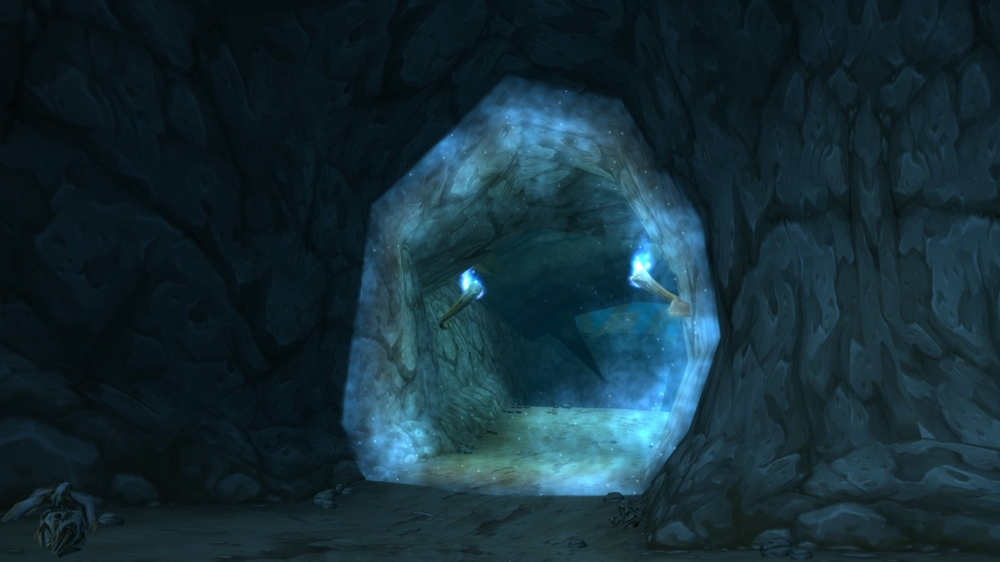
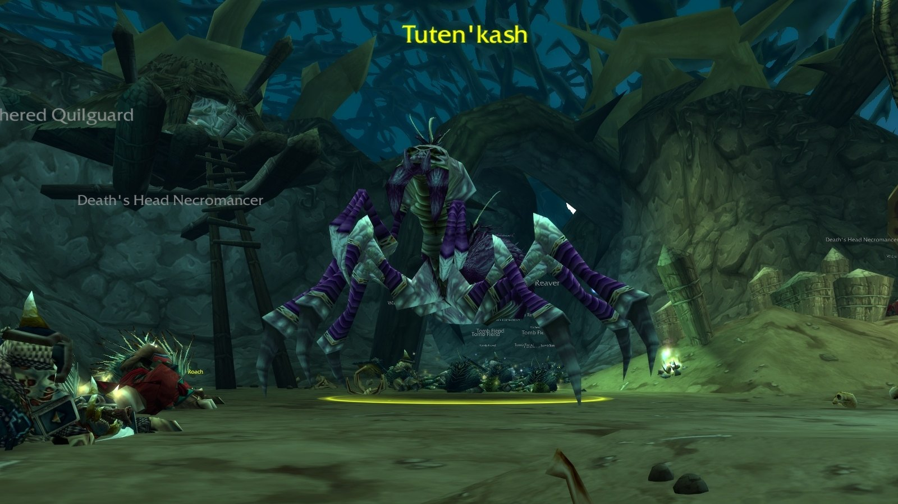
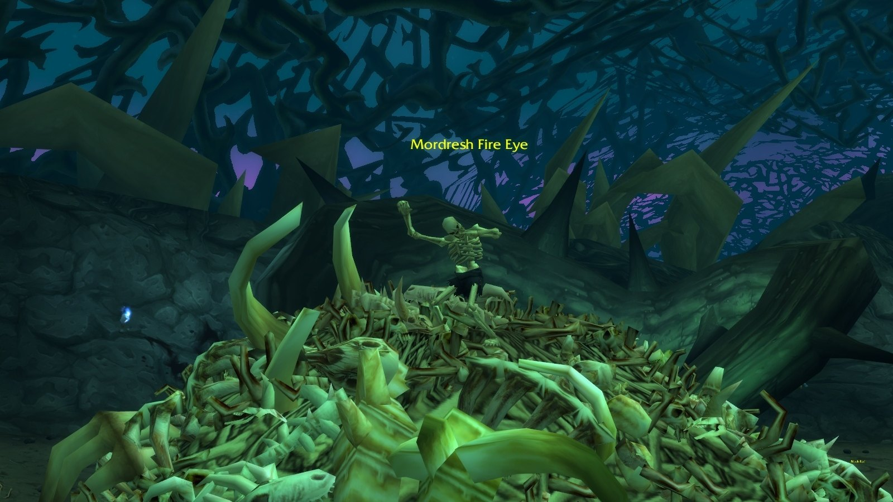
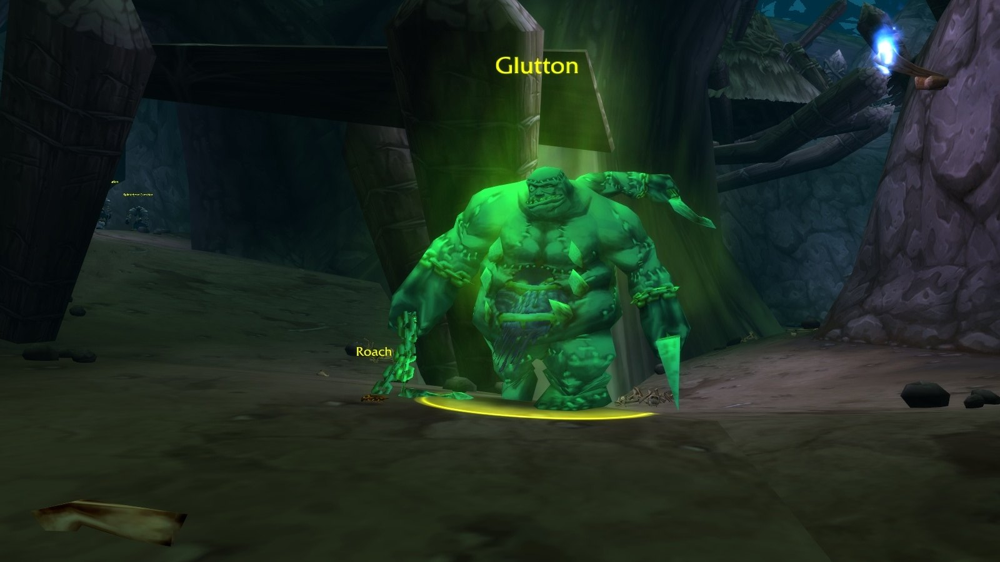
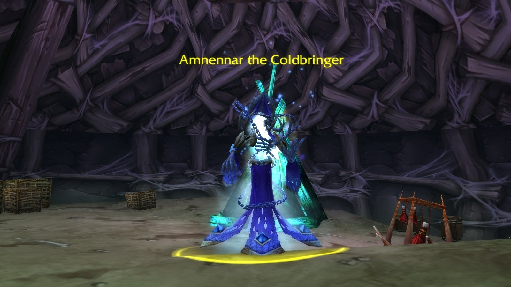

Razorfen Downs ist die alte Hauptstadt der Quilboar, gewachsen aus denselben riesigen Ranken wie Razorfen Kraul. Die Scourge hat sie übernommen: Der Lich Amnennar the Coldbringer herrscht über das Dornenlabyrinth, und die Priester der Death's Head dienen ihm. Drinnen warten sechs Bosse und sechs Quests.

## Auf einen Blick

| | |
|---|---|
| Stufen | 35-44, Bosse der Stufe 39 bis 41 |
| Eingang | Der Süden von The Barrens, östlich des Great Lift |
| Bosse | 6, davon ist Ragglesnout ein Rare und Plaguemaw beendet eine Eskorte |
| Quests | 6, für beide Fraktionen |
| Event | Der Gong, der Tuten'kash beschwört |
| Kurzname | RFD |

## Der Weg dorthin

**Horde.** Flieg nach Camp Taurajo und reite nach Süden. Bieg kurz vor dem Great Lift nach Thousand Needles nach Osten ab.

**Alliance.** Nimm das Schiff von Booty Bay nach Ratchet, reite in den Süden von The Barrens und bieg vor dem Great Lift nach Osten ab.

## Die Quests

| Quest | Wo sie beginnt | Stufe | Belohnung |
|---|---|---|---|
| <a href="https://www.wowhead.com/forever/quest=6626">A Host of Evil</a> Beide | The Barrens, vor dem Eingang: Myriam Moonsinger /way 49.0 94.8 | 28 | Erfahrung und Silber |
| <a href="https://www.wowhead.com/forever/quest=3523">Scourge of the Downs</a> Beide | Im Dungeon: <a class="wf-wh wf-plain" href="https://www.wowhead.com/forever/npc=8516">Belnistrasz</a>, in den Zellen nahe Mordresh Fire Eye | 32 | Führt zu Extinguishing the Idol |
| <a href="https://www.wowhead.com/forever/quest=3525">Extinguishing the Idol</a> Beide | Im Dungeon: Belnistrasz, nach Scourge of the Downs | 32 | Dragonclaw Ring |
| <a href="https://www.wowhead.com/forever/quest=3636">Bring the Light</a> Alliance | Stormwind, Cathedral of Light: Archbishop Benedictus /way 50.3 45.6 | 39 | <a class="wf-wh wf-q3" href="https://www.wowhead.com/forever/item=10823">Vanquisher's Sword</a> oder <a class="wf-wh wf-q3" href="https://www.wowhead.com/forever/item=10824">Amberglow Talisman</a> |
| <a href="https://www.wowhead.com/forever/quest=3341">Bring the End</a> Horde | Undercity, Magic Quarter: Andrew Brownell /way 74.0 32.8 | 37 | <a class="wf-wh wf-q3" href="https://www.wowhead.com/forever/item=10823">Vanquisher's Sword</a> oder <a class="wf-wh wf-q3" href="https://www.wowhead.com/forever/item=10824">Amberglow Talisman</a> |
| <a href="https://www.wowhead.com/forever/quest=6521">An Unholy Alliance</a> Horde | Undercity, Royal Quarter: Varimathras /way 56.6 92.6 <em>Erledige zuerst An Unholy Alliance aus Razorfen Kraul.</em> | 28 | <a class="wf-wh wf-q3" href="https://www.wowhead.com/forever/item=17039">Skullbreaker</a>, <a class="wf-wh wf-q3" href="https://www.wowhead.com/forever/item=17042">Nail Spitter</a> oder <a class="wf-wh wf-q3" href="https://www.wowhead.com/forever/item=17043">Zealot's Robe</a> |

Die Stufe ist die niedrigste Stufe, ab der man die Quest annehmen kann, laut Wowhead. Der Dragonclaw Ring steht noch nicht in den Forever-Daten von Wowhead.

- **A Host of Evil.** Töte Death's Head Cultists, Razorfen Battleguards und Razorfen Thornweavers im ganzen Dungeon.
- **Scourge of the Downs und Extinguishing the Idol.** Jeder Spieler spricht für die erste Quest zweimal mit Belnistrasz; das dritte Gespräch startet die Eskorte. Beschütze ihn, während sein Ritual das Idol abschaltet. Plaguemaw the Rotting kommt am Ende.
- **Bring the Light und Bring the End.** Töte Amnennar the Coldbringer; die Horde bringt den Skull of the Coldbringer zurück.
- **An Unholy Alliance.** Die Small Scroll von Charlga Razorflank in [Razorfen Kraul](/de/guides/dungeons/razorfen-kraul/) führt zu Varimathras. Er will den Kopf von <a class="wf-wh wf-plain" href="https://www.wowhead.com/forever/npc=12865">Ambassador Malcin</a>, der an mehreren Stellen direkt vor der Instanz erscheinen kann.

## Freezing Spirits

Die geisterhaften Freezing Spirits wirken Frost Nova. Stellt euch zum Tank, damit niemand an der falschen Stelle einfriert.

## Die Bosse und ihre Beute

Die Beute pro Boss stammt von Wowhead, mit den Werten aus den Dateien der Beta. Wowhead nennt weitere Drops, die noch nicht in den Forever-Daten seiner Tooltips stehen; sie stehen ohne Link da.

### Tuten'kash

Mit dem Gong beschworen: Räum zuerst die Spinnenwellen und schlag nach jeder Welle erneut den Gong. Dreh ihn wegen Web Spray von der Gruppe weg.

| Gegenstand | Neu in Forever |
|---|---|
| <a class="wf-wh wf-q3" href="https://www.wowhead.com/forever/item=10775">Carapace of Tuten'kash</a> | Unverändert |

Außerdem genannt: Silky Spider Cape und Arachnid Gloves.

### Mordresh Fire Eye

Ein Boss mit wenig Rüstung auf einem Knochenhaufen. Räum zuerst die tanzenden Skelette; die letzte Gruppe pullt ihn, also töte sie schnell mit Flächenschaden. Unterbrich seinen Fireball.

| Gegenstand | Neu in Forever |
|---|---|
| <a class="wf-wh wf-q3" href="https://www.wowhead.com/forever/item=10771">Deathmage Sash</a> | Bis zu 6 Zauberschaden und Heilung statt Stamina |

Außerdem genannt: Glowing Eye of Mordresh und Mordresh's Lifeless Skull.

### Glutton

Ein einfacher Kampf. Bleib aus seiner Disease Cloud und heile den Tank durch sein Enrage.

| Gegenstand | Neu in Forever |
|---|---|
| <a class="wf-wh wf-q3" href="https://www.wowhead.com/forever/item=10772">Glutton's Cleaver</a> | Blau, mehr Schaden, und die Blutung trifft härter: 70 Schaden in 7 Sekunden |
| <a class="wf-wh wf-q3" href="https://www.wowhead.com/forever/item=10774">Fleshhide Shoulders</a> | Unverändert |

### Ragglesnout, ein Rare

Sein Dominate Mind ist die Gefahr: Wird der Tank oder Heiler übernommen, springen die Hybriden ein. Unterbrich seinen Heal und seine Shadow Bolts. Wowhead nennt für ihn Savage Boar's Guard, Boar Champion's Belt und X'caliboar.

### Amnennar the Coldbringer

Der letzte Boss. Tanke ihn mit Blick zum Zelt, in dem er steht, um Amnennar's Wrath zu neutralisieren, stellt euch für Frost Nova zum Tank, wechselt auf die Frost Spectres, wenn er sie beschwört, und unterbrecht Frostbolt.

| Gegenstand | Neu in Forever |
|---|---|
| <a class="wf-wh wf-q3" href="https://www.wowhead.com/forever/item=10761">Coldrage Dagger</a> | Der Frostblitz trifft härter: 34 bis 50 Frostschaden |
| <a class="wf-wh wf-q3" href="https://www.wowhead.com/forever/item=10762">Robes of the Lich</a> | Bis zu 14 Frost- und 14 Schattenschaden statt Intellect |
| <a class="wf-wh wf-q3" href="https://www.wowhead.com/forever/item=10764">Deathchill Armor</a> | Bis zu 19 Heilung, etwas weniger Spirit |
| <a class="wf-wh wf-q3" href="https://www.wowhead.com/forever/item=10765">Bonefingers</a> | Blau, 4 Mana alle 5 Sekunden |
| <a class="wf-wh wf-q3" href="https://www.wowhead.com/forever/item=10763">Icemetal Barbute</a> | Etwas weniger Rüstung und Strength |

### Plaguemaw the Rotting

Das Ende der Eskorte von Belnistrasz. Töte die Wellen einzeln, am besten mit einem Off-Tank, der sie von Belnistrasz wegzieht. Plaguemaw selbst ist ein einfacher Kampf. Wowhead nennt für ihn Swine Fists und Plaguerot Sprig.

## Was noch nicht bekannt ist

- **Die Drops, die noch nicht in den Forever-Daten stehen**, etwa X'caliboar und der Dragonclaw Ring: ob sie noch fallen.
- **Die Dropchancen** der Bossbeute.
- **Die Belohnungen der Quests** können sich in der Beta noch ändern.
