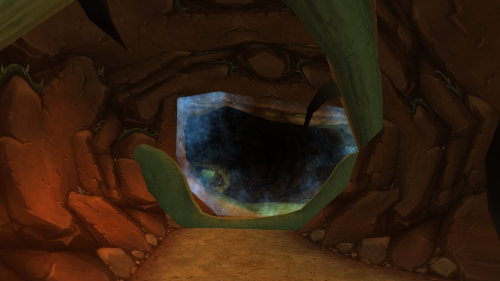
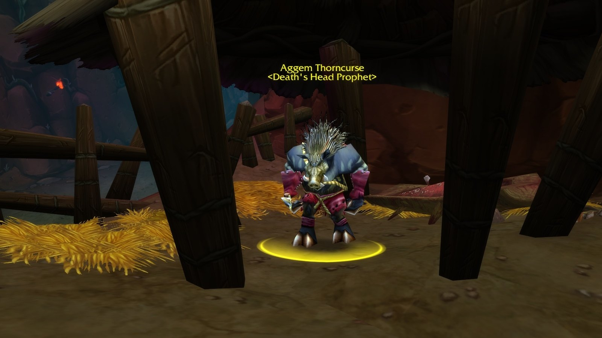
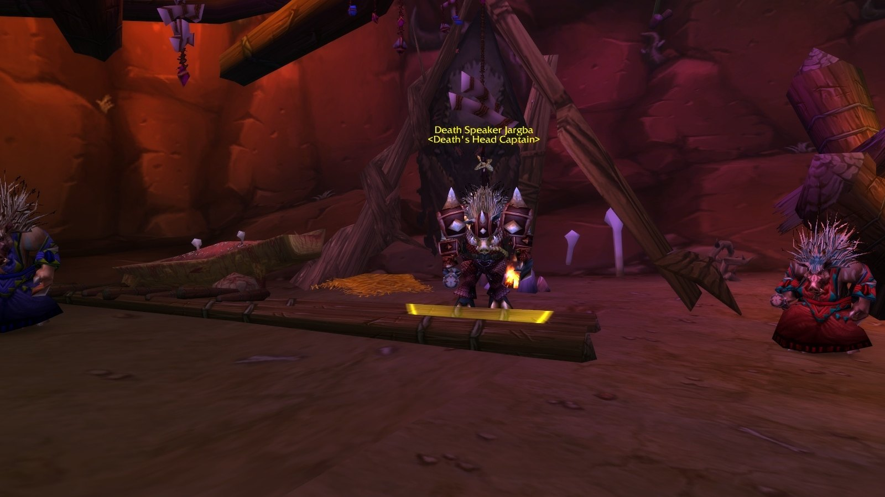
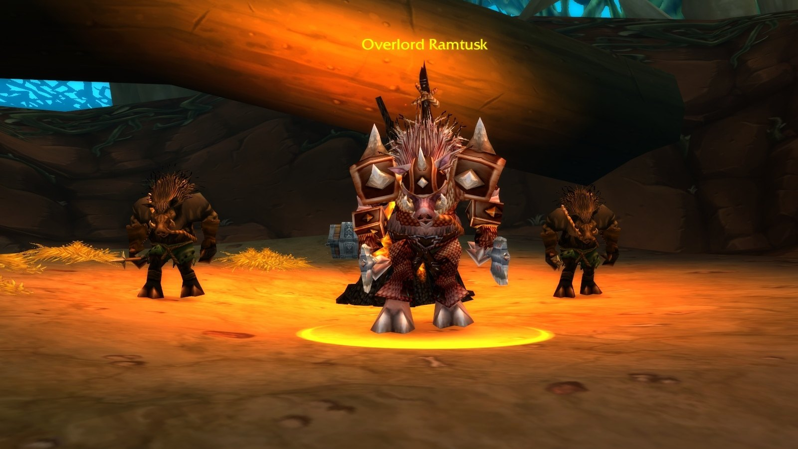
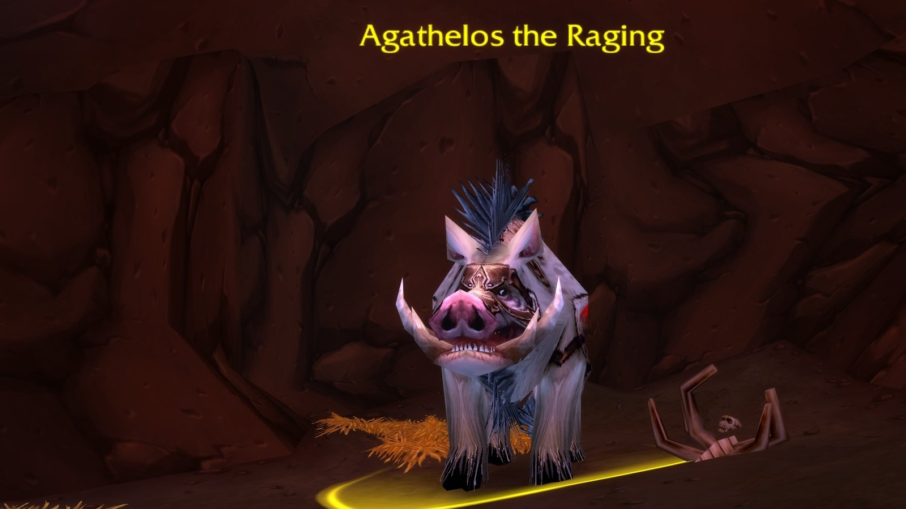
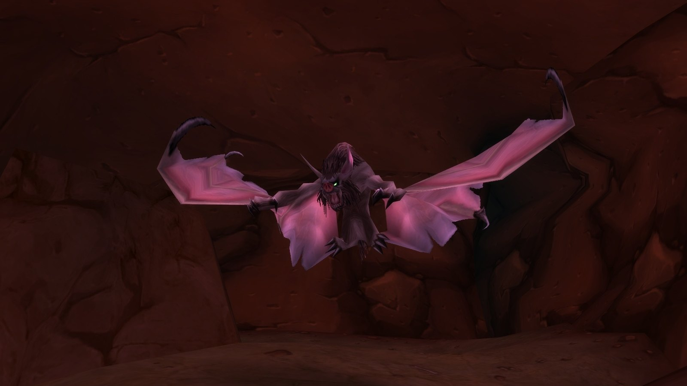
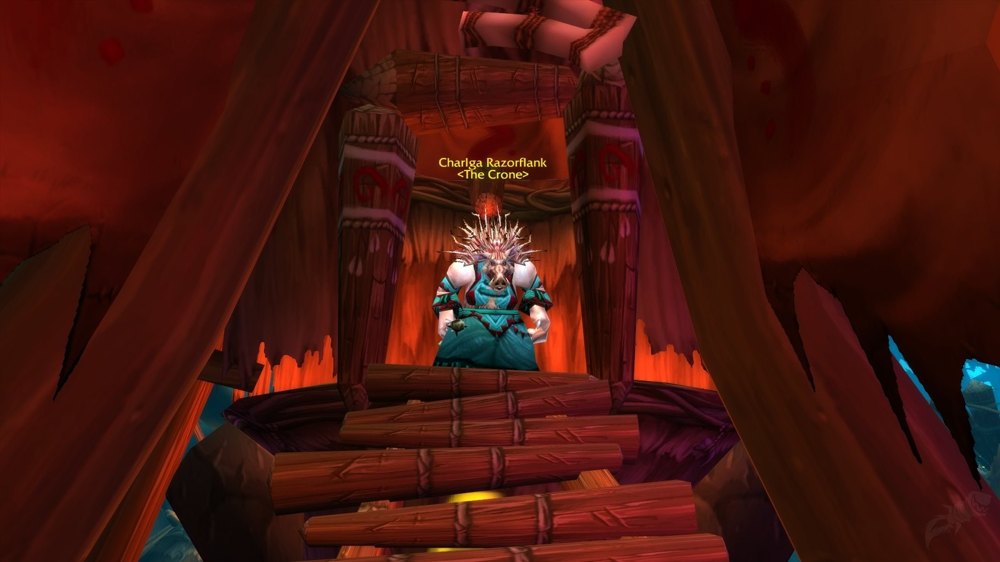

Razorfen Kraul wuchs dort, wo vor zehntausend Jahren das Blut des Halbgotts Agamaggan fiel: ein Labyrinth aus riesigen Dornenranken im Süden von The Barrens. Die Quilboar leben dort unter Charlga Razorflank. Drinnen warten acht Bosse, davon zwei Rares, und sieben Quests.

## Auf einen Blick

| | |
|---|---|
| Stufen | 25-34, Bosse der Stufe 28 bis 33 |
| Eingang | Der Süden von The Barrens, westlich des Great Lift |
| Bosse | 8, davon sind Blind Hunter und Earthcaller Halmgar Rares |
| Quests | 7, für beide Fraktionen |
| Beute | Die meisten Bossdrops sind in Forever blau |
| Kurzname | RFK |

## Der Weg dorthin

**Horde.** Flieg nach Camp Taurajo und reite nach Süden. Bieg kurz vor dem Great Lift nach Thousand Needles nach Westen ab.

**Alliance.** Nimm das Schiff von Booty Bay nach Ratchet, reite in den Süden von The Barrens und bieg vor dem Great Lift nach Westen ab.

## Die Quests

| Quest | Wo sie beginnt | Stufe | Belohnung |
|---|---|---|---|
| <a href="https://www.wowhead.com/forever/quest=1221">Blueleaf Tubers</a> Beide | The Barrens, Ratchet: Mebok Mizzyrix /way 62 37 | 20 | <a class="wf-wh wf-q1" href="https://www.wowhead.com/forever/item=6755">A Small Container of Gems</a> |
| <a href="https://www.wowhead.com/forever/quest=1144">Willix the Importer</a> Beide | Im Dungeon: <a class="wf-wh wf-plain" href="https://www.wowhead.com/forever/npc=4508">Willix the Importer</a>, in einem Zelt nahe dem letzten Boss | 22 | <a class="wf-wh wf-q3" href="https://www.wowhead.com/forever/item=6748">Monkey Ring</a>, <a class="wf-wh wf-q3" href="https://www.wowhead.com/forever/item=6750">Snake Hoop</a> oder <a class="wf-wh wf-q3" href="https://www.wowhead.com/forever/item=6749">Tiger Band</a> |
| <a href="https://www.wowhead.com/forever/quest=1142">Mortality Wanes</a> Alliance | Im Dungeon: <a class="wf-wh wf-plain" href="https://www.wowhead.com/forever/npc=4510">Heralath Fallowbrook</a>, hinter dem letzten Boss | 25 | <a class="wf-wh wf-q3" href="https://www.wowhead.com/forever/item=6751">Mourning Shawl</a> oder <a class="wf-wh wf-q3" href="https://www.wowhead.com/forever/item=6752">Lancer Boots</a> |
| <a href="https://www.wowhead.com/forever/quest=1101">The Crone of the Kraul</a> Alliance | Feralas, The Lower Wilds: Falfindel Waywarder /way 89 46 <em>Erledige zuerst Lonebrow's Journal.</em> | 29 | <a class="wf-wh wf-q3" href="https://www.wowhead.com/forever/item=4197">Berylline Pads</a>, <a class="wf-wh wf-q3" href="https://www.wowhead.com/forever/item=6742">Stonefist Girdle</a> oder <a class="wf-wh wf-q3" href="https://www.wowhead.com/forever/item=6725">Marbled Buckler</a> |
| <a href="https://www.wowhead.com/forever/quest=1102">A Vengeful Fate</a> Horde | Thunder Bluff, am Hauptaufzug: Auld Stonespire /way 37 29 | 29 | <a class="wf-wh wf-q3" href="https://www.wowhead.com/forever/item=4197">Berylline Pads</a>, <a class="wf-wh wf-q3" href="https://www.wowhead.com/forever/item=6742">Stonefist Girdle</a> oder <a class="wf-wh wf-q3" href="https://www.wowhead.com/forever/item=6725">Marbled Buckler</a> |
| <a href="https://www.wowhead.com/forever/quest=1109">Going, Going, Guano!</a> Horde | Undercity, The Apothecarium: Master Apothecary Faranell /way 48 69 | 30 | Erfahrung und Silber |
| <a href="https://www.wowhead.com/forever/quest=6522">An Unholy Alliance</a> Horde | Im Dungeon: Small Scroll, eine Beute von Charlga Razorflank | 28 | Geht in Razorfen Downs weiter |

Die Stufe ist die niedrigste Stufe, ab der man die Quest annehmen kann, laut Wowhead.

- **Blueleaf Tubers.** Nimm die Crate With Holes, das Snufflenose Owner's Manual und den Snufflenose Command Stick neben Mebok mit. Drinnen beschwört die Kiste einen Snufflenose Gopher; mit dem Stab gräbt er eine Knolle aus. Wiederhole das, bis du 6 hast.
- **Willix the Importer.** Eine Eskorte am Ende des Dungeons. Ihr Weg führt an vielen Blueleaf Tubers vorbei.
- **Mortality Wanes.** Treshala's Pendant fällt bei jedem Quilboar drinnen.
- **The Crone of the Kraul und A Vengeful Fate.** Razorflank's Medallion und Razorflank's Heart, beide von Charlga Razorflank. Für die Alliance liegt Lonebrow's Journal bei der Leiche eines Zwergs am Fuß des Great Lift.
- **Going, Going, Guano!** Kraul Guano von den Kraul Bats im letzten Teil. Wird für Hearts of Zeal in [Scarlet Monastery](/de/guides/dungeons/scarlet-monastery/) gebraucht.
- **An Unholy Alliance.** Die Small Scroll schickt dich zu Varimathras in der Undercity; die Reihe geht in [Razorfen Downs](/de/guides/dungeons/razorfen-downs/) weiter.

## Die Zauberer der Quilboar

- **Razorfen Totemics** stellen ein Earthgrab Totem auf, das alle in der Nähe 30 Sekunden lang festhält. Töte zuerst das Totem.
- **Razorfen Dustweavers** wirken Enveloping Winds, eine Betäubung von 10 Sekunden. Pull sie einzeln.
- **Death's Head Adepts** wirken Chains of Ice. Leicht zu töten, aber gefährlich mit einer zweiten Gruppe in der Nähe.

## Die Bosse und ihre Beute

Die Beute pro Boss stammt von Wowhead, mit den Werten aus den Dateien der Beta.

### Roogug

Optional, für zwei Klassenquests des Warriors. Räum zuerst die Umgebung und banne den Elementar an seiner Seite, wenn ein Warlock in der Gruppe ist. Keine besondere Beute.

### Aggem Thorncurse

Ein einfacher Kampf der Stufe 30, der einen Boar Spirit beschwört. Töte zuerst den Eber.

| Gegenstand | Neu in Forever |
|---|---|
| <a class="wf-wh wf-q3" href="https://www.wowhead.com/forever/item=6681">Thornspike</a> | Von weiß zu blau: schleudert Stacheln für 45 körperlichen Schaden, die auf einen zweiten Feind überspringen |

### Death Speaker Jargba

Kommt mit zwei Zauberern, die hart zuschlagen. Kontrolliere mindestens einen. Jargba übernimmt mit Dominate Mind einen Spieler, also töte ihn schnell.

| Gegenstand | Neu in Forever |
|---|---|
| <a class="wf-wh wf-q3" href="https://www.wowhead.com/forever/item=2816">Death Speaker Scepter</a> | Ein Streitkolben für Heiler: bis zu 68 Heilung, 28 Schattenschaden und 12 Gesundheit alle 5 Sekunden |
| <a class="wf-wh wf-q3" href="https://www.wowhead.com/forever/item=6682">Death Speaker Robes</a> | Blau, mehr Intellect und bis zu 19 Heilung |
| <a class="wf-wh wf-q3" href="https://www.wowhead.com/forever/item=6685">Death Speaker Mantle</a> | Blau, mehr Intellect und bis zu 5 Zauberschaden und Heilung |

### Overlord Ramtusk

Ein Boss der Stufe 32 mit harten Treffern, flankiert von zwei Razorfen Spearhides, deren Whirling Barrage tödlich ist. Kontrolliere beide, wenn es geht.

| Gegenstand | Neu in Forever |
|---|---|
| <a class="wf-wh wf-q3" href="https://www.wowhead.com/forever/item=6686">Tusken Helm</a> | Blau, mehr Strength und 120 zusätzliche Rüstung |
| <a class="wf-wh wf-q3" href="https://www.wowhead.com/forever/item=6687">Corpsemaker</a> | Unverändert |

### Agathelos the Raging

Ein Eber der Stufe 33 mit hohem Einzelzielschaden, Rushing Charge und Enrage. Der Kampf dreht sich darum, den Tank am Leben zu halten.

| Gegenstand | Neu in Forever |
|---|---|
| <a class="wf-wh wf-q3" href="https://www.wowhead.com/forever/item=6690">Ferine Leggings</a> | Blau, Intellect und 26 Attack Power |
| <a class="wf-wh wf-q3" href="https://www.wowhead.com/forever/item=6691">Swinetusk Shank</a> | Jetzt ein Dolch für Zauberer: bis zu 40 Zauberschaden und Heilung |

### Blind Hunter, ein Rare

In der Fledermaushöhle. Hör auf zu zaubern, wenn er seinen Sonic Burst beginnt, eine Flächen-Silence. Hunter können ihn zähmen.

| Gegenstand | Neu in Forever |
|---|---|
| <a class="wf-wh wf-q3" href="https://www.wowhead.com/forever/item=6695">Stygian Bone Amulet</a> | Bis zu 16 Zauberschaden gegen Undead statt Spirit |
| <a class="wf-wh wf-q3" href="https://www.wowhead.com/forever/item=6696">Nightstalker Bow</a> | 5 Shadow Resistance |
| <a class="wf-wh wf-q3" href="https://www.wowhead.com/forever/item=6697">Batwing Mantle</a> | 1 Intellect mehr |

### Earthcaller Halmgar, ein Rare

Banne seinen Elementar, wenn es geht, oder räum die Plattform, töte seine Totems und erledige zuerst den Elementar.

| Gegenstand | Neu in Forever |
|---|---|
| <a class="wf-wh wf-q3" href="https://www.wowhead.com/forever/item=6689">Wind Spirit Staff</a> | Jetzt ein Stab für Heiler: bis zu 71 Heilung |
| <a class="wf-wh wf-q3" href="https://www.wowhead.com/forever/item=6688">Whisperwind Headdress</a> | Blau, mehr Stamina, Intellect und Spirit |

### Charlga Razorflank

Der letzte Boss, eine Zauberin mit wenig Rüstung in einer erhöhten Hütte. Zieh sie auf die Plattform darunter, unterbrich sie und verteilt euch gegen Chain Bolt. Sie heilt sich und wird zeitweise immun.

| Gegenstand | Neu in Forever |
|---|---|
| <a class="wf-wh wf-q3" href="https://www.wowhead.com/forever/item=6693">Agamaggan's Clutch</a> | 3 % schneller in The Barrens, Thousand Needles, Razorfen Kraul und Razorfen Downs |
| <a class="wf-wh wf-q3" href="https://www.wowhead.com/forever/item=6692">Pronged Reaver</a> | 6 Gesundheit alle 5 Sekunden statt Spirit |
| <a class="wf-wh wf-q3" href="https://www.wowhead.com/forever/item=6694">Heart of Agamaggan</a> | Bis zu 14 Heilung statt Spirit |

## Blaue Gegenstände der Monster

<a class="wf-wh wf-q3" href="https://www.wowhead.com/forever/item=2549">Staff of the Shade</a>, ein Gegenstand, der beim Anlegen gebunden wird, gibt jetzt 15 Stamina und bis zu 37 Schattenschaden. <a class="wf-wh wf-q3" href="https://www.wowhead.com/forever/item=2264">Mantle of Thieves</a>, <a class="wf-wh wf-q3" href="https://www.wowhead.com/forever/item=1488">Avenger's Armor</a>, <a class="wf-wh wf-q3" href="https://www.wowhead.com/forever/item=4438">Pugilist Bracers</a> und <a class="wf-wh wf-q3" href="https://www.wowhead.com/forever/item=2039">Plains Ring</a> bleiben gleich.

## Was noch nicht bekannt ist

- **Die Dropchancen** der Bossbeute.
- **Die Belohnungen der Quests** können sich in der Beta noch ändern.
